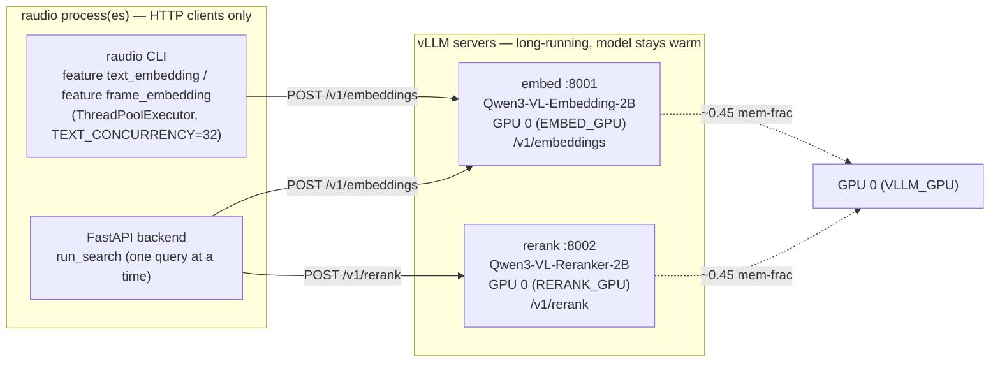
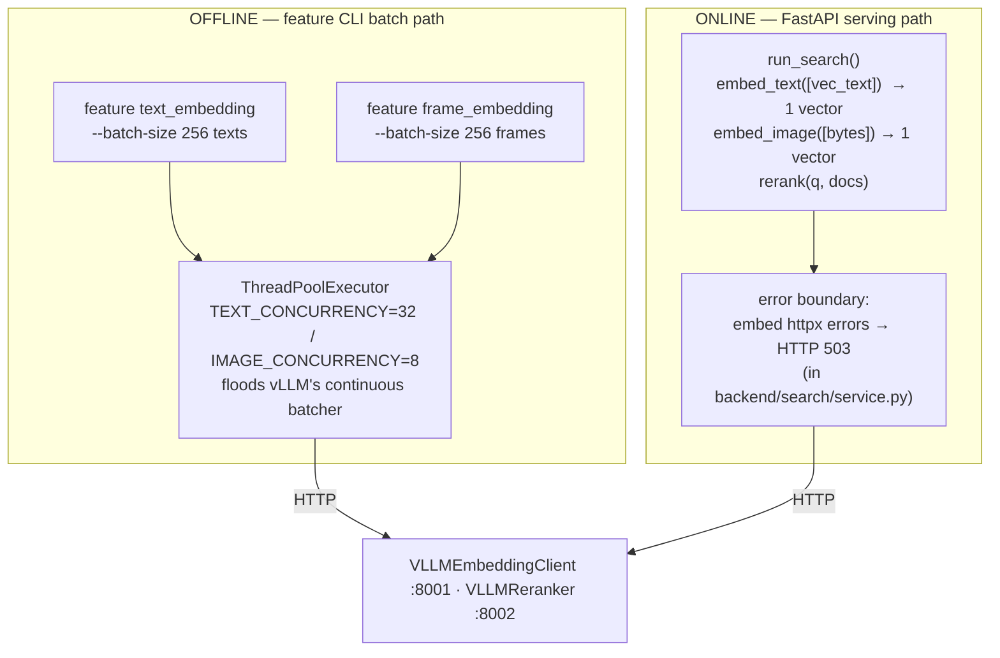
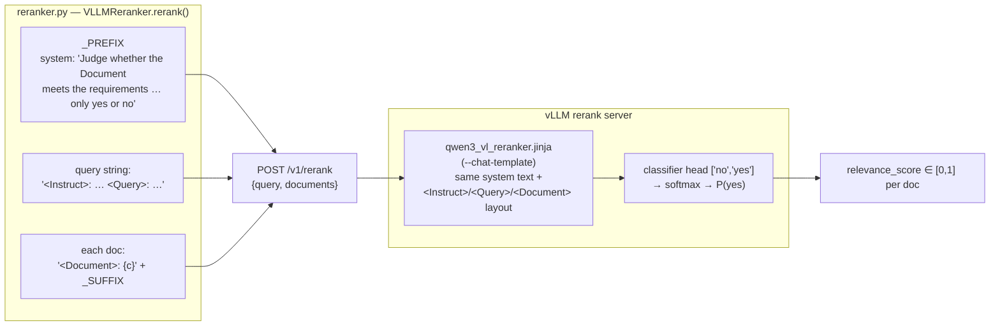
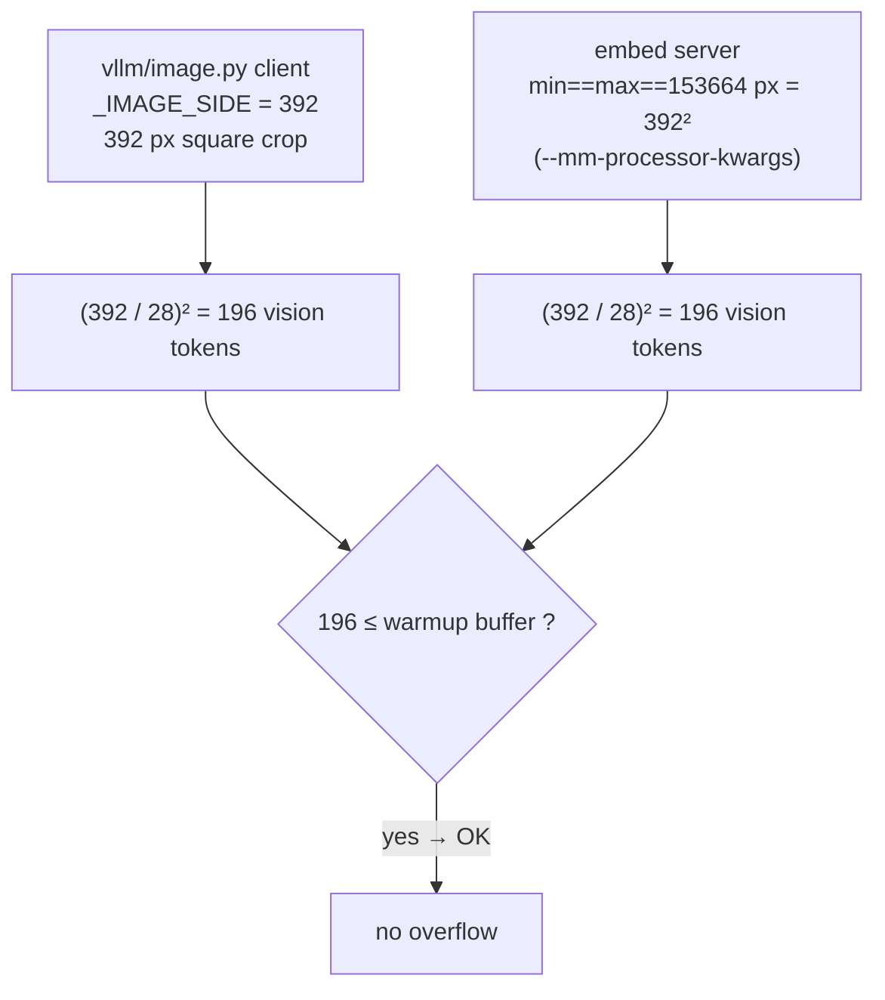

# Multimodal embeddings & reranking (Qwen3-VL + vLLM)

> How `raudio` turns Swedish transcript text and video frames into 2048-d
> vectors in one shared space, and how it cross-encodes query/document pairs for
> reranking. This is the "shared seam" of the project — read
> [GUIDE.md §7](GUIDE.md#7-the-shared-seam-vllm-clients) for where it sits in
> the wider architecture, and [TODO.md](TODO.md) for open blockers. The
> image-embed resolution mismatch that historically gated frame embedding has its
> own deep-dive in **[INVESTIGATION.md](INVESTIGATION.md)** (Part B) — read that
> before you touch image resolution or vLLM warmup.

Source of truth: [`src/rmedia/vllm/embedding.py`](../src/rmedia/vllm/embedding.py),
[`src/rmedia/vllm/reranker.py`](../src/rmedia/vllm/reranker.py),
[`src/rmedia/vllm/image.py`](../src/rmedia/vllm/image.py),
[`Makefile`](../Makefile) (the `embed-server` / `rerank-server` / `*-docker`
targets), [`src/rmedia/cli/features.py`](../src/rmedia/cli/features.py) +
[`src/rmedia/features/`](../src/rmedia/features/) (the `feature text_embedding` /
`feature frame_embedding` commands), [`backend/search/service.py`](../backend/search/service.py)
(`run_search`), and the chat template
[`src/rmedia/retrieval/qwen3_vl_reranker.jinja`](../src/rmedia/retrieval/qwen3_vl_reranker.jinja).

---

## 1. The two models, in one table

Both models are 2B Qwen3-VL variants, served by vLLM as long-running HTTP
servers. The embedder produces vectors; the reranker produces relevance scores.

| | **Embedding** | **Reranker** |
|---|---|---|
| Model ID | `Qwen/Qwen3-VL-Embedding-2B` (`EMBED_MODEL`) | `Qwen/Qwen3-VL-Reranker-2B` (`RERANK_MODEL`) |
| Role | bi-encoder: text **and** image → one shared vector space | cross-encoder: `(query, document)` pair → one relevance score |
| Native output | **2048-d** embedding | logits over a `["no", "yes"]` classifier head |
| What raudio stores/uses | the full **2048** dims (`EMBED_DIM`), L2-normalized | `relevance_score ∈ [0, 1]` = softmax→`yes` probability |
| Compared via | **cosine** distance (IVF_PQ index) | sort by score, descending |
| HTTP endpoint | `POST /v1/embeddings` (chat-shaped) | `POST /v1/rerank` |
| Default URL | `http://127.0.0.1:8001` (`DEFAULT_EMBED_URL`) | `http://127.0.0.1:8002` (`DEFAULT_RERANK_URL`) |
| GPU (Makefile) | `EMBED_GPU ?= $(VLLM_GPU)` (= 0) | `RERANK_GPU ?= $(VLLM_GPU)` (= 0) |

The Python defaults live in the client constructors (`VLLMEmbeddingClient` in
`vllm/embedding.py`, `VLLMReranker` in `vllm/reranker.py`) and the module
constants `EMBED_MODEL`, `RERANK_MODEL`, `DEFAULT_EMBED_URL`,
`DEFAULT_RERANK_URL`. The vector width is `EMBED_DIM = 2048` in
[`model/schema.py`](../src/rmedia/model/schema.py) — the single source of truth.

**Why the full 2048-d (no Matryoshka truncation)?** Qwen3-VL-Embedding-2B emits a
2048-d vector. You *could* slice to a shorter prefix to halve storage + index
cost, but `raudio` keeps the full width for maximum retrieval fidelity. The only
transform is L2-normalization (the vLLM pooler returns un-normalized vectors), in
`vllm/image.py::l2_normalize`:

```python
# vllm/image.py — l2_normalize()
norms = np.linalg.norm(arr, axis=1, keepdims=True)
norms = np.where(norms == 0, 1.0, norms)
return (arr / norms).astype(np.float32)     # unit vectors, full 2048-d
```

`l2_normalize` also validates `arr.shape[1] == EMBED_DIM`, so a server/model
dimension mismatch fails loudly there instead of corrupting the Lance column.

Because both text and frame embeddings land in the **same** 2048-d unit-sphere
space, cross-modal search is a plain cosine compare: a text query vector can be
matched against `frame_embedding`, and an image query vector against
`text_embedding`. The backend leans on this in `mode=visual` and `mode=all`.

---

## 2. Serving topology — vLLM out of process

The single most important architectural fact: **vLLM does not run inside the
`raudio` process.** It runs as two independent, long-lived HTTP servers, and
*both* the offline CLI and the online FastAPI backend are merely HTTP clients of
them.



### Why out of process? (three independent reasons, all real)

1. **Torch pin conflict.** vLLM ships its own pinned `torch`/`torchaudio`, which
   conflicts with the project's `cu128` pin in [`pyproject.toml`](../pyproject.toml).
   The pyproject comment is explicit: vLLM is **not** a project extra because its
   torch/torchaudio pins conflict with our cu128 versions — run it via `uvx`
   instead. The `embed-server` / `rerank-server` targets launch it in a
   `uvx`-managed ephemeral env so the two dependency trees never have to resolve
   together.
2. **Cold start is expensive.** Loading a model takes tens of seconds and pins
   several GB of GPU memory. If that happened per CLI invocation, every
   `rmedia feature text_embedding` resume would re-pay it, and every FastAPI
   restart would re-load. A long-lived server amortizes the load — the model
   stays *warm* across all uses.
3. **Free throughput.** A persistent server gives vLLM's continuous batcher
   something to batch: many concurrent requests fuse into one GPU pass.

The client-side dependency footprint is deliberately tiny — the `[multimodal]`
extra (`Pillow`, `numpy`, `httpx`, `tqdm`) is pure HTTP-client code with **no GPU
and no torch**, so installing it never conflicts with the cu128 pin and FTS-only
deployments need no GPU at all.

### One GPU, two servers — start sequentially

Both vLLM servers default to the **same** GPU (`VLLM_GPU ?= 0`, with
`EMBED_GPU ?= $(VLLM_GPU)` and `RERANK_GPU ?= $(VLLM_GPU)`). The two 2B models
co-locate comfortably at half memory each (`EMBED_MEM_FRAC ?= 0.45`,
`RERANK_MEM_FRAC ?= 0.45` — ~88 GB on a 96 GB card). Override the card per
invocation with `make embed-server VLLM_GPU=N`.

**Start them sequentially** — bring the embed server fully up before launching
the rerank server. Co-locating two servers that init *concurrently* triggers
vLLM's "memory profiling" race: when one server frees a few GB mid-init, the
other's `profile_run` aborts. Starting them one at a time avoids the race.

---

## 3. Launching the servers (Makefile targets)

There are two launch paths for each server. Both expose the *same* OpenAI-style
endpoints; pick based on your driver situation.

| Target | Path | When to use |
|---|---|---|
| `make embed-server` | `uvx --python 3.12 --with kernels --from vllm==0.22.0 vllm serve …` | host has a CUDA-12.9 (driver ≥ 575) capable driver |
| `make rerank-server` | `uvx --python 3.12 --with kernels --from vllm==0.22.0 vllm serve …` | same |
| `make embed-server-docker` | `docker run vllm/vllm-openai:v0.22.0 …` | **recommended on Blackwell + driver 12.8** — bundles its own CUDA |
| `make rerank-server-docker` | `docker run vllm/vllm-openai:v0.22.0 …` | same |
| `make vllm-stop` | `docker stop raudio-embed raudio-rerank` | stop the docker servers |
| `make kernels-prepare` | pre-fetch FlashAttention-3 kernels (sm_120) | one-time, ~200 MB |

**vLLM is pinned to one build across both paths** (`VLLM_PIN ?= vllm==0.22.0`,
`VLLM_IMAGE ?= vllm/vllm-openai:v0.22.0`, reasoning inline in the Makefile):

- vLLM ≥ 0.20 requires NVIDIA driver ≥ 575 (CUDA 12.9). On a host whose driver
  only supports CUDA 12.8, the native (`uvx`) server "driver too old"-crashes at
  engine init → use the **docker** path, which brings its own CUDA userspace.
- On Blackwell (sm_120) the FlashAttention PTX gap is covered by the HF `kernels`
  package + FA3 cache (`make kernels-prepare`); the `uvx` targets run with
  `--with kernels` so FA3 is available.

The **docker** path additionally sidesteps the host-driver problem by bringing
its own CUDA userspace. Both docker targets pass the GPU as
`--device=nvidia.com/gpu=$(GPU)` (CDI by name) rather than `--gpus all`, because
Docker 27+ routes `--gpus all` through CDI for *all* vendors and aborts with "AMD
CDI spec not found" on NVIDIA-only hosts.

### Key server flags (and what they wire up)

**Embed server** (`embed-server` / `embed-server-docker`):

```
--model Qwen/Qwen3-VL-Embedding-2B
--runner pooling                 # pooling runner = emit embeddings, not chat tokens
--port 8001
--enable-prefix-caching
--dtype bfloat16
--gpu-memory-utilization 0.45    # EMBED_MEM_FRAC (shares the GPU with the reranker)
--max-model-len 8192
--limit-mm-per-prompt '{"image": 1}'
--mm-processor-kwargs '{"min_pixels": 153664, "max_pixels": 153664}'  # pin pixels (see §7)
```

**Rerank server** (`rerank-server` / `rerank-server-docker`):

```
--model Qwen/Qwen3-VL-Reranker-2B
--runner pooling
--port 8002
--dtype bfloat16
--gpu-memory-utilization 0.45    # RERANK_MEM_FRAC (shares the GPU with the embedder)
--max-model-len 4096
--limit-mm-per-prompt '{"image": 0, "video": 0}'   # reranker is text-only here
--hf_overrides '{"architectures":["Qwen3VLForSequenceClassification"],
                 "classifier_from_token":["no","yes"],
                 "is_original_qwen3_reranker":true}'
--chat-template ./src/rmedia/retrieval/qwen3_vl_reranker.jinja
```

The reranker is **not** an embedding model — the `hf_overrides` reconfigure it as
`Qwen3VLForSequenceClassification` with a two-token (`no`/`yes`) classifier head.
That, plus the chat template, is what turns `/v1/rerank` into a yes/no relevance
scorer. Disabling image+video multimodal profiling (`{"image": 0, "video": 0}`)
frees ~1 GB and skips a multimodal warmup raudio never uses — only text
query/doc strings are ever sent to the reranker.

---

## 4. The shared seam: one client, two callers

`vllm/embedding.py` exposes `VLLMEmbeddingClient` (`embed_text`, `embed_image`),
behind the structural `EmbeddingClient` `Protocol` that the feature engine and
backend depend on (tests inject an offline fake). `vllm/reranker.py` exposes
`VLLMReranker` (`rerank`) plus the `QwenVLReranker` LanceDB adapter. The two
callers drive them differently.



**Offline (`feature text_embedding` / `feature frame_embedding`).** vLLM's
chat-embeddings endpoint takes one chat at a time, but the engine batches
internally — so the client fires many requests *concurrently* via a
`ThreadPoolExecutor` (`TEXT_CONCURRENCY=32`, `IMAGE_CONCURRENCY=8`; images cost
more vision tokens, hence lower) and lets vLLM's continuous batcher fuse them
into one GPU pass. The feature CLI layers an outer batch on top
(`--batch-size 256`, the same default for both columns).

**Online (`run_search`).** The backend issues **one query at a time**
(`client.embed_text([vec_text])[0]`, `client.embed_image([image_bytes])[0]`). The
clients connect lazily — `ensure_embedder` / `ensure_reranker` in
[`backend/clients.py`](../backend/clients.py) only construct a client on first
use, so an FTS-only deployment never needs vLLM up. There are **two error
boundaries**, both mapping failures to a structured **503** ("embedding/rerank
service unavailable") so the frontend shows a meaningful message instead of a
500: the lazy constructors in `backend/clients.py`, and the per-request embed call
inside `run_search` (`backend/search/service.py`), which catches
`httpx.ConnectError` / `httpx.HTTPError` from `embed_text` / `embed_image`.

> The POST handler offloads `run_search` to `run_in_threadpool(...)` because the
> client makes *blocking* httpx + Lance calls; running them inline would stall the
> async event loop. The GET handler is sync and is threadpooled by FastAPI.

### The text embedding request shape

`raudio` does **not** use the plain `input: [str]` form of `/v1/embeddings`. It
sends a Qwen-VL **chat-shaped** request — `system` (the instruction) + `user`
(the content) + an empty trailing `assistant` turn — with the vLLM extensions
`continue_final_message: true` and `add_special_tokens: true`:

```python
# _text_message() + _embed_one()
messages = [
    {"role": "system",    "content": [{"type": "text", "text": "Represent the user's input."}]},
    {"role": "user",      "content": [{"type": "text", "text": text}]},
    {"role": "assistant", "content": [{"type": "text", "text": ""}]},
]
body = {"model": self.model, "messages": messages, "encoding_format": "float",
        "continue_final_message": True, "add_special_tokens": True}
# → data["data"][0]["embedding"]   (raw 2048-d, before L2-normalize)
```

The system instruction is `EMBED_INSTRUCTION = "Represent the user's input."` —
per the Qwen model card, **English** instructions yield the best results even
when the content is Swedish. The image request (`_image_message`) is identical
except the user turn carries an `image_url` data-URL block plus an empty trailing
`text` block (as the Qwen pure-image examples do).

---

## 5. The reranker: double-scaffolding (Python ↔ Jinja)

This is the subtlety most likely to bite you. The Qwen reranker's prompt framing
exists **twice**, and the two copies must stay byte-compatible:



In Python (`vllm/reranker.py`), `rerank()` wraps the query and each document in
the model-card scaffolding before posting:

```python
_PREFIX = ("<|im_start|>system\n"
    "Judge whether the Document meets the requirements based on the Query "
    'and the Instruct provided. Note that the answer can only be "yes" or "no".'
    "<|im_end|>\n<|im_start|>user\n")
_SUFFIX = "<|im_end|>\n<|im_start|>assistant\n"

body = {
    "model": self.model,
    "query": f"{_PREFIX}<Instruct>: {self.instruction}\n<Query>: {query}\n",
    "documents": [f"<Document>: {c}{_SUFFIX}" for c in candidates],
}
```

On the server, [`qwen3_vl_reranker.jinja`](../src/rmedia/retrieval/qwen3_vl_reranker.jinja)
applies the **same** system text and the same `<Instruct>` / `<Query>` /
`<Document>` layout. The default instruction in both places is
`RERANK_INSTRUCTION = "Given a search query, retrieve relevant candidates that
answer the query."`.

> **⚠️ If you edit one, edit the other.** The Python constants build the
> `/v1/rerank` strings; the Jinja template is what the server actually renders
> into tokens. Drift between them silently degrades relevance — the model was
> trained on this exact framing. Treat changes here as risky (see
> [GUIDE.md §7](GUIDE.md#7-the-shared-seam-vllm-clients)).

The response (`data["results"]`) may come back unordered, so `rerank()` re-sorts
by the returned `index` to restore the caller's candidate order before returning
the list of `relevance_score` floats.

### Plugging into Lance: `QwenVLReranker`

`QwenVLReranker(client)` wraps a `VLLMReranker` as a `lancedb.rerankers.Reranker`
subclass so it drops straight into Lance's hybrid query API. Its `_score()` takes
the candidate Arrow table, slices the top `top_k` rows (`DEFAULT_TOP_K = 100`),
reads the `text` column, calls `client.rerank(query, docs)`, appends the scores as
`_relevance_score`, and sorts descending. It implements `rerank_hybrid`,
`rerank_vector`, and `rerank_fts`, so it works in every Lance query path.

> Note: the **online search path** does *not* use `QwenVLReranker`. `run_search`
> calls `VLLMReranker.rerank` directly via the `_rerank_by_text` helper (see §6)
> so it can rerank only a bounded *head* of the fused list. `QwenVLReranker` is
> the adapter for code that drives Lance's native `.rerank(...)` hybrid pipeline.

---

## 6. How search uses embeddings (`backend/search/service.py::run_search`)

> The concrete row-count and index facts in §6–§7 (145,175 rows,
> `frame_embedding_idx`, etc.) refer to `transcripts_v2.lance` — which is both the
> served dataset and the `Makefile`/CLI default (`DB ?= ./transcripts_v2.lance`).

`/api/search` accepts a `mode`; `run_search` routes each one differently. Only
`fts` needs no GPU; every other mode calls `get_embedder()` first (and 503s if the
embed server is down). A `SearchSpec` ([`backend/search/spec.py`](../backend/search/spec.py))
normalizes the request: `q` (FTS text), `q_vec` (optional separate vector-leg
text, falls back to `q`), `n` (results, default **20**, clamped 1..200), `mode`,
`rerank` + `rerank_n` (cross-encoder head size, default 20, clamped 1..200),
`weight` (0..1 balance, hybrid only; `None` = RRF), `fuzziness`, `phrase`,
structured filters (`language`/`namn`/`referenskod`/`extraid`), `where` (raw SQL),
and `prefilter`.

| `mode` | Signal | Implementation |
|---|---|---|
| `fts` | BM25 over `chunks.text` | `chunks.search(MatchQuery/PhraseQuery)` — **no embeddings** |
| `semantic` | cosine over `chunks.text_embedding` | `_vector_search(..., "text_embedding")` with embedded query |
| `visual` | cosine over `chunk_frames.frame_embedding` | `_frame_search(...)` — image query *or* text query (shared space), joined back to `chunks` |
| `scene` | cosine over `chunk_frames.caption_embedding` | `_frame_search(..., column="caption_embedding")` — text query vs the Swedish frame caption, joined back to `chunks` |
| `scene_fts` | BM25 over `chunk_frames.caption` | `_frame_fts_search(...)` — keyword query vs the Swedish frame caption, joined back to `chunks` |
| `hybrid` | FTS **+** text-vector, fused | Lance native hybrid query (`search(query_type="hybrid", vector_column_name="text_embedding")`) |
| `all` | FTS + text-vector + frame-vector + caption-vector | up to four rankings fused by `_rrf_fuse()`, optional rerank |

`visual` and `scene` are the same join (`_frame_search`) over two different
vector columns on `chunk_frames`: the raw image embedding vs the text embedding
of the Gemma Swedish caption. `scene` lets a text query match *what is visible on
screen* even when the transcript never says it.

Every mode's hits are then enriched with `caption` (the representative frame's
Swedish caption, `frame_idx=0`) via `_attach_captions` — one guarded scan of
`chunk_frames`, so the list/table views can show the scene description. It is a
no-op (leaves the field absent) when frames or the caption column don't exist.

All vector legs run cosine and apply the IVF_PQ recall knobs `nprobes=20` +
`refine_factor=3` (`_VECTOR_NPROBES` / `_VECTOR_REFINE_FACTOR`) — Lance's default
probes too few partitions for good recall, so this widens the probe and re-scores
the top candidates with full-precision vectors (see
[INVESTIGATION.md §A3](INVESTIGATION.md)).

### Fusion

- **RRF (reciprocal-rank fusion, `k=60`)** is the parameter-free default. Each leg
  returns a ranked list; each candidate's score is the sum of `1/(k + rank)` over
  the lists it appears in. In **`hybrid`**, Lance's native `RRFReranker()` fuses
  the FTS + text-vector pair (the hybrid query passes
  `vector_column_name="text_embedding"` because `chunks` has two vector columns).
  In **`all`**, raudio fuses *up to four* rankings (FTS, text-vector,
  frame-vector, caption/scene-vector) with its own `_rrf_fuse()` helper, keyed on
  the chunk, because Lance's native RRF only covers the FTS-plus-one-vector case.
  The independent legs are **unioned** by chunk (not chained). The `all` mode is
  **always equal-weight RRF** — there is currently no per-leg image-vs-text weight.
- **`LinearCombinationReranker(weight)`** is a 2-way blend used **only** in
  `hybrid` when the Balance slider (`weight`) is set:
  `final = weight·vectorScore + (1 − weight)·ftsScore` (0 = pure FTS, 1 = pure
  vector). It cannot express more than two legs, so the slider is ignored in `all`.

```mermaid
sequenceDiagram
    participant FE as Frontend
    participant API as run_search
    participant EMB as vLLM embed :8001
    participant LDB as Lance (chunks)
    participant RER as vLLM rerank :8002

    FE->>API: GET /api/search?q=…&mode=hybrid&rerank=true
    API->>EMB: embed_text([vec_text])  (chat-shaped /v1/embeddings)
    EMB-->>API: raw 2048-d → l2_normalize → 2048-d unit vector
    API->>LDB: search(query_type="hybrid", vector_column_name="text_embedding").vector(vec).text(fts_query).rerank(fusion)
    Note over LDB: BM25 candidates + ANN candidates (IVF_PQ cosine)<br/>fused by RRF (default) or LinearCombination (slider)
    LDB-->>API: fused candidate list
    alt rerank=true
        API->>RER: rerank(rerank_query, [head.text, …])  (/v1/rerank)
        RER-->>API: relevance_score per head candidate
        Note over API: _rerank_by_text re-orders the top rerank_n head;<br/>tail keeps first-stage order
    end
    API-->>FE: top-n JSON hits (alignments_json parsed → alignments)
```

### Cross-encoder rerank (`rerank=true`)

`rerank` is an **optional re-scoring pass on top of** the fused result, not a
replacement for fusion. Fusion (RRF or LinearCombination) always produces the
candidate list first; then `_rerank_by_text` re-scores **only the top `rerank_n`
(default 20)** of that list — the "head" — and returns `n` results as
`reranked_head + untouched_tail`. This bounds the (slow) cross-encoder cost while
letting the result list be longer than the reranked window.

The reranker is **text-only**: it scores the user's combined text intent
(`q + q_vec`) jointly with each candidate's transcript `text`; it never sees the
image or the vectors. It applies to `fts`, `semantic`, `scene`, `scene_fts`,
`hybrid`, and `all`. For image-only `visual` search there is no query text, so rerank is a
**no-op** there (results keep their frame-similarity order regardless of the toggle).

> **Frame search gating:** `mode=visual` and the frame branch of `mode=all` query
> the `chunk_frames` table (`_frame_search`: rank by `frame_embedding`, dedup to
> one best frame per chunk key, then fetch the matching `chunks` rows and re-order
> to the frame ranking). On the live DB `chunk_frames.frame_embedding` is fully
> built (all 145,175 rows + `frame_embedding_idx`), so `visual` and the frame leg
> of `all` return hits today. On the live DB (`transcripts_v2.lance`)
> `chunk_frames.caption` and `caption_embedding` are also fully built (all 145,175
> rows + `caption_idx` + `caption_embedding_idx`), so `scene` and `scene_fts`
> return hits today. Both `_vector_search` and `_frame_search` still degrade to
> `[]` (not an error) when an embedding column is absent, so fusion modes keep
> their other legs on a partially-built DB.

---

## 7. Image resolution: client and server must agree (392 px)

Frame embedding goes through the vLLM image path, which has one hard invariant:
**the client must not send an image that yields more vision tokens than the
server sized its deepstack buffer for at warmup**, or the engine aborts with
`ValueError: Requested more deepstack tokens than available in buffer`.



The mechanics (from the comment block above `_IMAGE_SIDE` in `vllm/image.py`):

- Qwen3-VL uses a 14 px patch with a 2× spatial merge → an effective **28 px**
  tile, so an `S×S` image yields `(S/28)²` vision tokens.
- vLLM sizes its deepstack-input-embeds buffer at **warmup** time for *its own
  dummy image*, but honours the runtime `mm_processor_kwargs` at request time. If
  runtime tokens exceed the warmup buffer, the engine dies.
- The fix is to make the token count **deterministic and below the warmup
  ceiling** by pinning every image to one resolution. The embed server pins
  `min_pixels == max_pixels == 153664` (= 392²) → **196** tokens.

**Client and server now agree.** `_IMAGE_SIDE = 392` in `vllm/image.py`, matching
the server's `153664`-px pin → both produce 196 tokens. (An earlier `_IMAGE_SIDE
= 448` produced 256 tokens and overflowed the server's buffer — the historical
recurring crash documented in [INVESTIGATION.md](INVESTIGATION.md) Part B.) The
fix is **verified end-to-end** — `feature frame_embedding` has run to completion
on the live DB, populating all 145,175 `chunk_frames.frame_embedding` rows and
building the `frame_embedding_idx` IVF_PQ index, so the image-embed path is no
longer a blocker.

`image_to_data_url()` calls `_square_crop()` to center-crop to a square and resize
to `_IMAGE_SIDE`; aspect ratio is deliberately sacrificed because we only care
about whole-image similarity. **Invariant:** whatever you set `_IMAGE_SIDE` to,
keep the Makefile `min_pixels`/`max_pixels` pin equal to `side²`, and ensure
`(side/28)²` stays at or below the server's warmup buffer.

---

## 8. The offline embed CLI commands

Both columns are built with one CLI verb — `rmedia feature <name>` — driven by the
`FEATURES` registry in [`features/columns.py`](../src/rmedia/features/columns.py).
Adding a column is one entry in that dict.

| Command | Reads | Writes | Index | Resumable |
|---|---|---|---|---|
| `rmedia feature text_embedding` | `chunks.text` | `chunks.text_embedding` (2048-d) via `add_columns` | IVF_PQ cosine | yes — null-fill via `merge_insert`; `--all` rebuilds |
| `rmedia feature frame_embedding` | `chunk_frames.frame_blob` | `chunk_frames.frame_embedding` (2048-d) via `add_columns` | IVF_PQ cosine | all-or-nothing (skips if column exists; `--all` rebuilds) |
| `rmedia feature caption` | `chunk_frames.frame_blob` | `chunk_frames.caption` (Gemma 4 Swedish string) via `add_columns` | FTS-able string | all-or-nothing (skips if column exists; `--all` rebuilds) |
| `rmedia feature caption_embedding` | `chunk_frames.caption` | `chunk_frames.caption_embedding` (2048-d) via `add_columns` | IVF_PQ cosine | yes — null-fill via `merge_insert`; `--all` rebuilds |

`caption` is a **generative** feature: it POSTs each existing frame to the Gemma 4
VLM you already run on `:8003` (`--url`/`--model`/`--instruction` or the
`MEDIA_CAPTION_*` env vars override the defaults) and stores one Swedish
sentence per frame — it never re-extracts frames. `caption_embedding` then embeds
that text into the shared 2048-d space (reusing the embed server, same as
`text_embedding`) so `mode=scene` can search it. The Makefile wraps the pair as
`make captions` (`caption-chunk-frames` → `embed-captions`).

(The Makefile wraps these as `make embed-chunks` and `make embed-chunk-frames`.)
Both default to `--batch-size 256` and `--url http://127.0.0.1:8001`, and build
the IVF_PQ index with `num_partitions=256`, `num_sub_vectors=64` on completion
(`--no-create-index` skips it). Both attach the vector column with
`dataset.add_columns(...)` (Lance "data evolution" — one new column file, no
fragment rewrites), implemented in `raudio.features.engine`
(`upsert_scan_column` / `upsert_blob_column` / `ensure_vector_index`) and driven by
the `embed_text_column` / `embed_frame_column` feature functions in
`raudio.features.columns`. They differ only in how the UDF gets its input:

- **`text_embedding` is single-pass** (`upsert_scan_column`): a `lance.batch_udf`
  reads each batch's own `text` column and returns that batch's `text_embedding`,
  so there is no cross-scan alignment to get wrong. Crash-resumable via
  `--checkpoint`. `--only-null` (the default) tops up residual `NULL` rows from a
  later ingest via `merge_insert` on the chunk key — safe because `chunks` carries
  no blob column; `--all` drops and rebuilds.
- **`frame_embedding` is two-pass** (`upsert_blob_column`): a frame's JPEG lives in
  a Blob V2 column a scan can't materialise, so pass 1 reads each blob via
  `take_blobs(ids=row_ids)` and embeds it keyed by `_rowid`; pass 2's `add_columns`
  UDF reads `_rowid` and looks each vector up by id — order-independent and
  race-free. Frames live in a separate append-only `chunk_frames` table because
  Lance 4.0's `merge_insert` crashes the decoder on the wide `chunks` schema when
  filling blob columns (see [INVESTIGATION.md §A1](INVESTIGATION.md)).

`ensure_vector_index` **refuses to build while the column still has NULLs** (the
IVF_PQ trainer mishandles partially-NULL vector columns) and skips when the table
has fewer than `num_partitions` rows (flat search is used until it grows). So the
full chain is `embed-chunks → extract-chunk-frames → embed-chunk-frames → compact`
(see `make pipeline-multimodal`), with `compact` consolidating fragments and
rebuilding the indexes after the bulk writes.

---

## 9. Quick reference: "where do I look for…?"

| I want to… | Look at |
|---|---|
| Change the embed/rerank wire format | [`vllm/embedding.py`](../src/rmedia/vllm/embedding.py) / [`vllm/reranker.py`](../src/rmedia/vllm/reranker.py) **and** [`qwen3_vl_reranker.jinja`](../src/rmedia/retrieval/qwen3_vl_reranker.jinja) (keep in sync!) |
| Change the embedding dim / normalization | `EMBED_DIM` in [`model/schema.py`](../src/rmedia/model/schema.py); `l2_normalize()` in [`vllm/image.py`](../src/rmedia/vllm/image.py) |
| Change embed image resolution | `_IMAGE_SIDE`, `_square_crop()` in [`vllm/image.py`](../src/rmedia/vllm/image.py) + the Makefile pixel pin + [INVESTIGATION.md](INVESTIGATION.md) |
| Change caption image resolution | `frame_to_data_url` / `_CAPTION_MAX_SIDE` in [`vllm/image.py`](../src/rmedia/vllm/image.py) (full frame, no square crop) |
| Change the caption model / prompt / language | `MEDIA_CAPTION_*` env or `feature caption --model/--instruction/--url`; defaults in [`vllm/caption.py`](../src/rmedia/vllm/caption.py) |
| Launch / configure the vLLM servers | [`Makefile`](../Makefile) — `embed-server*`, `rerank-server*` targets (the caption VLM is run externally; raudio is only its client) |
| Change which GPU the servers use | `VLLM_GPU` (both default here) — or `EMBED_GPU` / `RERANK_GPU` to split them — in the Makefile |
| Change search fusion / add a mode | [`backend/search/service.py`](../backend/search/service.py) — `run_search`, `_vector_search`, `_frame_search`, `_rrf_fuse`; modes in [`backend/search/spec.py`](../backend/search/spec.py) |
| Add a non-vLLM client backend (e.g. HF) | add a client class in [`vllm/`](../src/rmedia/vllm/) satisfying `EmbeddingClient`, wire it via `backend/clients.py` / `features/columns.py` |
| Add a new derived column | one entry in `FEATURES` in [`features/columns.py`](../src/rmedia/features/columns.py) |
| Run the offline embed passes | `rmedia feature text_embedding` / `frame_embedding` / `caption` / `caption_embedding` ([`cli/features.py`](../src/rmedia/cli/features.py)) |
| Understand the open blockers | [TODO.md](TODO.md) and [INVESTIGATION.md](INVESTIGATION.md) |
