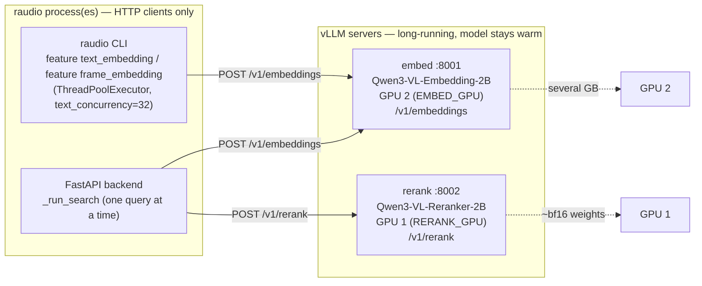
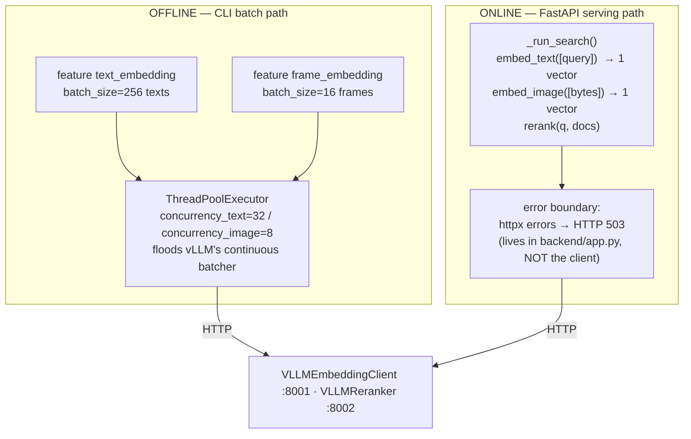
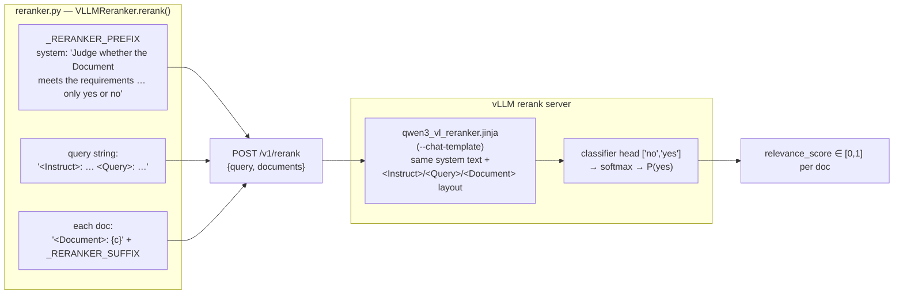
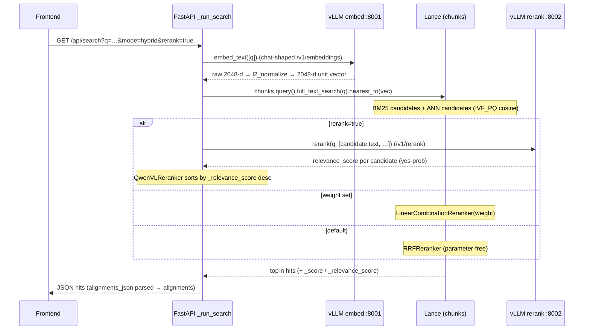
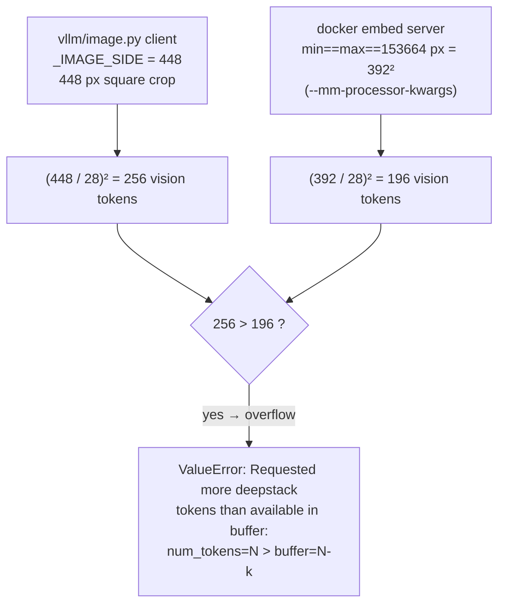

# Multimodal embeddings & reranking (Qwen3-VL + vLLM)

> How `raudio` turns Swedish transcript text and video frames into 2048-d
> vectors, and how it cross-encodes query/document pairs for reranking. This is
> the "shared seam" of the project — read [GUIDE.md §7](../GUIDE.md#7-the-shared-seam-embeddingspy)
> for where it sits in the wider architecture, and [TODO.md](../TODO.md) for the
> open blockers. The recurring GPU crash that gates frame embedding has its own
> deep-dive in **[INVESTIGATION.md](INVESTIGATION.md)** — read that before you
> touch image resolution or vLLM warmup.

Source of truth: [`src/raudio/vllm/embedding.py`](../src/raudio/vllm/embedding.py),
[`src/raudio/vllm/reranker.py`](../src/raudio/vllm/reranker.py),
[`Makefile`](../Makefile) (the `embed-server` / `rerank-server` / `*-docker`
targets), [`src/raudio/cli/`](../src/raudio/cli/) (`feature text_embedding`,
`feature frame_embedding`), [`backend/app.py`](../backend/app.py) (`_run_search`), and
the chat template [`src/raudio/retrieval/qwen3_vl_reranker.jinja`](../src/raudio/retrieval/qwen3_vl_reranker.jinja).

---

## 1. The two models, in one table

The embedding model is a 2B Qwen3-VL variant (the reranker is also a 2B variant), served by vLLM as long-running HTTP
servers. The embedder produces vectors; the reranker produces relevance scores.

| | **Embedding** | **Reranker** |
|---|---|---|
| Model ID | `Qwen/Qwen3-VL-Embedding-2B` | `Qwen/Qwen3-VL-Reranker-2B` |
| Role | bi-encoder: text **and** image → one shared vector space | cross-encoder: `(query, document)` pair → one relevance score |
| Native output | **2048-d** embedding (MRL-capable, but we keep the full width) | logits over a `["no", "yes"]` classifier head |
| What raudio stores/uses | the full **2048** dims (`EMBED_DIM`), L2-normalized | `relevance_score ∈ [0, 1]` = softmax→`yes` probability |
| Compared via | **cosine** distance (IVF_PQ index) | sort by score, descending |
| HTTP endpoint | `POST /v1/embeddings` (chat-shaped) | `POST /v1/rerank` |
| Default URL | `http://127.0.0.1:8001` (`DEFAULT_EMBED_URL`) | `http://127.0.0.1:8002` (`DEFAULT_RERANK_URL`) |
| GPU (Makefile) | `EMBED_GPU ?= 2` | `RERANK_GPU ?= 1` |

The Python defaults live in the client constructors (`VLLMEmbeddingClient` in
`vllm/embedding.py`, `VLLMReranker` in `vllm/reranker.py`) and the
module constants `EMBED_MODEL`, `RERANK_MODEL`, `DEFAULT_EMBED_URL`,
`DEFAULT_RERANK_URL`. The vector width is `EMBED_DIM = 2048` in
[`model/schema.py`](../src/raudio/model/schema.py) — the single source of truth.

**Why the full 2048-d (no MRL truncation)?** Qwen3-VL-Embedding-2B emits a
2048-d vector. It is Matryoshka-trained, so you *could* slice to a shorter prefix
(e.g. 1024) to halve storage + index cost — but `raudio` keeps the full width for
maximum retrieval fidelity. The only transform is L2-normalization (the vLLM
pooler returns un-normalized vectors), in `vllm/image.py::l2_normalize`:

```python
# vllm/image.py — l2_normalize()
norms = np.linalg.norm(arr, axis=1, keepdims=True)
return (arr / norms).astype(np.float32)     # unit vectors, full 2048-d
```

Because both text and frame embeddings land in the **same** 2048-d unit-sphere
space, cross-modal search is a plain cosine compare: a text query vector can be
matched against `frame_embedding`, and an image query vector against
`text_embedding`. The backend leans on this in `mode=visual` and `mode=all`.

---

## 2. Serving topology — vLLM out of process

The single most important architectural fact: **vLLM does not run inside the
`raudio` process.** It runs as two independent, long-lived HTTP servers, and
*both* the offline CLI and the online FastAPI backend are merely HTTP clients of
them.



### Why out of process? (three independent reasons, all real)

1. **Torch pin conflict.** vLLM ships its own pinned `torch`/`torchaudio`, which
   conflicts with the project's `cu128` pin (`torch==2.11.0+cu128`,
   `torchaudio==2.11.0+cu128` in [`pyproject.toml`](../pyproject.toml)). The
   pyproject comment is explicit: *"vLLM is NOT a project extra: its
   torch/torchaudio pins conflict with our cu128 versions. Run it instead via
   `uvx`."* The `embed-server` / `rerank-server` targets launch it in a
   `uvx`-managed ephemeral env so the two trees never have to resolve together.
2. **Cold start is expensive.** Loading the embedding model takes **tens of seconds** and pins
   **several GB** of GPU memory (2B weights ~4.4 GB; total scales with `--gpu-memory-utilization`). If that happened per CLI
   invocation, every `raudio feature text_embedding` resume would re-pay it; every FastAPI
   restart would re-load. A long-lived server amortizes the load — the model
   stays *warm* across all uses.
3. **Free throughput.** A persistent server gives vLLM's continuous batcher
   something to batch: many concurrent requests fuse into one GPU pass.

The client-side dependency footprint is deliberately tiny — the `[multimodal]`
extra (`Pillow`, `numpy`, `httpx`, `tqdm`) is pure HTTP-client code with **no
GPU and no torch**, so installing it never conflicts with the cu128 pin and
FTS-only deployments need no GPU at all.

### Why two GPUs?

The Makefile pins the servers to **distinct** GPUs (`EMBED_GPU ?= 2`,
`RERANK_GPU ?= 1`) on purpose. From the Makefile comment: *co-locating both on
one GPU triggers vLLM 0.20.0's "memory profiling" race — when one server frees a
few GB during init, the other's `profile_run` aborts with an AssertionError.*

---

## 3. Launching the servers (Makefile targets)

There are two launch paths for each server. Both expose the *same* OpenAI-style
endpoints; pick based on your driver situation.

| Target | Path | When to use |
|---|---|---|
| `make embed-server` | `uvx --from vllm==0.22.0 vllm serve …` | host has a CUDA-12.9 (driver ≥ 575) capable driver |
| `make rerank-server` | `uvx --from vllm==0.22.0 vllm serve …` | same |
| `make embed-server-docker` | `docker run vllm/vllm-openai:v0.22.0 …` | **recommended on Blackwell + driver 12.8** — bundles its own CUDA |
| `make rerank-server-docker` | `docker run vllm/vllm-openai:v0.22.0 …` | same |
| `make vllm-stop` | `docker stop raudio-embed raudio-rerank` | stop the docker servers |
| `make kernels-prepare` | pre-fetch FlashAttention-3 kernels (sm_120) | one-time, ~200 MB |

**vLLM is pinned to one build across both paths** (`VLLM_PIN ?= vllm==0.22.0`,
`VLLM_IMAGE ?= vllm/vllm-openai:v0.22.0`, reasoning inline in the Makefile):

- vLLM ≥ 0.20 requires NVIDIA driver ≥ 575 (CUDA 12.9). On a host whose driver
  only supports CUDA 12.8, the native (`uvx`) server "driver too old"-crashes at
  engine init → use the **docker** path, which brings its own CUDA userspace.
- On Blackwell (sm_120) the bundled FlashAttention-2 PTX gap is covered by the HF
  `kernels` package + FA3 cache (`make kernels-prepare`); the `uvx` targets run
  with `--with kernels` so FA3 is available.

`make kernels-prepare` (HF `kernels` package + FA3 cache for sm_120) is the
intended workaround for the FA2/PTX gap; the **docker** path additionally
sidesteps the host-driver problem by bringing its own CUDA userspace. Note the
docker targets use
`--device=nvidia.com/gpu=$(GPU)` (CDI by name) rather than `--gpus all`, because
Docker 27+ routes `--gpus all` through CDI for *all* vendors and aborts with
"AMD CDI spec not found" on NVIDIA-only hosts.

### Key server flags (and what they wire up)

**Embed server** (`embed-server` / `embed-server-docker`):

```
--model Qwen/Qwen3-VL-Embedding-2B
--runner pooling                 # pooling runner = emit embeddings, not chat tokens
--port 8001
--dtype bfloat16
--gpu-memory-utilization 0.85    # EMBED_MEM_FRAC (own GPU → can use most of it)
--max-model-len 8192
--limit-mm-per-prompt '{"image": 1}'
# docker variant additionally pins pixels (see §6):
--mm-processor-kwargs '{"min_pixels": 153664, "max_pixels": 153664}'
```

**Rerank server** (`rerank-server` / `rerank-server-docker`):

```
--model Qwen/Qwen3-VL-Reranker-2B
--runner pooling
--port 8002
--max-model-len 4096
--hf_overrides '{"architectures":["Qwen3VLForSequenceClassification"],
                 "classifier_from_token":["no","yes"],
                 "is_original_qwen3_reranker":true}'
--chat-template ./src/raudio/retrieval/qwen3_vl_reranker.jinja
# docker variant disables image/video profiling (reranker is text-only here):
--limit-mm-per-prompt '{"image": 0, "video": 0}'
```

The reranker is **not** an embedding model — the `hf_overrides` reconfigure it as
`Qwen3VLForSequenceClassification` with a two-token (`no`/`yes`) classifier head.
That, plus the chat template, is what turns `/v1/rerank` into a yes/no relevance
scorer. The docker rerank target also disables image+video multimodal profiling
(`{"image": 0, "video": 0}`) — raudio only ever sends text query/doc strings to
the reranker, so this frees ~1 GB and skips a multimodal warmup it would never
use.

---

## 4. The shared seam: one client, two callers

`vllm/embedding.py` exposes `VLLMEmbeddingClient` (`embed_text`,
`embed_image`); `vllm/reranker.py` exposes `VLLMReranker` (`rerank`) plus
the `QwenVLReranker` LanceDB adapter. The two callers drive them differently.



**Offline (`feature text_embedding` / `feature frame_embedding`).** vLLM's chat-embeddings
endpoint takes one chat at a time, but the engine batches internally — so the
client fires many requests *concurrently* via a `ThreadPoolExecutor`
(`concurrency_text=32`, `concurrency_image=8`) and lets vLLM's continuous batcher
fuse them into one GPU pass. The docstring claims ~10–15× over serial RTT. The
CLI layers an outer batch on top (`feature text_embedding --batch-size 256`,
`feature frame_embedding --batch-size 16`).

**Online (`_run_search`).** The backend issues **one query at a time**
(`client.embed_text([spec.q])[0]`, `client.embed_image([image_bytes])[0]`). It
connects lazily — `_get_embedder()` / `_get_reranker()` only construct the client on
the first semantic-mode call, so an FTS-only deployment never needs vLLM up. The
**error boundary is in `backend/app.py`, not in the client**: any
`httpx.ConnectError` / `HTTPError` from the embed call is caught in `_run_search`
and converted into a structured **503** ("embedding service unavailable") so the
frontend shows a meaningful message instead of a 500. Keep that boundary where it
is.

> The POST handler offloads `_run_search` to `run_in_threadpool(...)` because the
> client makes *blocking* httpx + Lance calls; doing that inline would stall the
> async event loop.

### The text embedding request shape

`raudio` does **not** use the plain `input: [str]` form of `/v1/embeddings`. It
sends a Qwen-VL **chat-shaped** request — `system` (the instruction) + `user`
(the content) + an empty trailing `assistant` turn — with the vLLM extensions
`continue_final_message: true` and `add_special_tokens: true`:

```python
# _text_messages() + _post_embeddings()
messages = [
    {"role": "system",    "content": [{"type": "text", "text": "Represent the user's input."}]},
    {"role": "user",      "content": [{"type": "text", "text": text}]},
    {"role": "assistant", "content": [{"type": "text", "text": ""}]},
]
body = {"model": embed_model, "messages": messages, "encoding_format": "float",
        "continue_final_message": True, "add_special_tokens": True}
# → data["data"][0]["embedding"]   (raw 2048-d, before L2-normalize)
```

The system instruction is `DEFAULT_EMBED_INSTRUCTION = "Represent the user's
input."` — per the Qwen model card, **English** instructions yield the best
results even when the content is Swedish. The image request (`_image_messages`)
is identical except the user turn carries an `image_url` data-URL block (and an
empty trailing `text` block, as the Qwen examples do for pure-image mode).

---

## 5. The reranker: double-scaffolding (Python ↔ Jinja)

This is the subtlety most likely to bite you. The Qwen reranker's prompt framing
exists **twice**, and the two copies must stay byte-compatible:



In Python (`vllm/reranker.py`), `rerank()` wraps the query and each document in the
model-card scaffolding before posting:

```python
_RERANKER_PREFIX = ('<|im_start|>system\n'
    'Judge whether the Document meets the requirements based on the Query '
    'and the Instruct provided. Note that the answer can only be "yes" or "no".'
    '<|im_end|>\n<|im_start|>user\n')
_RERANKER_SUFFIX = "<|im_end|>\n<|im_start|>assistant\n"

q_template    = f"{_RERANKER_PREFIX}<Instruct>: {rerank_instruction}\n<Query>: {query}\n"
docs_template = [f"<Document>: {c}{_RERANKER_SUFFIX}" for c in candidates]
body = {"model": rerank_model, "query": q_template, "documents": docs_template}
```

On the server, [`qwen3_vl_reranker.jinja`](../src/raudio/retrieval/qwen3_vl_reranker.jinja)
applies the **same** system text and the same `<Instruct>` / `<Query>` /
`<Document>` layout. The default instruction in both places is *"Given a search
query, retrieve relevant candidates that answer the query."* (`RERANKER_INSTRUCTION`
in Python; the `default(...)` in the Jinja `<Instruct>` block).

> **⚠️ If you edit one, edit the other.** The Python constants build the
> `/v1/rerank` strings; the Jinja template is what the server actually renders
> into tokens. Drift between them silently degrades relevance — the model was
> trained on this exact framing. Treat changes here as risky (see
> [GUIDE.md §7](../GUIDE.md#7-the-shared-seam-embeddingspy)).

The response (`data["results"]`) may come back unordered, so `rerank()` re-sorts
by the returned `index` to preserve the caller's candidate order before returning
the list of `relevance_score` floats.

### Plugging into Lance: `QwenVLReranker`

`QwenVLReranker(reranker)` wraps a `VLLMReranker` as a `lancedb.rerankers.Reranker`
subclass so it drops straight into Lance's hybrid query API. Its `_score()`
takes the top-K candidate Arrow table (`top_k_to_rerank=100` by default), reads
the `text` column, calls `client.rerank(query, docs)`, appends the scores as
`_relevance_score`, and sorts descending. It implements `rerank_hybrid`,
`rerank_vector`, and `rerank_fts`, so it works in every Lance query path.

---

## 6. How search uses embeddings (`backend/app.py` `_run_search`)

`/api/search` accepts a `mode`; `_run_search` routes each one differently. Only
`fts` needs no GPU; everything else calls `get_client()` first (and 503s if vLLM
is down).

| `mode` | Signal | Implementation |
|---|---|---|
| `fts` | Tantivy BM25 over `chunks.text` | `chunks.search(MatchQuery/PhraseQuery)` — **no embeddings** |
| `semantic` | cosine over `chunks.text_embedding` | `_vector_search(..., "text_embedding")` with embedded query |
| `visual` | cosine over `frame_embedding` | `_vector_search(..., "frame_embedding")` — image query *or* text query (shared space) |
| `hybrid` | FTS **+** text-vector, fused | Lance native `full_text_search().nearest_to().rerank(...)` |
| `all` | FTS + text-vector + frame-vector | three rankings fused by `_rrf_fuse()`, optional rerank |

**The fusion choice in `hybrid` is a priority ladder** (verbatim from
`_run_search`):



The ladder, in code order:

1. `rerank=true` → **`QwenVLReranker`** (the cross-encoder; biggest quality bump,
   most latency).
2. else `weight` supplied → **`LinearCombinationReranker(weight)`**
   (`weight ∈ [0,1]`: 0 = pure FTS, 1 = pure vector).
3. else → **`RRFReranker()`** — Lance's default, parameter-free
   reciprocal-rank fusion.

So `rerank=true` **swaps RRF for the Qwen cross-encoder**, exactly as advertised.
For `mode=all`, raudio issues *three* separate rankings (FTS, text-vector,
frame-vector) and fuses them with its own `_rrf_fuse()` helper (keyed on
`(doc_id, chunk_id)`, `k=60`), because Lance's native RRF only handles the
single FTS-plus-one-vector case; `rerank=true` then optionally cross-encodes the
fused top-K.

> **Frame data still pending:** `mode=visual` / the `mode=all` frame branch now
> query the `chunk_frames` table (`_frame_search`, joined back to `chunks`), not a
> column on `chunks`. The wiring is done; it returns hits only once
> `feature frame_embedding` has populated `chunk_frames.frame_embedding` — still gated
> on the vLLM image-embed crash ([INVESTIGATION.md](INVESTIGATION.md)).

---

## 7. The recurring crash: image resolution mismatch (448 vs 392)

This is **the** bug that has blocked `feature frame_embedding` from ever completing
end-to-end. It deserves the full deep-dive in
**[INVESTIGATION.md](INVESTIGATION.md)**; the short version, grounded in the
code comments:



The mechanics (from the comment block above `_IMAGE_SIDE`):

- Qwen3-VL uses a 14 px patch with a 2× spatial merge → an effective **28 px**
  tile, so an `S×S` image yields `(S/28)²` vision tokens.
- vLLM (0.20.0) sizes its deepstack-input-embeds buffer at **warmup** time for
  *its own dummy image*, but honours the runtime `mm_processor_kwargs` at request
  time. If runtime tokens exceed the warmup buffer, the engine dies.
- The fix is to make the token count **deterministic and below the warmup
  ceiling** by pinning every image to one resolution. The docker embed server
  pins `min_pixels == max_pixels == 153664` (= 392²) → **196** tokens.

The mismatch: the **client crops to 448** (`_IMAGE_SIDE = 448`) → **256** tokens,
which overflows the server's 196-token buffer. The documented fix is to set
`_IMAGE_SIDE = 392` so client and server agree. It is **left at 448 pending
end-to-end GPU validation** — `feature frame_embedding` has never completed a full
run, so the change hasn't been verified. (See the inline comment marked
"⚠️ KNOWN MISMATCH", [TODO.md](../TODO.md) item #2, and
[INVESTIGATION.md](INVESTIGATION.md).)

`_square_crop_resize()` does a center-crop to a square then resizes to
`_IMAGE_SIDE`; aspect ratio is deliberately sacrificed because we only care about
whole-image similarity. Whatever you set `_IMAGE_SIDE` to, **it must satisfy
`(side/28)² ≤ server warmup buffer`** — that invariant is the whole point.

> Two unblock options are on the table (TODO #2), both ~80 LOC: **(A)** an
> in-process `transformers` `HFClient` that bypasses vLLM image internals
> entirely (you'd add a second client class in `vllm/` —
> only the vLLM transport is implemented today), or **(B)** a different vLLM tag. Ask before
> implementing.

---

## 8. The offline embed CLI commands

| Command | Reads | Writes | Index | Resumable |
|---|---|---|---|---|
| `feature text_embedding` | `chunks.text` | `chunks.text_embedding` (2048-d) via `add_columns` | IVF_PQ cosine | yes — checkpointed UDF; `--all` rebuilds |
| `feature frame_embedding` | `chunk_frames.frame_blob` | `chunk_frames.frame_embedding` (2048-d) via `add_columns` | IVF_PQ cosine | one-shot (skips if column exists) |

Both default to `--embed-url http://127.0.0.1:8001` and build the IVF_PQ index
with `num_partitions=256`, `num_sub_vectors=64` on completion. Both attach the
vector column with `dataset.add_columns(...)` (Lance "data evolution" — one new
column file, no fragment rewrites), implemented in `raudio.features.engine`
(`upsert_scan_column` / `upsert_blob_column` / `ensure_vector_index`) and driven by
the `embed_text_column` / `embed_frame_column` feature definitions in
`raudio.features.columns`. They differ only in how the UDF gets its input:

- `feature text_embedding` is **single-pass**: a `lance.batch_udf` reads each batch's own
  `text` column and returns that batch's `text_embedding`, so there is no
  cross-scan alignment to get wrong. Crash-resumable via `--checkpoint`. Re-runs
  are a no-op; `--all` drops and rebuilds. Residual `NULL` rows from a later
  ingest are topped up with `merge_insert` on the chunk key — safe because
  `chunks` carries no blob column.
- `feature frame_embedding` is **two-pass**: a frame's JPEG lives in a Blob V2 column
  a scan doesn't materialise, so pass 1 reads each blob via
  `take_blobs(ids=row_ids)` and embeds it keyed by `_rowid`; pass 2's
  `add_columns` UDF reads `_rowid` and looks each vector up by id —
  order-independent and race-free. Frames live in a separate append-only
  `chunk_frames` table because Lance 4.0's `merge_insert` crashes the decoder on
  the wide `chunks` schema when filling blob columns (see INVESTIGATION.md §A1).

`ensure_vector_index` **refuses to build while the column still has NULLs** —
Lance's IVF_PQ builder mishandles partially-NULL vector columns. So the full
chain is `feature text_embedding → extract-chunk-frames → feature frame_embedding → compact`
(see `make pipeline-multimodal`), with `compact` consolidating fragments and
rebuilding the indexes after the bulk writes.

---

## 9. Quick reference: "where do I look for…?"

| I want to… | Look at |
|---|---|
| Change the embed/rerank wire format | [`src/raudio/vllm/embedding.py`](../src/raudio/vllm/embedding.py) / [`src/raudio/vllm/reranker.py`](../src/raudio/vllm/reranker.py) **and** [`qwen3_vl_reranker.jinja`](../src/raudio/retrieval/qwen3_vl_reranker.jinja) (keep in sync!) |
| Change the MRL dim / normalization | `EMBED_DIM` in `model/schema.py`; `l2_normalize()` in `vllm/image.py` |
| Change image resolution (the crash) | `_IMAGE_SIDE`, `_square_crop_resize()` in `vllm/image.py` + [INVESTIGATION.md](INVESTIGATION.md) |
| Launch / configure the vLLM servers | [`Makefile`](../Makefile) — `embed-server*`, `rerank-server*` targets |
| Change which GPU each server uses | `EMBED_GPU` / `RERANK_GPU` in the Makefile |
| Change search fusion / add a mode | [`backend/app.py`](../backend/app.py) — `_run_search`, `_vector_search`, `_rrf_fuse` |
| Add a non-vLLM backend (e.g. HF) | add a client class in `vllm/` and wire it into `backend/app.py` / `cli/` |
| Run the offline embed passes | `feature text_embedding` / `feature frame_embedding` in [`cli/`](../src/raudio/cli/); column definitions in [`features/columns.py`](../src/raudio/features/columns.py) |
| Understand the open blockers | [TODO.md](../TODO.md) (items #2–#5) |
