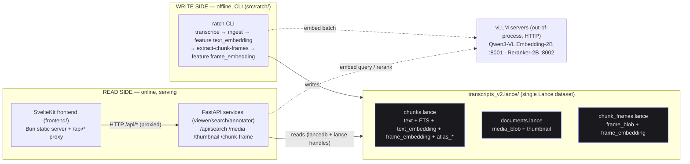
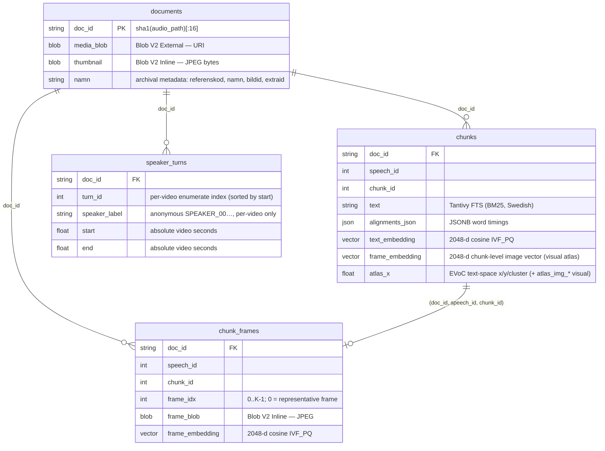
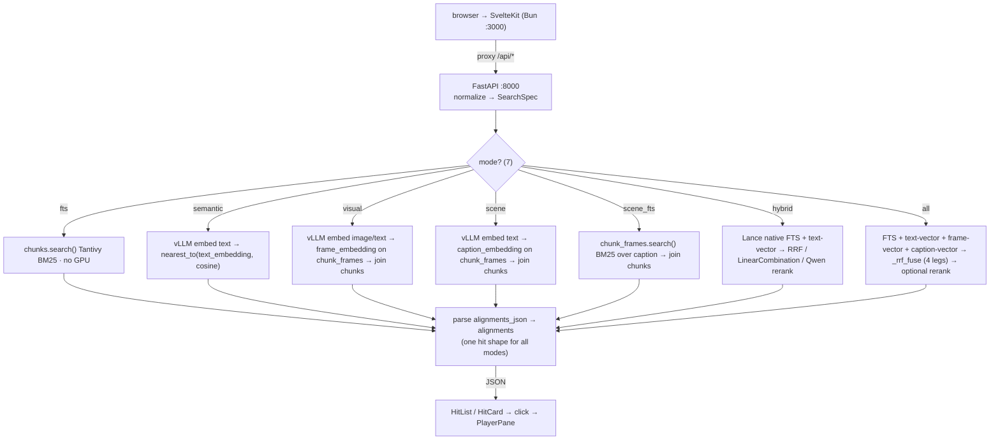

# ratch — Architecture & Onboarding Guide

> A developer's map of `lance-audio`. The [README](../README.md) is the quickstart
> (how to install and run); this guide is the **why and how** — the mental
> model, the data flow, the design decisions, and where to look for things.
> For the running task list see [TODO.md](TODO.md); for the bigger forward-looking
> architecture bets (Ray/KubeRay inference, Lance maintenance & namespacing,
> schema flexibility, KG overhaul) see [WHATS_LEFT.md](WHATS_LEFT.md).

---

## 1. What this is, in one paragraph

`ratch` is a **searchable archive viewer for Swedish press-conference video
transcripts**. It ingests [`easytranscriber`](https://github.com/kb-labb/easytranscriber)
output (word-aligned transcript JSON + the source MP4) into a single, self-contained
[Lance](https://lancedb.com) dataset, then serves keyword / semantic / visual /
scene / hybrid / fused search (seven modes), a 2-D Atlas map of the corpus, and
synchronized video playback through a typed HTTP API and a SvelteKit UI. Everything — text, metadata, embeddings, thumbnails, per-chunk
video frames, and the media URIs — lives in **one Lance database**; there are no
sidecar JSON files or disk walks at query time.

**Deep-dive docs** (this guide is the overview; these go deep with diagrams):
- [`docs/PIPELINE.md`](PIPELINE.md) — the ASR pipeline & models (easytranscriber / easyaligner, KB-Whisper, wav2vec2, MMS-LID).
- [`docs/STORAGE.md`](STORAGE.md) — how ratch uses Lance (Blob V2 tiers, JSONB, IVF_PQ / FTS).
- [`docs/EMBEDDINGS.md`](EMBEDDINGS.md) — Qwen3-VL embeddings + reranking over vLLM.
- [`docs/VOICE.md`](VOICE.md) — speaker voiceprints + cross-video voice search (pyannote WeSpeaker, `/api/voice`).
- [`docs/INVESTIGATION.md`](INVESTIGATION.md) — root-cause analysis of the Lance indexation + vLLM crash issues.

---

## 2. The mental model: one write side, one read side



> Both the CLI batch path and the backend serving path call the **same**
> `src/ratch/clients/embedding.py` client (the "shared seam", §7) → the same
> out-of-process vLLM servers.

- **Write side** = `src/ratch/` (the `ratch` Typer CLI + the ingest/extract
  modules). Run offline, GPU-heavy, idempotent/resumable.
- **Read side** = `services/{viewer,search}` (FastAPI) + `frontend/apps/media` (SvelteKit). Run online,
  mostly CPU; only the embedding step needs a GPU and that lives in a **separate
  vLLM process** reached over HTTP, so FTS-only use works with no GPU at all.
- **`src/ratch/clients/embedding.py` is the one module both sides share** — see §7.

---

## 3. Tech stack

| Layer | Choice | Notes |
|---|---|---|
| Storage / search | **Lance / LanceDB** (file format 2.2) | Columnar store + Tantivy BM25 FTS + IVF_PQ vector index + Blob V2 |
| Transcript parsing | **Pydantic v2** | Typed model of easytranscriber JSON; `model_validate_json` at the ingest boundary |
| Arrow plumbing | **PyArrow** | Schemas, table materialization, blob/JSON extension columns |
| API | **FastAPI** + **Starlette** + **uvicorn** | API-only; HTTP Range streaming off Lance Blob V2 |
| Embeddings / rerank | **vLLM** serving **Qwen3-VL-Embedding-2B** / **-Reranker-2B** | Out-of-process, OpenAI-compatible HTTP; full 2048-d (no truncation) |
| Media | **ffmpeg** (subprocess) | Thumbnails + per-chunk frame extraction |
| ASR (upstream) | **easytranscriber** `0.2.3` + **easyaligner** `0.2.3` (Whisper/ct2 + wav2vec2 alignment) | PyPI deps (`easytranscriber` declared in `pyproject.toml`; `easyaligner` transitive); torch pinned to `cu128` |
| Frontend | **SvelteKit 2 / Svelte 5** (runes), **TypeScript**, **Vite**, **Tailwind 4**, **Zod**, **bits-ui**, **Bun** | SPA (`adapter-static`, `ssr=false`); Bun server proxies `/api/*` |
| Python toolchain | **uv** + **ruff** + **ty** + **pytest** | `uv run` / `uvx`; lint + type config in `pyproject.toml` |
| Orchestration | **GNU Make** | `Makefile` is the single source of truth for how every piece runs together |

**Why vLLM is out-of-process (not a Python dep):** its torch pins conflict with
our `cu128` pin, and loading a Qwen3-VL model takes tens of seconds + several GB of VRAM. Running it
as a long-lived `uvx`/docker server means the model loads once and stays warm
across every CLI run and API restart, and gets continuous-batching throughput
for free. The CLI/backend are just HTTP clients of it.

---

## 4. The data model — four core Lance tables (+ a derived `topics.lance`)

All four core tables live inside one `transcripts_v2.lance/` directory (gitignored —
local working data). Schemas: [`src/ratch/model/schema.py`](src/ratch/model/schema.py).
A fifth, single-row `topics.lance` is written on the read side by `feature topics`
(its `hierarchy` column holds the nested topic tree) and is served by `/api/topics`
(`services/viewer/api/v1/endpoints/topics.py`) — see §6.

| Table | Grain | Carries | Key columns |
|---|---|---|---|
| **`chunks`** | one row per ~30 s transcript chunk | FTS text, metadata, alignments JSON, **two** vector columns — `text_embedding` (2048-d) and `frame_embedding` (2048-d, the chunk-level image vector) — plus the nine EVōC atlas columns: `atlas_x/y/cluster` (text), `atlas_img_x/y/cluster` (visual), `atlas_cap_x/y/cluster` (caption) — plus the topic columns `topic_l*`/`doc_topic` written by `feature topics` | `(doc_id, speech_id, chunk_id)` |
| **`documents`** | one row per source media file | `media_blob` (Blob V2 *External* URI), `thumbnail` (Blob V2 *Inline* bytes), metadata | `doc_id` |
| **`chunk_frames`** | one row per extracted frame (a chunk can hold N frames, `frame_idx` 0..K-1; `frame_idx=0` is the single representative frame) | `frame_blob` (Blob V2 Inline JPEG), `frame_embedding` (2048-d, added later) | `(doc_id, speech_id, chunk_id, frame_idx)` |
| **`speaker_turns`** | one row per diarized speaker turn (a video produces N turns) | `speaker_label` (anonymous pyannote label `SPEAKER_00`…, stable only *within* one video), `start` / `end` in **absolute video seconds**. **No** vector/blob column → no IVF/vector index | `(doc_id, turn_id)` |

`doc_id` is `sha1(audio_path)[:16]` — deterministic, so re-ingesting the same
file is stable.



See [`docs/STORAGE.md`](STORAGE.md) for the full Lance storage deep-dive.

**Why `chunk_frames` is a separate table** (the single most important schema
fact): Lance 4.0's `merge_insert` crashes its encoder when backfilling blob
columns post-hoc on the *wide* `chunks` schema (multiple extension types at
once). The Lance 2.2 docs recommend "append + `add_columns`" for data evolution,
so frames go into their own append-only table: `extract-chunk-frames` writes new
fragments, `feature frame_embedding` attaches `frame_embedding` via
`dataset.add_columns(...)`. No `merge_insert`. Visual / cross-modal search runs
the frame-vector query against `chunk_frames` and joins back to `chunks` for the
hit payload (`services/search/services/service.py::_frame_search`).

`chunks` *does* carry a **chunk-level** `frame_embedding` (a second 2048-d vector
column) — but that is a distinct, atlas-only column: `feature atlas --space visual`
joins the representative frame (`frame_idx=0`) up onto `chunks` so the visual
EVōC projection (`atlas_img_*`) can be computed. It is **not** the per-frame
vector that backs visual search; that one lives on `chunk_frames` and is what
`_frame_search` queries.

**Why `speaker_turns` is its own table too:** speaker diarization ("who spoke
when") is produced *per video* as a unit (one pyannote pass → that video's whole
set of turns), so it follows the same "append-only, never `merge_insert` into the
wide `chunks` schema" rationale as `chunk_frames`. It carries **no** embedding or
blob column — it is pure timeline metadata (anonymous label + absolute-second
`start`/`end`) — so there is **no** IVF/vector index on it; the only useful index
is an optional scalar BTREE on `doc_id` to speed the per-video lookup at
full-corpus scale. The labels (`SPEAKER_00`, `SPEAKER_01`, …) are **anonymous and
local to one video** — they identify distinct speakers *within* that recording but
carry no identity across videos (the cross-video "voice search" axis is built
*on top of* these turns — per-turn voiceprints + `/api/voice`, see
[VOICE.md](VOICE.md)).

**Blob V2 cheat-sheet** (load-bearing constraints):

- *External* = the column stores a **URI string** (`file://`, `hf://`, `s3://`)
  wrapped with `lance.blob_array([...])`; bytes live wherever the URI points.
- *Inline* = small bytes (<64 KB) wrapped with `blob_array([...])`, stored in the
  main data page.
- Read both via `ds.take_blobs(col, indices=[...])[0]` → a lazy, seekable
  `BlobFile`. This is why HTTP Range maps cleanly to `seek(start) + read(len)`.
- You **cannot** build a `blob_field` or `pa.json_()` column with
  `pa.array(values, type=...)`; you must wrap blob columns with `blob_array(...)`
  and build JSON columns per-declared-field-type. Both writers in `ingest/ingest.py`
  special-case these.
- Blob columns require `data_storage_version="2.2"`, which `lancedb.create_table`
  can't set — so `ingest/ingest.py` writes the first dataset via
  `lance.write_dataset(mode="create", data_storage_version="2.2", allow_external_blob_outside_bases=True)`
  then re-opens it through lancedb.

---

## 5. End-to-end information flow

### Build side (offline pipeline)

```mermaid
flowchart TD
    S0["video_batcher.csv<br/>(local, gitignored seed)"] -->|"ratch download<br/>(httpx → iiifintern-ai.ra.se)"| S1["input/sv/{bildid}.mp4"]
    S1 -->|"ratch detect-language<br/>(Whisper-large-v3 / MMS-LID)"| A["input/&lt;lang&gt;/*.mp4<br/>(sorted; corpus is sv-only)"]
    A -->|"ratch transcribe<br/>(easytranscriber → KB-Whisper)"| C["output/&lt;lang&gt;/alignments/*.json"]
    C -->|"ratch thumbnail (ffmpeg)"| D["thumbnails/{stem}.jpg"]
    C --> E
    D --> E
    E["ratch ingest<br/>JSON → chunks + documents · FTS + scalar indexes"] --> F
    F["ratch feature text_embedding<br/>Qwen3-VL text → text_embedding · IVF_PQ"] --> G
    G["ratch extract-chunk-frames<br/>ffmpeg → chunk_frames.lance (append-only)"] --> H
    H["ratch feature frame_embedding<br/>Qwen3-VL image → frame_embedding (add_columns)"] --> I
    I["ratch feature caption + caption_embedding<br/>Gemma 4 Swedish caption (:8003) → IVF_PQ"] --> J
    J["ratch extract-speaker-turns<br/>(pyannote → speaker_turns.lance)"] --> K
    K["ratch feature atlas / atlas-visual / atlas-caption<br/>EVōC → atlas_* (text/visual/caption)"] --> L
    L["ratch feature topics<br/>topic_l*/doc_topic + topics.lance"] --> M
    M["ratch compact<br/>compact fragments + rebuild indexes"] --> DB["(transcripts_v2.lance)<br/>self-contained dataset"]

    classDef done fill:#1a1a1e,stroke:#34d399,color:#e9e9ea;
    class S0,S1,A,C,D,E,F,G,H,I,J,K,L,M done;
```



> 🟢 = validated end-to-end on the live DB (`transcripts_v2.lance`: 145,175 chunks
> / 1,154 documents / 145,175 chunk_frames). The frame stages
> (`extract-chunk-frames` / `feature frame_embedding`) are **done** — all 145,175
> frames are embedded and IVF-indexed (`frame_embedding_idx`). **Captions are also
> built** (`make captions` = `feature caption` + `caption_embedding`, needs the
> Gemma server on `:8003`): `chunk_frames.caption` + `caption_embedding` are fully
> populated, so the `scene` / `scene_fts` modes return hits. Detailed pipeline +
> models: [`docs/PIPELINE.md`](PIPELINE.md).

The corpus seed is a local, gitignored `video_batcher.csv`
(`referenskod;namn;extraid;bildid`, ~1576 rows, never committed); `ratch download`
pulls each row's `bildid` as `https://iiifintern-ai.ra.se/api/audiovideo/{bildid}.mp4`
into `input/sv/`, then `detect-language` (Whisper-large-v3) sorts the Swedish files
into `input/sv/sv/` and the pipeline continues sv-only.

`ingest` is the heart: `load_transcript` (Pydantic `model_validate_json`) → `flatten_chunks`
(walks speeches→chunks, joins the `video_batcher` CSV metadata by
`bildid == audio_path stem`, embeds word alignments as JSON) → materializes
PyArrow tables → writes `chunks` (+ `documents` when `--audio-root`/`--thumbnail-dir`
is given) → builds the Tantivy FTS index (Swedish stemmer) + BTREE scalar indexes.

### Read side (a search request)



**The seven search modes** (`services/search/services/spec.py`):

| Mode | Backs onto | What runs |
|---|---|---|
| `fts` | `chunks.text` | Tantivy BM25 (Swedish) — no GPU |
| `semantic` | `chunks.text_embedding` | text → cosine kNN |
| `visual` | `chunk_frames.frame_embedding` | image **or** text → cosine kNN over frames, joined back to `chunks` |
| `scene` | `chunk_frames.caption_embedding` | text → cosine kNN over the Swedish-caption text vectors (empty until captions are built) |
| `scene_fts` | `chunk_frames.caption` | BM25 over the caption text (empty until captions are built) |
| `hybrid` | `chunks` (text + `text_embedding`) | Lance native `query_type="hybrid"` — **must** pass `vector_column_name="text_embedding"` because `chunks` now has two vector columns; fused by `RRFReranker` (default) or `LinearCombinationReranker(weight)` for the Balance slider |
| `all` | up to **four** legs | `_rrf_fuse` over FTS(text) + text-vector(`text_embedding`) + frame-vector(`frame_embedding`; the image vector if an image is attached, else the text vector) + caption/scene-vector(`caption_embedding`) |

`all` fuses the legs with `_rrf_fuse` (RRF, `k=60`, 0-indexed rank, score
`Σ 1/(60+rank)`): the legs are issued independently and **unioned** by chunk
key, not chained. `prefilter` (`spec.prefilter`, default True) is applied only to
the `chunks`-table legs (`fts` / vector / `hybrid`); the frame legs
(`visual` / `scene`) filter **after** ranking, in `_frames_to_chunk_hits`. The
cross-encoder rerank (`src/ratch/clients/reranker.py`) reads **only** the transcript
`text` column over the top `rerank_n` hits and is a no-op for image-only queries.

Detailed embedding/serving flow: [`docs/EMBEDDINGS.md`](EMBEDDINGS.md).

### Playback (Range streaming)

```
<video src="/api/media/{doc_id}">  (with Range: bytes=…)
   → FastAPI resolves doc_id → Lance _rowid → ds.take_blobs("media_blob")[0]
   → BlobFile.seek(start) + read(len) streamed back as 206 Partial Content
```

Per-chunk frames are fetched on demand from `/api/chunk-frame/{doc_id}/{speech_id}/{chunk_id}?frame_idx=N`
(`frame_idx` defaults to 0, the representative frame);
the frontend stops asking after the first 404 (frames not extracted yet) via the
`feature-flags.svelte.ts` singleton.

### Speaker diarization (the "Speakers" tab)

A separate, offline pipeline answers **"who spoke when"** for each video. `ratch
extract-speaker-turns` runs [`pyannote/speaker-diarization-community-1`](https://hf.co/pyannote/speaker-diarization-community-1)
**in-process** (pyannote.audio is in the main venv — no isolated worker, no vLLM
server; GPU-accelerated when available, ~90 s/video, crash-resumable at video
granularity) and appends each video's turns to the `speaker_turns` table. On the
read side, `GET /api/diarization/{doc_id}` (`services/viewer/api/v1/endpoints/diarization.py`,
mounted by `create_app`) reads `speaker_turns.lance` on demand and returns
`{built, doc_id, turns[], speakers[]}` — `built: false` when the table or the doc
is absent. The frontend's **"Speakers"** tab in the player
(`frontend/src/lib/components/player-pane.svelte` → `diarization-timeline.svelte`,
fetched via `getDiarization()` in `api.ts`) draws per-speaker lanes with a
playhead synced to the `<video>` and click-to-seek; the player defaults to the
existing **Transcript** tab and the Speakers tab shows "Diarization not built for
this video" when absent. The labels are **anonymous per-video** (`SPEAKER_00`…) —
they distinguish speakers within one recording, never across the corpus.

> ```mermaid
> flowchart LR
>     V["source MP4"] -->|"ratch extract-speaker-turns<br/>(pyannote, in-process, GPU)"| ST["speaker_turns.lance<br/>(doc_id, turn_id, label, start, end)"]
>     ST -->|"GET /api/diarization/{doc_id}"| TAB["player → Speakers tab<br/>(diarization-timeline.svelte)"]
> ```

---

## 6. Where things live (navigation map)

```
src/ratch/                 model-free Ray Data orchestration over Lance (the pipeline)
├── cli/                   Typer app: subcommands (the operator entry point)
├── clients/               HTTP clients to remote vLLM servers (shared by CLI + services)
│   ├── base.py             VLLMTransport: shared httpx pool + concurrent fan-out
│   ├── embedding.py        VLLMEmbeddingClient + EmbeddingClient Protocol — SHARED SEAM
│   ├── reranker.py         cross-encoder: VLLMReranker + QwenVLReranker (Lance adapter)
│   ├── caption.py / summarize.py / image.py / schemas.py
├── core/                  the Ray seams (kernel — imports no modality/client code)
│   ├── dataset.py          create/append/overwrite with the lance-media invariants
│   ├── driver.py           Ray Data drivers: lance_ray.read_lance → warm-actor map_batches
│   ├── engine.py           upsert_scan_column / blob attach / index helpers
│   ├── registry.py         Stage — the declarative stage record (Stage.runner binding)
│   ├── runners.py          RunnerContext + resolve_runner_actor + per-runner runtime_env
│   └── jobs.py             the Ray Jobs seam (run_runner; mirrors lance-ns ray_submit)
├── features/              composition roots: FEATURES registry (columns.py), Ray AV
│                          append stages (ray_av.py), STAGES declarations (stages.py),
│                          EVōC projection, topic_tree
├── ingest/                JSON → chunks + documents tables; FTS/scalar indexes; audio.py
├── modalities/av/         PURE compute: ffmpeg frames/thumbnails/wav transcode,
│                          download, cluster — no models
├── model/                 DATA CONTRACTS: schema.py (PyArrow/Lance) + datamodel.py (Pydantic)
├── retrieval/             FTS query + pure helpers + the reranker chat template
└── lineage.py             Stage-aware OpenLineage emission (uses common lancekit primitives)

runners/                   EVERY MODEL'S HOME — one dir per model, own pyproject env
├── asr/                   easytranscriber transcribe + detect_language
├── diarize/               pyannote diarization: diarize.py + actor.py (compute_factory)
├── voiceprint/            WeSpeaker turn embeddings: voiceprint.py + actor.py
├── topics/                Toponymy: worker.py (Ray Job entrypoint) + deployment.py (Serve)
└── kg/                    LightRAG knowledge-graph scripts (job-only)

services/                  the split FastAPI backend (lance-ns services/ shape)
├── common/                shared kernel: lancekit (descriptor/predicate/reader/writer/
│                          blobs/lineage), core (config/exceptions/RFC-9457 handlers),
│                          schemas, state.py, deps.py
├── viewer/    :8101       read plane — media/blobs (Range/206), transcripts, datasets,
│                          atlas, graph, topics, voice, diarization
├── search/    :8102       retrieval — FTS/vector/hybrid over declared bindings, encoders, rerank
└── annotator/ :8103       write plane — annotations (merge_insert + 409), assist, jobs

frontend/                  turborepo (bun workspaces)
├── apps/media/            viewer zone (SvelteKit) + server.ts (per-domain /api + /annotate proxy)
│   └── e2e/               the three browser E2E suites (annotator/temporal/read-plane)
├── apps/annotator/        annotator zone (kit.paths.base=/annotate) — the write-plane UI
└── packages/              @lance/engine (annotation model, plain TS), @lance/labeling
                           (LabelOp axes), @lance/ui, @lance/api, @lance/config

Makefile                   end-to-end developer commands (source of truth for how it runs)
pyproject.toml             uv project: [multimodal]/[atlas]/[models] extras, ruff/ty/pytest config
tests/                     pytest suite (see TESTING.md) — no dataset, no GPU, no network
```

---

## 7. The shared seam: `clients/` (vLLM)

This is the most important coupling fact for onboarding. The `clients/` vLLM clients
— `VLLMEmbeddingClient` (`embedding.py`, the bi-encoder) and `VLLMReranker`
(`reranker.py`, the cross-encoder) — are used by **two** consumers with different
concurrency needs:

- **CLI batch path** (`feature text_embedding` / `feature frame_embedding`): floods vLLM's
  continuous batcher with a `ThreadPoolExecutor` (`text_concurrency=32`,
  `image_concurrency=8`) for ~10–15× throughput over serial RTT.
- **Backend serving path** (`/api/search`): one query at a time, lazily connects,
  and lets `httpx.HTTPError` propagate so the API layer can translate it into a
  single structured **503** ("embedding service unavailable"). The error boundary
  lives in `services/search/services/service.py` (`run_search` wraps the embed calls),
  **not** in the client — keep it that way.

A planned async-per-query path for the backend (see [TODO.md](TODO.md)) must
**preserve the sync ThreadPoolExecutor batch path** — the two coexist.

Two subtleties worth knowing:
- **Reranker double-scaffolding:** the model-card prefix/suffix framing is
  duplicated between the `_PREFIX`/`_SUFFIX` constants in `clients/reranker.py`
  (which build `/v1/rerank` strings) and `retrieval/qwen3_vl_reranker.jinja` (the chat
  template the server applies). They must stay in sync; treat edits as risky.
- **Image pinning:** `_IMAGE_SIDE = 392` square center-crop (`clients/image.py`) is a
  vLLM warmup-buffer workaround. vLLM sizes the Qwen3-VL deepstack buffer once at
  warmup, so every runtime image must yield the same vision-token count or the
  engine dies with `num_tokens > buffer`. Sending each image at exactly the area
  the server pins via `min_pixels == max_pixels` (392 × 392 = 153 664 px — see the
  `embed-server` / `embed-server-docker` Makefile targets) keeps the runtime token
  count at the warmup ceiling. (448 × 448 = 200 704 px overran it — the recurring
  crash.) Aspect ratio is sacrificed on purpose; if you change the side length,
  change the Makefile pixel pin to match (`side² == pin`).

---

## 8. Design decisions & gotchas (the load-bearing rationale)

These are choices that look odd until you know why. Don't "fix" them blindly.

- **Pydantic v2 in `model/datamodel.py`.** Typed decode of easytranscriber JSON
  at the ingest boundary (`AudioMetadata.model_validate_json`). A shared `_Base`
  sets `ConfigDict(extra="ignore")` so upstream adding fields never breaks ingest,
  and list fields use `Field(default_factory=list)` — never bare `= []`, which
  would share one mutable list across instances.
- **Lazy *module* imports from CLI commands / the backend.** The heavy modules
  (`lance`, `torch`-backed ASR, the `clients/` vLLM clients) are imported inside
  the function body that needs them, so `ratch --help` stays instant and the
  optional `[multimodal]`/transcribe extras stay optional. Within those modules
  imports are normal top-level — the optionality comes from *the module not being
  imported at startup*, not from scattering imports inside methods. (Verified:
  `import ratch` pulls no `httpx`/`torch`/`PIL`.)
- **`_Ctx` class as CLI global state.** `--db` / `--table` are stashed on a
  module-level class by the root callback rather than threaded through every
  signature. It's process-global; the idiomatic Typer alternative is `ctx.obj`.
- **Eager DB open inside `create_app`, plus a lifespan.** The read-only Lance
  handles are opened eagerly in `create_app` (so a bare `TestClient(create_app(db))`
  still has `app.state.resources` — no pool to dispose, no async driver), but a
  lifespan IS wired (`services/common/core/lifespan.py`): it only warms caches + flips the
  `/readyz` readiness flags, which a lifespan-less TestClient rightly skips. Cost:
  `create_app` still needs a real dataset (it raises if `chunks` is missing), which
  is exactly what the TestClient smoke test exercises.
- **FTS language must be `"Swedish"`.** The default English stemmer can't reduce
  Swedish forms (`ministern`, `vägen`, `ansåg`), so those queries return zero
  hits. `with_position=True` enables phrase queries; `remove_stop_words=False`
  keeps stop words so quoted phrases match verbatim.
- **`ThreadPoolExecutor` (not Process) for ffmpeg in `frames.py`.** ffmpeg is a
  subprocess (GIL released during the wait) and threads dodge the "lance is not
  fork-safe" warning the fork start method triggers.
- **`ensure_vector_index` refuses to build with NULLs present.** Lance's IVF_PQ
  builder mishandles partially-NULL vector columns, so embeds run to completion
  before the index is built.
- **vLLM version/GPU pins live in the Makefile** with comments: the `cu128` torch
  pin (driver 570.x → CUDA 12.8 ceiling), vLLM run via `uvx` to avoid torch-pin
  conflicts, and `min==max` pixels to avoid the deepstack overflow bug. By default
  **both** servers share one GPU (`VLLM_GPU ?= 0`, `EMBED_GPU ?= $(VLLM_GPU)`,
  `RERANK_GPU ?= $(VLLM_GPU)`) at `EMBED_MEM_FRAC ?= 0.45` / `RERANK_MEM_FRAC ?= 0.45`
  — the two 2B models co-locate (~88 GB on a 96 GB card). **Start them
  sequentially** (`embed-server` :8001, then `rerank-server` :8002): launching
  concurrently races vLLM's memory profiler. Override `EMBED_GPU` / `RERANK_GPU`
  to split them across cards. **Keep these comments** — they encode hours of
  debugging.
- **Frontend: `api.ts` is the only place untrusted JSON enters**, and every
  response is Zod-parsed (`asJson`). Backend schema drift surfaces as a clean
  `ApiError`, not a silent mis-render. Never add a fetch that returns un-parsed JSON.
- **Theme reactivity is local to `theme-toggle.svelte`** on purpose — an earlier
  `theme.svelte.ts` store didn't re-render reliably in production builds.

---

## 9. The Atlas subsystem — a 2-D map of the corpus

The **Atlas** is a shipped subsystem that projects the 145,175 chunks down to a
2-D scatter for an in-browser "map of the corpus" view. It has three parts:

- **The features** (`src/ratch/features/columns.py`, `FEATURES` registry):
  - `atlas` — the **text** space. Fits an [EVōC](https://github.com/TutteInstitute/evoc)
    layout over `text_embedding` and writes `atlas_x` / `atlas_y` / `atlas_cluster`
    onto `chunks` via `add_columns`.
  - `atlas_visual` (alias: `atlas --space visual`) — the **visual** space. First
    joins each chunk's representative-frame vector up from `chunk_frames` onto
    `chunks` (`chunk_frame_embedding_column` → the chunk-level `frame_embedding`),
    then fits EVōC over it and writes `atlas_img_x` / `atlas_img_y` /
    `atlas_img_cluster`.
  - `atlas_caption` (alias: `atlas --space caption`) — the **caption** space. First
    joins each chunk's `caption_embedding` up from `chunk_frames` onto `chunks`,
    then fits EVōC over it and writes `atlas_cap_x` / `atlas_cap_y` /
    `atlas_cap_cluster`.
  - `topics` — names the EVōC regions: runs in an isolated env and writes the
    `topic_l*` / `doc_topic` columns onto `chunks` plus the single-row `topics.lance`
    (the nested hierarchy served by `/api/topics`).
  - The three atlas features delegate the EVōC fit to `src/ratch/features/projection.py`
    (`project_atlas_columns`). EVōC is CPU-only (numba / scikit-learn, no torch) and
    ships in the `[atlas]` optional extra.
- **The columns on `chunks`:** the three triplets above — `atlas_x/y/cluster`
  (text), `atlas_img_x/y/cluster` (visual), and `atlas_cap_x/y/cluster` (caption) —
  plus the `topic_l*` / `doc_topic` topic columns. The presence of the `*_x` column
  is the "is this space built?" signal.
- **The backend router** (`services/viewer/api/v1/endpoints/atlas.py`, mounted by `create_app`),
  prefix `/api/atlas`:
  - `GET /status?space=text|visual|caption` — which spaces are built + the requested
    space's non-null row count (reports every space's presence so the UI can gate a
    Text/Visual/Caption toggle — `services/common/schemas/atlas.py`).
  - `GET /points?space=` — one Apache Arrow IPC stream (binary, parse-free): float16
    x/y coords + dictionary-encoded `cluster` / `language` / `namn` / topic keys + a
    doc-id dictionary, cached per (space, dataset version). No 2048-d vectors and no
    per-point text. (`services/viewer/services/points.py::build_points`)
  - `GET /chunk/{doc_id}/{speech_id}/{chunk_id}` — the full hit for one chunk
    (text + alignments + paths), lazy-fetched when a point is selected.
  - `POST /chunks` — full hits for a batch of chunk keys (capped at 1000) for the
    lasso/box-selection results table.

  All four are pure read-only `StateDep` scans via the native-LanceDB idiom
  (`chunks.to_lance().to_table(...)`) — the same one `search/service.py` uses.

---

## 10. Developer workflow

### Toolchain (mandated by the `writing-python` / `writing-typescript` skills)

```bash
# Python — from the repo root
uv sync --extra multimodal --extra atlas   # runtime + the non-model extras the suite needs
uvx ruff check src services runners tests   # lint  (config in pyproject.toml)
uvx ruff check --fix src services runners tests  # autofix
uvx ty check                            # type-check
uv run pytest tests/ -m "not slow"      # the full suite — no dataset/GPU/network needed
uv run ratch --help                    # CLI smoke

# Frontend — from frontend/
bun install
bun run check                # svelte-kit sync + svelte-check (the type gate)
bun run build                # static SPA into build/
```

> **Note on `ruff format`:** it is intentionally *not* run in CI. The codebase
> uses hand-aligned dict literals and box-drawing comment separators that the
> formatter would reflow into a large, low-signal diff. Run `uvx ruff format`
> manually only if you want to adopt it wholesale. Lint and types *are* enforced.

### The verification gates (what "green" means)

| Surface | Command | Bar |
|---|---|---|
| Python lint | `uvx ruff check src services runners tests` | 0 issues |
| Python types | `uvx ty check` | 0 diagnostics |
| Python tests | `uv run pytest tests/ -m "not slow"` | all pass |
| CLI | `uv run ratch --help` | exit 0 |
| Frontend types | `cd frontend && bun run check` | 0 errors / 0 warnings |
| Frontend build | `cd frontend && bun run build` | succeeds |

### Tests

- `tests/test_units.py` — pure logic, runs everywhere: `timecode`, `_parse_range`
  (HTTP Range), `_build_where_clause` (SQL predicate assembly + quote escaping),
  `_rrf_fuse`, query-term extraction.
- the browser E2E suites (`frontend/apps/media/e2e/`, 51 checks) run against
  the composed split stack — `make services-up` + `bun run dev`, then
  `bun run test:e2e` in `frontend/apps/media`

### Running the whole thing

See the [README](../README.md) quickstart and the `Makefile` (`make backend`,
`make frontend`, `make embed-server-docker`, `make pipeline`, …). The Makefile is
the authoritative, commented description of how every process fits together.

---

## 11. Quick "where do I look for…?" index

| I want to… | Look at |
|---|---|
| Change the table schema | `src/ratch/model/schema.py` |
| Change how transcripts become rows | `src/ratch/ingest/ingest.py` (`flatten_chunks`, `_document_row`) |
| Add/modify a CLI command | `src/ratch/cli/` |
| Add/modify a feature column (embed/summary/caption) | `src/ratch/features/columns.py` (+ `features/engine.py`) |
| Change search behavior / add a mode | `services/search/services/service.py` (`run_search`, `_vector_search`, `_frame_search`, `_rrf_fuse`) + `services/search/services/spec.py` (`SearchMode`) |
| Touch the Atlas projection / map endpoints | `src/ratch/features/projection.py` (EVōC fit) + `services/viewer/api/v1/endpoints/atlas.py` (`/api/atlas/*`) |
| Touch speaker diarization (Speakers tab) | `runners/diarize/diarize.py` (pyannote → `speaker_turns`) + `services/viewer/api/v1/endpoints/diarization.py` (`/api/diarization/{doc_id}`) + `frontend/apps/media/src/lib/components/diarization-timeline.svelte` |
| Add an API endpoint | the relevant service's `api/v1/endpoints/` (viewer/search/annotator) |
| Change the embedding/rerank wire format | `src/ratch/clients/embedding.py` (+ `clients/reranker.py`, `retrieval/qwen3_vl_reranker.jinja`) |
| Touch the search UI | `frontend/src/routes/+page.svelte` + `frontend/src/lib/components/` |
| Change the API client / response shapes | `frontend/src/lib/api.ts` (Zod schemas) |
| Change how processes are launched | `Makefile` |
| Understand a Lance/vLLM quirk | the comments in the relevant module (they're load-bearing) + §8 here |
