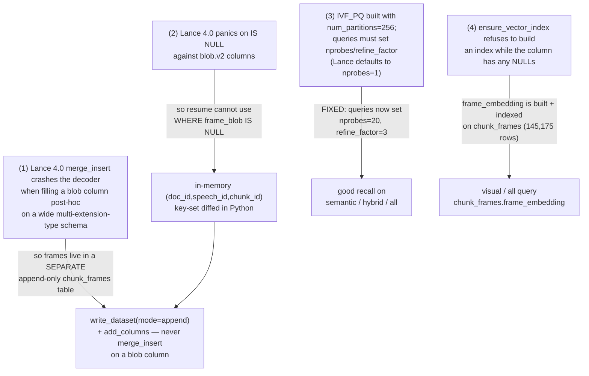
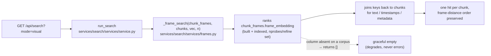

# Lance indexation & the vLLM image-embed crash (root-cause analysis)

> **Audience:** an engineer who has to *finish* visual search.
> **Status (2026-07):** Everything this document originally described as a
> *blocker* is now **fixed in code and built on the live DB** —
> `chunk_frames.frame_embedding` (145,175 rows, indexed) AND the caption pass
> (`caption` / `caption_embedding`, so `scene` / `scene_fts` are LIVE).
> Part A explains the Lance constraints that shaped the schema (and what is now
> resolved); Part B explains the image-embed crash and the current client/server
> pixel agreement (kept as the rationale for the pixel pin — the embed path now
> runs cleanly on the live DB).
>
> Every claim is cited to a file you can open and check.
>
> See also: [GUIDE.md](GUIDE.md) (architecture & data flow),
> [../README.md](../README.md) (quickstart), [TODO.md](TODO.md) (live blockers).

---

## Part A — Lance indexation: four interacting constraints

The first two constraints are real Lance 4.0 limitations that *permanently* shape
the schema. The second two (A3, A4) describe bugs that have since been fixed in
code — they are kept here as the rationale for the current design.



### A1. `merge_insert` crashes the decoder when back-filling a blob column

Lance 4.0 crashes its decoder when `merge_insert` fills a **Blob V2** column
*post-hoc* on a wide schema that mixes several extension types (JSONB +
fixed-size-list vector + blob). The original `chunks` table hit exactly this: it
carried `alignments_json` (`pa.json_()`), a `text_embedding` vector, and a
`frame_blob` blob in one schema. The failure was:

> `Invalid user input: there were more fields in the schema than provided
> column indices / infos` (decoder.rs:438) — confirmed at row counts 1, 100,
> and 145k.
> — `src/ratch/model/schema.py:169-170`

Commit `3954ee5` ("Phase 2 v2: chunk_frames as a separate Lance table") is the
fix and records the same diagnosis.

**Consequence — and the current layout:** per-chunk frames are *not* on `chunks`.
They live in a separate, append-only `chunk_frames` table
(`CHUNK_FRAMES_SCHEMA`, `model/schema.py:179-194`). It is written with
`lance.write_dataset(..., mode="append")` (`modalities/av/frames.py:322`) and every
derived column (`frame_embedding`, `caption`) is later attached with
`dataset.add_columns(...)` (`features/engine.py`, the `upsert_blob_column` path).
This is Lance's recommended "append + add_columns" data-evolution pattern.

Today `chunks` is no longer wide *at ingest time*: vectors are attached after
ingest via `add_columns` (`features/columns.py:embed_text_column` →
`features/engine.py:upsert_scan_column`), so the **declared** PyArrow
`CHUNK_SCHEMA` (`model/schema.py:64-101`) carries no vector and no blob at all.
The **live** `chunks` table, however, has had several vector/scalar columns
attached post-ingest by the embed / atlas features: `text_embedding` (2048),
a *chunk-level* `frame_embedding` (2048, the image vector used by the visual
atlas — joined from `chunk_frames`), plus `atlas_x/y/cluster` (text-space EVōC)
and `atlas_img_x/y/cluster` (visual-space EVōC). So `chunks` carries **two**
vector columns on disk even though `CHUNK_SCHEMA` declares neither — see
`features/columns.py:chunk_frame_embedding_column` (line 219) for the attach.
`merge_insert` survives only as the residual-`NULL` top-up for a *scalar/vector*
column on `chunks` after it already exists
(`features/engine.py:_fill_null_scan_column`, line 140) — safe, because `chunks`
carries no blob column for the decoder to choke on.

### A2. Lance 4.0 panics on `IS NULL` against blob.v2 columns

The natural way to make `extract-chunk-frames` resumable would be
`WHERE frame_blob IS NULL`. That is impossible — Lance 4.0 panics on `IS NULL`
against a `lance.blob.v2` column — so `chunk_frames.frame_blob` is declared
`nullable=False` (`model/schema.py:189`): there is deliberately no NULL state to
query.

Resume is done in Python instead. `extract-chunk-frames` reads back the existing
`(doc_id, speech_id, chunk_id, frame_idx)` keys with
`existing_frame_keys(frames_path)` (`modalities/av/frames.py:251`), collapses them to
chunk granularity, and diffs the work list against that set
(`cli/media.py:154-166`):

```python
# src/ratch/cli/media.py
frame_keys = existing_frame_keys(frames_path) if (frames_exists and only_null) else set()
already = {(d, s, c) for d, s, c, _ in frame_keys}
rows = [
    r for r in rows if (r["doc_id"], int(r["speech_id"]), int(r["chunk_id"])) not in already
]
```

No predicate ever touches `frame_blob`.

### A3. The IVF_PQ index uses 256 partitions — queries now probe 20 + refine ✅ fixed

Indexes are built with `num_partitions=256` (the `FeatureRunOptions` default,
`features/columns.py:316`; also the `compact` default, `cli/media.py:237`),
passed into `table.create_index(...)` in `ensure_vector_index`
(`features/engine.py:278-285`).

The original bug was that the backend's vector queries set neither `nprobes` nor
`refine_factor`, so Lance defaulted to probing **1 of 256** partitions → fast but
poor recall. **This is fixed.** Every vector leg in `services/search/services/service.py`
now sets these knobs (`_VECTOR_NPROBES = 20`, `_VECTOR_MAX_NPROBES = 0`,
`_VECTOR_REFINE_FACTOR = 3`, defined in `services/search/services/constants.py:49,56,57`
and imported at `service.py:29-32`):

```python
# services/search/services/service.py — vector / hybrid leg
chunks.search(query_type="hybrid", vector_column_name="text_embedding")
    .vector(text_vec.tolist())
    .text(fts_query)
    .rerank(fusion)
    .minimum_nprobes(_VECTOR_NPROBES)        # 20 — ≈ √256, visits 20/256 partitions
    .maximum_nprobes(_VECTOR_MAX_NPROBES)    # 0 — adaptive ceiling (extends toward all)
    .refine_factor(_VECTOR_REFINE_FACTOR)    # 3 — re-scores top-K×3 with full vectors
    .select(_PAYLOAD_COLUMNS)
    .limit(spec.n)
```

The hybrid leg (`service.py:244-246`) and the frame-vector leg
(`_frame_search`, now in `services/search/services/frames.py`) apply the same knobs. Cost
is roughly 20-30 ms per query; recall is restored. The knobs are ignored when the
column has no IVF index yet (flat search), so they are safe at any table size.

### A4. The index builder refuses to run while the column has NULLs ✅ design resolved

`ensure_vector_index` short-circuits if *any* row in the target column is NULL:

```python
# src/ratch/features/engine.py:263-266
nulls = table.count_rows(filter=f"{column} IS NULL")
if nulls > 0:
    logger.warning(f"skipping index on {column}: {nulls} row(s) still NULL")
    return False
```

The docstring explains why (`features/engine.py:254-255`): *"every row must have a
vector — the IVF trainer rejects partial-`NULL` columns."* (`compact` rebuilds
through the same guard, `cli/media.py:280-283`.)

The original *visible* bug here was a data-path mistake: `mode=visual` and the
frame branch of `mode=all` queried a legacy `chunks.frame_embedding` column that
was never populated → all-NULL → never indexed → empty results. **This is fixed.**
The frame columns were removed from `CHUNK_SCHEMA` entirely (there is no
`frame_embedding` on `chunks` today), and the backend frame branch now queries the
*real* column on the `chunk_frames` table:



`_frame_search` (now in `services/search/services/frames.py`, re-imported into
`service.py:40`) ranks `chunk_frames.frame_embedding`, keeps the best frame per
`(doc_id, speech_id, chunk_id)`, then fetches the matching `chunks` rows via a
single keyed Lance filter scan and re-orders them to the frame ranking. The
`mode=all` fuse calls it for the frame-vector leg (`service.py:291`); the
scene/caption leg calls it at `service.py:197`. When a ranked column doesn't exist
yet, the path returns `[]` — the graceful-degradation contract for corpora
that lack a given column. On the live DB both `frame_embedding` and
`caption_embedding` are built, so the visual, scene, and `all` legs return
real hits.

The frame *image* read path matches: `/api/chunk-frame/{doc_id}/{speech_id}/{chunk_id}`
serves the JPEG from `chunk_frames` (route at `services/viewer/api/v1/endpoints/media.py:61`, blob
read via `take_blobs("frame_blob", ...)` at `router.py:104`); the legacy
`chunks.frame_blob` fallback was removed along with the column.

**The frame data is now built.** `frame_embedding` is populated by
`ratch feature frame_embedding` (`make embed-chunk-frames`,
`features/columns.py:_run_frame_embedding`, line 366) and on the **live**
`transcripts_v2.lance` DB it is complete end-to-end: `chunk_frames.frame_embedding`
has 145,175 rows (zero NULL) with an IVF index `frame_embedding_idx`, so `visual`
and the frame leg of `all` return real hits today. The Part B crash described
below therefore no longer blocks this path — it is kept as the rationale for the
pixel pin. **Captions are also built** (`make captions`, the Gemma pass):
`chunk_frames.caption` / `caption_embedding` are populated on the live DB and
`scene` / `scene_fts` return real hits.

### Part A — status

| # | Item | Where | State |
|---|------|-------|-------|
| A1/A2 | Keep `chunk_frames` separate + append-only; Python-side resume | `model/schema.py`, `modalities/av/frames.py`, `cli/media.py` | Deliberate workaround for Lance 4.0 — keep until a newer Lance fixes the decoder + `IS NULL` panic |
| A3 | `nprobes=20` / `refine_factor=3` on every vector leg | `services/search/services/constants.py:49,56-57` + `services/search/services/service.py:244-246` (hybrid leg) + `services/search/services/frames.py` (moved `_vector_search`/`_frame_search`) | ✅ Fixed |
| A4 | `visual` / `all` query `chunk_frames.frame_embedding`, join back to `chunks` | `services/search/services/frames.py:_frame_search` | ✅ Fixed — frame data AND captions built + indexed on the live DB (145,175 rows); every mode live |

---

## Part B — The vLLM image-embed crash (historical — now cleared on the live DB)

`ratch feature frame_embedding` (`make embed-chunk-frames`,
`features/columns.py:_run_frame_embedding`, line 366) has now **completed
end-to-end** on the live DB (145,175 frame vectors, indexed). Getting there meant
clearing the crash documented below: earlier every attempt to embed an image
killed the vLLM engine with:

```
ValueError: Requested more deepstack tokens than available in buffer:
            num_tokens=N > buffer=N-k
```

### Root cause: warmup sizes the deepstack buffer from a *dummy* image

vLLM sizes the Qwen3-VL "deepstack" input-embeds buffer **once, at warmup**, from
a dummy image. At runtime the *real* image can yield a **different** vision-token
count; if it exceeds the warmup-time buffer, the engine aborts. The fix is to pin
every image to **one** pixel area so the runtime token count is deterministic and
stays under the warmup ceiling — both the client crop and the server's
`min_pixels == max_pixels` enforce this.

Qwen3-VL uses a 14 px patch with a 2× spatial merge → a **28 px effective tile**,
so an `S×S` image yields `(S/28)²` vision tokens.

### Client and server now agree at 196 tokens ✅

The earlier crash was a client/server *mismatch*: the client cropped to 448 px
(`(448/28)² = 256` tokens) while the server pinned 392 px (`(392/28)² = 196`
tokens), and `256 > 196` overflowed the pin. **Both sides are now aligned to
392 px = 153664 px² = 196 tokens.**

| Side | Setting | Pixels | Vision tokens |
|------|---------|--------|---------------|
| **Client** (`clients/image.py:32`) | `_IMAGE_SIDE = 392` (center-crop to square) | 392² = 153664 | `(392/28)² = 14² = `**`196`** |
| **Server** — Docker (`Makefile:286`) | `--mm-processor-kwargs '{"min_pixels": 153664, "max_pixels": 153664}'` | 153664 = 392² | `(392/28)² = `**`196`** |
| **Server** — uvx (`Makefile:331`) | same `min_pixels == max_pixels == 153664` pin | 153664 = 392² | `(392/28)² = `**`196`** |

`image_to_data_url` center-crops then resizes to `_IMAGE_SIDE`
(`clients/image.py:57`; the crop/resize happens in `_square_crop`, `.crop` at
`image.py:123`, `.resize` at `image.py:125`); aspect ratio is sacrificed,
which is fine for whole-image similarity. The in-code comment at
`clients/image.py:21-31` documents the agreement and warns: if you change
`_IMAGE_SIDE`, change the Makefile `min/max_pixels` pin to match (`side² == pin`).

### Why it is still unverified (the real open caveat)

The 392 px / 153664 px pin and the 196-token budget were originally derived for the
**8B** embedding model on **vLLM 0.20.0**. The current pin is **Qwen3-VL-
Embedding-2B** on **vLLM 0.22.0** (`Makefile:252,259,287-289`). The 2B vision
tower may produce a *different* token count for the same pixel area, and 0.22.0
may size the warmup buffer differently — but in practice this pin held: the live
DB has 145,175 frame vectors, so the image-embed path now runs cleanly under it.
The Makefile still flags the residual model/build caveat in two places
(`Makefile:243-251` and the `embed-server-docker` NOTE at `Makefile:287-289`).

> The `src/ratch/clients/image.py` header comment now records the verified
> state (the 145k-frame backfill completed under the pixel pin).

**Validation gate (re-run if you change the pin or the model/build):**

```bash
make embed-server-docker          # Qwen3-VL-Embedding-2B on :8001, pinned to 153664 px
make extract-chunk-frames         # populate chunk_frames.frame_blob (if not already)
make embed-chunk-frames           # ratch feature frame_embedding → frame_embedding + IVF_PQ
```

Confirm it processes all rows without the `deepstack tokens` ValueError, that
`chunk_frames.frame_embedding` is populated, and that `ensure_vector_index` built
an IVF_PQ index on it (`features/columns.py:381-386`). On the live DB this already
holds (145,175 rows + `frame_embedding_idx`), so the A4 `visual`/`all` frame leg
is exercised end-to-end with real data.

### Operational notes for the vLLM servers

These are settled in the current `Makefile` — listed so they are not
re-discovered the hard way:

1. **One pinned vLLM build across both launch paths.** Both the uvx path
   (`VLLM_PIN ?= vllm==0.22.0`, `Makefile:252`) and the Docker path
   (`VLLM_IMAGE ?= vllm/vllm-openai:v0.22.0`, `Makefile:259`) pin **0.22.0**, so a
   token budget tuned on one build holds on the other. (The earlier 0.19.1-vs-
   `:latest` drift is gone.)

2. **Both server targets carry the pixel pin.** `embed-server` (uvx,
   `Makefile:331`) and `embed-server-docker` (`Makefile:286`) both pass
   `--mm-processor-kwargs '{"min_pixels": 153664, "max_pixels": 153664}'`. (The earlier
   "no pin on the non-Docker server" gap is closed.)

3. **Both servers default to the *same* GPU; start them sequentially.** There is
   one card knob, `VLLM_GPU ?= 0` (`Makefile:224`), and both servers inherit it:
   `EMBED_GPU ?= $(VLLM_GPU)` and `RERANK_GPU ?= $(VLLM_GPU)`
   (`Makefile:225-226`). The two 2B models co-locate on one GPU at
   `EMBED_MEM_FRAC ?= 0.45` / `RERANK_MEM_FRAC ?= 0.45` each (~88 GB on a 96 GB
   card; `Makefile:227-228`). **Bring them up sequentially** — embed fully up
   *before* launching rerank — or vLLM's memory-profiling race trips: one server
   freeing GPU memory mid-init can abort the other's `profile_run` with an
   `AssertionError` (`Makefile:221-223`). Override the card per launch with
   `make embed-server VLLM_GPU=N`.

4. **Driver / PTX matrix on Blackwell.** vLLM ≥ 0.20 wants NVIDIA driver ≥ 575
   (CUDA 12.9); on a host capped at CUDA 12.8 the native (uvx) server can
   "driver too old"-crash at engine init, so the Docker image (which bundles its
   own CUDA userspace) is the recommended path (`Makefile:243-259`). The HF
   `kernels` package + FA3 prebuilt cache (`make kernels-prepare`,
   `Makefile:317`) is the workaround for the Blackwell `sm_120` FlashAttention
   gap, and both `embed-server`/`rerank-server` launch with `--with "kernels"`
   (`Makefile:326,337`).

5. **Where the pins actually live.** The in-process transcription stack pins
   `torch==2.11.0+cu128` / `torchaudio==2.11.0+cu128` (`pyproject.toml:21-22`,
   resolved in `uv.lock:3731`) — the same `cu128` build that drives the driver
   constraint above. vLLM is deliberately **not** a project dependency and does
   **not** appear in `uv.lock`: it runs in a `uvx` ephemeral env to avoid a
   torch-pin conflict (`pyproject.toml:49-52`). So the only source of truth for the
   vLLM 0.22.0 pin is the Makefile (`VLLM_PIN`, `Makefile:252` / `VLLM_IMAGE`,
   `Makefile:259`) — don't grep `uv.lock` for it.

### Part B — recommended fixes

| # | Fix | Where | Effort | Risk |
|---|-----|-------|--------|------|
| B1 | If you change the pin or model/build, re-run the **validation gate** above to re-confirm the 2B/0.22.0 token count under the 392 px pin; adjust `_IMAGE_SIDE` + the Makefile pin together (`side² == pin`) if it overruns | `clients/image.py:32`, `Makefile:286,331` | XS–S | Med — *re-verify per build* |
| B2 (alt) | If vLLM stays unstable, add an in-process `transformers` client that satisfies the `EmbeddingClient` Protocol alongside `VLLMEmbeddingClient` (same `embed_text`/`embed_image` surface) and wire it via the feature/backend client getters | `clients/embedding.py` (`EmbeddingClient` Protocol, `embedding.py:39-48`), `TODO.md:66-73` | M (~80 LOC) | Low — immune to vLLM internals, ~2 s/query slower |
| B3 (alt) | Try a different vLLM tag (`v0.21.0+` or back to a `v0.10.x`) | `Makefile:252,259` | M | High — Blackwell `sm_120` compat unknown until tested |
| B4 | Both servers share one GPU at 0.45 mem-frac each; start them **sequentially** (embed up before rerank) to avoid the memory-profiling race | `Makefile:224-228` | — | High if regressed |

---

## One-paragraph mental model

`ratch` works around Lance 4.0 by keeping frames in a separate, append-only
`chunk_frames` table (A1) with Python-side resume (A2). Both earlier search bugs
are fixed: vector queries now set `nprobes=20`/`refine_factor=3` for good recall
on the 256-partition index (A3), and `visual`/`all` query the real
`chunk_frames.frame_embedding` column and join back to `chunks` (A4). That frame
data is now **built on the live DB** — `chunk_frames.frame_embedding`: 145,175
rows + `frame_embedding_idx` — so visual search is live. Getting there meant
clearing the Qwen3-VL image-embed crash (vision-token / warmup-buffer mismatch);
the client crop (392 px) and the server pixel pin (153664 px) are aligned at 196
tokens and the pin held in practice (the 8B/0.20.0 → 2B/0.22.0 caveat is now only
a *re-verify when you change the build* note, not a blocker). The caption pass
has also run: `chunk_frames.caption` / `caption_embedding` are built and
`scene` / `scene_fts` are live — nothing in this document remains open.
