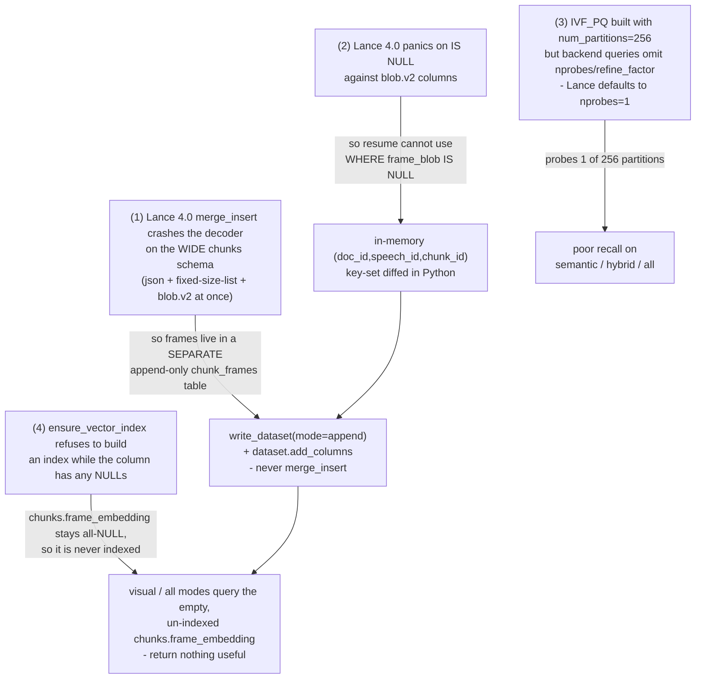
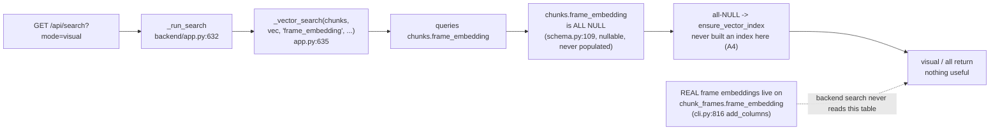
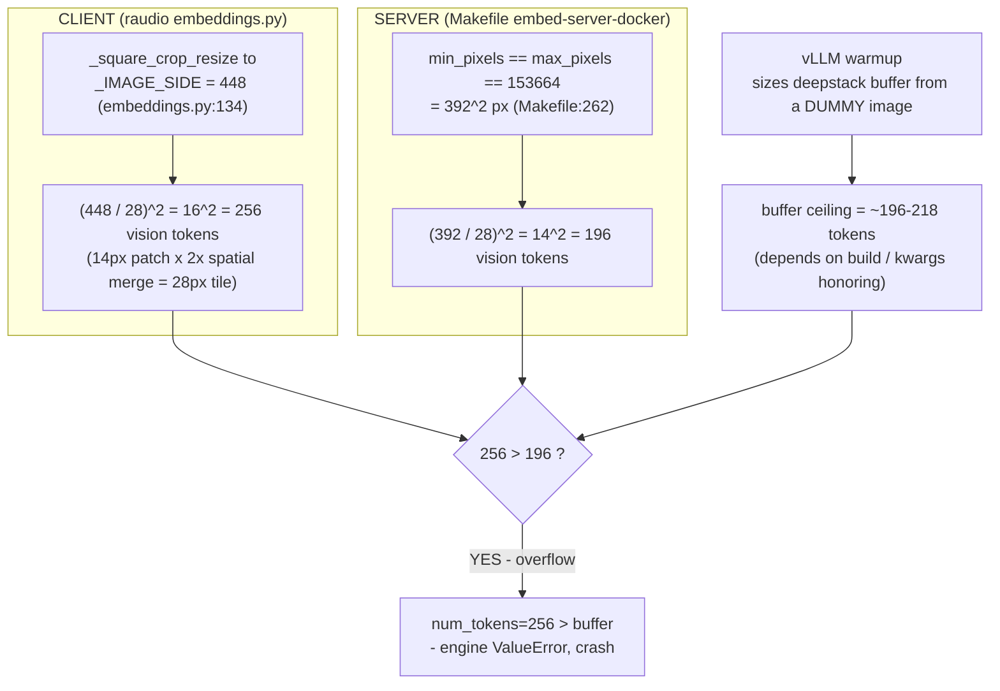
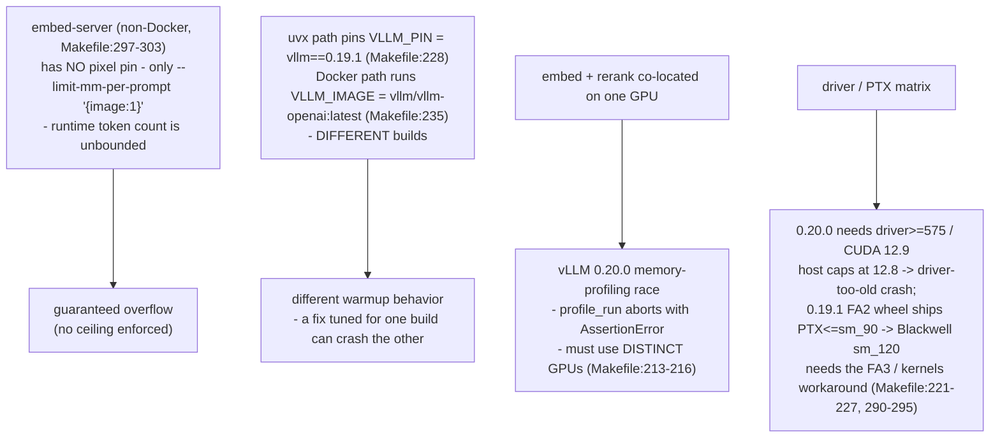

# Lance indexation errors & why vLLM keeps crashing (root-cause analysis)

> **Audience:** a new engineer who has to *fix* the visual-search blocker.
> **TL;DR:** None of the failures below are bugs in `raudio`. They are
> consequences of four specific Lance-4.0 / file-format-2.2 constraints (Part A)
> and one vLLM Qwen3-VL warmup-vs-runtime token-count mismatch made worse by a
> client/server config drift (Part B). Every claim here is cited to a file:line
> you can open and check.
>
> See also: [GUIDE.md](GUIDE.md) (architecture & data flow),
> [../README.md](../README.md) (quickstart), [../TODO.md](../TODO.md) (live blockers).

---

## Part A — Lance indexation: four interacting constraints

These four are not independent design choices — each one *forces* the next. Read
them top to bottom; the architecture only makes sense as a chain.



### A1. `merge_insert` crashes the decoder on the wide `chunks` schema

At the time of the crash the `chunks` table was *wide* — it mixed three Lance
extension types in one schema: JSONB (`alignments_json`, `pa.json_()`), a
fixed-size-list `text_embedding`, and a Blob V2 `frame_blob`. (Today `frame_blob`
lives in the separate `chunk_frames` table and `text_embedding` is attached
post-ingest via `add_columns`, so `chunks` is no longer wide — but this decoder
crash is *why* those two moved off the base schema.)

When `merge_insert` tries to fill a blob column *post-hoc* on this schema, Lance
4.0 crashes its decoder. The failure is documented at the head of
`CHUNK_FRAMES_SCHEMA`:

> `Invalid user input: there were more fields in the schema than provided
> column indices / infos` (decoder.rs:438) — confirmed at row counts 1, 100,
> and 145k.
> — `src/raudio/schema.py:164-174`

Commit `3954ee5` ("Phase 2 v2: chunk_frames as a separate Lance table") is the
fix and states the same thing: *"Lance 4.0 merge_insert crashes its encoder on
the wide chunks schema when filling blob columns post-hoc (confirmed at row
counts 1, 100, 145k)."*

**Consequence:** per-chunk frames do **not** go on `chunks`. They live in a
separate, append-only `chunk_frames` table (`CHUNK_FRAMES_SCHEMA`,
`schema.py:179-191`). It is written with `lance.write_dataset(..., mode="append")`
(`src/raudio/cli.py:688-694`) and the embedding column is later attached with
`dataset.add_columns(...)` (`src/raudio/cli.py:816`). Neither path ever calls
`merge_insert`. This is the Lance-recommended "append + add_columns" data-evolution
pattern (`README.md:41-48`).

> Update: `embed-chunks` (the *text* path) now also attaches its column with
> `add_columns` (`raudio/retrieval/embed.py`), not `merge_insert`. `merge_insert`
> survives only as a residual-`NULL` top-up for chunks appended after the column
> already exists — safe because `chunks` no longer carries a blob column (both
> the frame blob and the embedding live off the base schema).

### A2. Lance 4.0 panics on `IS NULL` against blob.v2 columns

The natural way to make `extract-chunk-frames` resumable would be
`WHERE frame_blob IS NULL`. That is impossible:

> *"Lance 4.0 panics on `IS NULL` against `lance.blob.v2` columns. We avoid the
> issue entirely by making `chunk_frames` append-only — no nullable blob …"*
> — `README.md:235-236`

So resume is done in Python instead. `extract-chunk-frames` reads back the
existing `(doc_id, speech_id, chunk_id)` keys into an in-memory `set`
(`cli.py:603-616`, ~4 MB for 145k keys per the inline comment) and diffs the
work list against it (`cli.py:625-629`):

```python
existing_keys = {(d, int(s), int(c)) for d, s, c in zip(...)}   # cli.py:608
rows = [r for r in rows
        if (r["doc_id"], int(r["speech_id"]), int(r["chunk_id"]))
        not in existing_keys]                                    # cli.py:626
```

No predicate ever touches `frame_blob`. (Note `chunk_frames.frame_blob` is even
declared `nullable=False`, `schema.py:186` — there is deliberately no NULL state
to query.)

### A3. The IVF_PQ index uses 256 partitions, but queries probe only 1

Indexes are built with `num_partitions=256` everywhere
(`cli.py:487` and `:730` defaults; passed into `table.create_index(...,
num_partitions=num_partitions, ...)` at `cli.py:950-955`).

But the backend's vector queries never set `nprobes` or `refine_factor`:

```python
# backend/app.py:726-733  (_vector_search)
chunks.query()
    .nearest_to(vec.tolist())
    .column(column)
    .distance_type("cosine")
    .select(_HIT_COLUMNS)
    .limit(n)
# no .nprobes(...), no .refine_factor(...)
```

The hybrid path (`app.py:658-665`) is the same. With `nprobes` unset, Lance
defaults to probing **1 of 256** partitions → fast but low recall, which is why
semantic/hybrid search "feels broken" and provokes re-query reflexes.

**Fix (per `TODO.md:180-199`):** add `.nprobes(20).refine_factor(3)`. `nprobes=20`
≈ √256 is the sweet spot for 256 partitions (visits 20/256); `refine_factor=3`
re-scores the top-K×3 with full-precision vectors. Costs ~20-30 ms, recall jumps.

### A4. The index builder refuses to run while the column has NULLs — and that strands visual search

`ensure_vector_index` short-circuits if *any* row in the target column is NULL:

```python
# src/raudio/cli.py:937-944
null_filter = f"{column} IS NULL"
nulls = table.count_rows(filter=null_filter)
if nulls > 0:
    typer.echo(f"  skipping index on {column}: {nulls} row(s) still NULL ...")
    return
```

The docstring explains *why* (`cli.py:932-935`): *"Refuses to run while the column
still has nulls — Lance's index builder doesn't handle partial-NULL vector columns
gracefully."* `compact` applies the same guard (`cli.py:917-926`).

This is correct behavior, but it combines with a data-path mistake to produce the
visible bug. Trace where a `mode=visual` query actually lands:



The real frame vectors are written to **`chunk_frames.frame_embedding`** via
`add_columns` (`cli.py:799-816`) and indexed there (`cli.py:818-822`). But
`backend/app.py` `_run_search` for `mode=visual` (and the frame branch of
`mode=all`, `app.py:698-702`) still calls
`_vector_search(chunks, vec, "frame_embedding", ...)` — i.e. it queries the
legacy `chunks.frame_embedding` column, which is nullable (`schema.py:109`) and
**never populated**. So that column is all-NULL → never indexed (A4) → visual
search returns garbage. This is `TODO.md:87-107` blocker #4.

> The read path for *serving* a frame image is already correct:
> `/api/chunk-frame` reads from `chunk_frames_ds` when present and only falls
> back to `chunks.frame_blob` for legacy datasets (`app.py:392-423`). It is only
> the **search** side that still points at the empty column.

### Part A — Recommended fixes

| # | Fix | Where | Effort | Risk |
|---|-----|-------|--------|------|
| A3 | Add `.nprobes(20).refine_factor(3)` to vector queries | `backend/app.py` `_vector_search` (`:726`) and hybrid (`:658`) | XS (~4 lines) | Low — pure recall/latency tradeoff, no schema change |
| A4 | Re-point `mode=visual` / frame branch of `mode=all` at `chunk_frames_ds`, then JOIN keys back to `chunks` for text/metadata | `backend/app.py` `_run_search` (`:632`, `:698`) | S (~30 LOC, `TODO.md:99-104`) | Low — `chunk_frames_ds` is already opened at startup (`app.py:227-235`); blocked only by Part B (no frame embeddings exist yet) |
| A1/A2 | None — these are *deliberate* workarounds for Lance constraints. Keep `chunk_frames` separate + append-only | `schema.py`, `cli.py` | — | Revisiting requires a newer Lance that fixes the decoder + `IS NULL` panic |
| cleanup | After visual search runs against `chunk_frames`, drop the dead `frame_*` columns from `chunks` | `TODO.md:140-158` | XS | Low — keep the legacy fallback until then |

---

## Part B — Why vLLM keeps crashing (the recurring image-embed crash)

`embed-chunk-frames` has **never completed end-to-end** (`TODO.md:48-73`,
`embeddings.py:132`). Every attempt to embed an image kills the vLLM engine with:

```
ValueError: Requested more deepstack tokens than available in buffer:
            num_tokens=N > buffer=N-k
```

### Root cause: warmup sizes the deepstack buffer from a *dummy* image

vLLM sizes the Qwen3-VL "deepstack" input-embeds buffer **once, at warmup**, from
a dummy image. At runtime, the *real* image can yield a **different** vision-token
count. If runtime tokens exceed the warmup-time buffer, the engine aborts. The fix
in principle is to pin every image to **one** resolution so the runtime token count
is deterministic and stays under the warmup ceiling — this is exactly what the
`_IMAGE_SIDE` / `mm_processor_kwargs` machinery is trying to do
(`embeddings.py:122-133`).



### The fix is currently BROKEN by a client/server mismatch

Qwen3-VL uses a 14 px patch with a 2× spatial merge → a **28 px effective tile**,
so an `S×S` image yields `(S/28)²` vision tokens (`embeddings.py:124-126`).

| Side | Setting | Pixels | Vision tokens |
|------|---------|--------|---------------|
| **Client** (`embeddings.py:134`) | `_IMAGE_SIDE = 448` | 448² | `(448/28)² = 16² = `**`256`** |
| **Server** (`Makefile:262`) | `min_pixels == max_pixels == 153664` | `153664 = 392²` | `(392/28)² = 14² = `**`196`** |

`256 > 196` → the client's image overflows the server's pin → crash. The client
crops to a *larger* square than the server expects.

The mismatch is now documented in-code at `embeddings.py:128-133`:

> ⚠️ KNOWN MISMATCH (the recurring crash — see docs/INVESTIGATION.md, TODO #2):
> this client crops to 448 → (448/28)² = 256 tokens, but the Docker embed server
> pins min==max==153664 px = 392² → (392/28)² = 196 tokens. 256 > 196 overflows
> the server pin. The fix is to set this to 392 to match the server pin; left at
> 448 pending end-to-end GPU validation (embed-chunk-frames has never completed).

> **Historical note:** an earlier in-code comment claimed `448 → 64 tokens`. That
> was arithmetically wrong (it used a 56 px tile divisor in one place — see the
> stale `_image_to_data_url` docstring at `embeddings.py:153-154` mentioning a
> "56-multiple grid") and has been corrected to 256 in the `_IMAGE_SIDE` comment.
> The real divisor is **28 px** (14 px patch × 2× merge), not 56.

**Recommended primary fix:** set `_IMAGE_SIDE = 392` in `embeddings.py:134` so the
client produces exactly `(392/28)² = 196` tokens, matching the server pin and
sitting at/under the warmup ceiling. This needs **end-to-end GPU validation** —
`embed-chunk-frames` has never run to completion, so the fix is unverified.

### Secondary crash modes (each one independently fatal)



1. **No pin on the non-Docker server.** `embed-server` (`Makefile:297-303`)
   passes only `--limit-mm-per-prompt '{"image": 1}'` — there is **no
   `--mm-processor-kwargs` pixel pin at all**. Runtime token count is unbounded →
   guaranteed overflow. Only `embed-server-docker` (`Makefile:250-262`) carries
   the `min_pixels/max_pixels = 153664` pin.

2. **Version drift between launch paths.** The `uvx` path pins
   `VLLM_PIN ?= vllm==0.19.1` (`Makefile:228`), while the Docker path runs
   `VLLM_IMAGE ?= vllm/vllm-openai:latest` (`Makefile:235`). Different builds have
   different warmup behavior, so a token budget tuned against one can still crash
   the other. (The `embed-server-docker` comment at `Makefile:243-249` describes a
   0.20.0-specific warmup quirk: it "sizes the deepstack buffer for ITS OWN dummy
   image (~218 tokens here)", and 200704 px → 224 tokens still overflowed; 392 px →
   196 tokens leaves ~22-token headroom.)

3. **Embed and rerank must be on distinct GPUs.** `EMBED_GPU ?= 2` and
   `RERANK_GPU ?= 1` are deliberately different (`Makefile:215-216`). Co-locating
   both on one GPU triggers vLLM 0.20.0's memory-profiling race: when one server
   frees a few GB during init, the other's `profile_run` aborts with an
   `AssertionError` (`Makefile:212-214`).

4. **Driver / PTX matrix.** Captured verbatim at `Makefile:221-227`:
   - `0.20.0` requires NVIDIA driver ≥ 575 (CUDA 12.9); the host driver supports
     only up to CUDA 12.8 → "driver too old" crash at engine init.
   - `0.19.1` works against driver 12.8, but its bundled FlashAttention-2 wheel
     ships PTX only up to `sm_90` → "unsupported PTX" crash on Blackwell
     (`sm_120`) ViT attention.
   - The HF `kernels` package + FA3 prebuilt cache (`make kernels-prepare`,
     `Makefile:290-295`) is the intended workaround for the FA2/`sm_120` gap.
   This is why the Docker image (which bundles its own CUDA toolkit + userspace)
   is the "recommended path on Blackwell with driver 12.8" (`Makefile:232-234`).

### Part B — Recommended fixes

| # | Fix | Where | Effort | Risk |
|---|-----|-------|--------|------|
| B1 (primary) | Set `_IMAGE_SIDE = 392` so the client emits 196 tokens, matching the Docker server pin | `embeddings.py:134` | XS (1 line) | **Med** — *unvalidated end-to-end*; needs a real GPU run of `make embed-chunk-frames` against `embed-server-docker`. Aspect ratio already sacrificed by center-crop (fine for whole-image similarity, `embeddings.py:133`) |
| B2 | Add the same `--mm-processor-kwargs '{"min_pixels":153664,"max_pixels":153664}'` pin to the non-Docker `embed-server` target (or stop using it) | `Makefile:297-303` | XS | Low |
| B3 | Standardize on one vLLM build — prefer the Docker image (bundles CUDA), or align `VLLM_PIN` to whatever the Docker tag resolves to | `Makefile:228`, `:235` | S | Med — re-tests the whole warmup budget |
| B4 | Keep embed/rerank on distinct GPUs (already done); do not "optimize" them onto one GPU | `Makefile:215-216` | — | High if regressed |
| B-alt (A) | If vLLM stays unstable, add an in-process `HFClient(EmbeddingClient)` (transformers) alongside `VLLMClient`; `make_client()` already supports a `--backend` switch | `embeddings.py:348-370`, `TODO.md:64-69` | M (~80 LOC) | Low — immune to vLLM internals, ~2 s/query slower |
| B-alt (B) | Try a different vLLM tag (`v0.21.0+` or back to `v0.10.x`) | `Makefile:228` | M | High — Blackwell `sm_120` compat unknown until tested |

> **Validation gate before declaring B1 fixed:** run
> `make embed-server-docker` then `make embed-chunk-frames`, confirm it processes
> all rows without the `deepstack tokens` ValueError, then verify
> `chunk_frames.frame_embedding` is populated and an IVF_PQ index built
> (`cli.py:818-822`). Only then is A4's `mode=visual` re-point (Part A table)
> testable end-to-end.

---

## One-paragraph mental model

`raudio` works around Lance 4.0 by keeping frames in a separate append-only
`chunk_frames` table (A1) with Python-side resume (A2). The text-search vector
path is healthy but under-probes its 256-partition index (A3). The visual path is
doubly broken: the embeddings that would populate `chunk_frames.frame_embedding`
never get written because every image embed crashes vLLM on a 256-vs-196
token-budget mismatch (B1), and even once they exist the backend still queries the
wrong, empty `chunks.frame_embedding` column (A4). Fix B1 first (it unblocks
everything downstream), validate on GPU, then re-point the search to
`chunk_frames` (A4) and add `nprobes`/`refine_factor` (A3).
