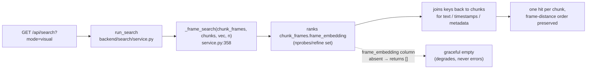

# Lance indexation & the vLLM image-embed crash (root-cause analysis)

> **Audience:** an engineer who has to *finish* visual search.
> **Status (2026-06):** Most of what this document originally described as
> *blockers* is now **fixed in code**. What remains is a single data-side gate:
> `raudio feature frame_embedding` has never completed end-to-end on GPU, because
> the Qwen3-VL image-embed path crashes vLLM. Part A explains the Lance
> constraints that shaped the schema (and what is now resolved); Part B explains
> the image-embed crash and the current client/server pixel agreement.
>
> Every claim is cited to a file you can open and check.
>
> See also: [GUIDE.md](GUIDE.md) (architecture & data flow),
> [../README.md](../README.md) (quickstart), [../TODO.md](../TODO.md) (live blockers).

---

## Part A — Lance indexation: four interacting constraints

The first two constraints are real Lance 4.0 limitations that *permanently* shape
the schema. The second two (A3, A4) describe bugs that have since been fixed in
code — they are kept here as the rationale for the current design.


### A1. `merge_insert` crashes the decoder when back-filling a blob column

Lance 4.0 crashes its decoder when `merge_insert` fills a **Blob V2** column
*post-hoc* on a wide schema that mixes several extension types (JSONB +
fixed-size-list vector + blob). The original `chunks` table hit exactly this: it
carried `alignments_json` (`pa.json_()`), a `text_embedding` vector, and a
`frame_blob` blob in one schema. The failure was:

> `Invalid user input: there were more fields in the schema than provided
> column indices / infos` (decoder.rs:438) — confirmed at row counts 1, 100,
> and 145k.
> — `src/raudio/model/schema.py:167-174`

Commit `3954ee5` ("Phase 2 v2: chunk_frames as a separate Lance table") is the
fix and records the same diagnosis.

**Consequence — and the current layout:** per-chunk frames are *not* on `chunks`.
They live in a separate, append-only `chunk_frames` table
(`CHUNK_FRAMES_SCHEMA`, `model/schema.py:179-194`). It is written with
`lance.write_dataset(..., mode="append")` (`media/frames.py:322`) and every
derived column (`frame_embedding`, `caption`) is later attached with
`dataset.add_columns(...)` (`features/engine.py`, the `upsert_blob_column` path).
This is Lance's recommended "append + add_columns" data-evolution pattern.

Today `chunks` is no longer wide: `text_embedding` is *also* attached after
ingest via `add_columns` (`features/columns.py:embed_text_column` →
`features/engine.py:upsert_scan_column`), so `CHUNK_SCHEMA`
(`model/schema.py:64-101`) declares no vector and no blob at all. `merge_insert`
survives only as the residual-`NULL` top-up for a *scalar/vector* column on
`chunks` after it already exists (`features/engine.py:_fill_null_scan_column`,
line 100) — safe, because `chunks` carries no blob column for the decoder to choke
on.

### A2. Lance 4.0 panics on `IS NULL` against blob.v2 columns

The natural way to make `extract-chunk-frames` resumable would be
`WHERE frame_blob IS NULL`. That is impossible — Lance 4.0 panics on `IS NULL`
against a `lance.blob.v2` column — so `chunk_frames.frame_blob` is declared
`nullable=False` (`model/schema.py:189`): there is deliberately no NULL state to
query.

Resume is done in Python instead. `extract-chunk-frames` reads back the existing
`(doc_id, speech_id, chunk_id, frame_idx)` keys with
`existing_frame_keys(frames_path)` (`media/frames.py:251`), collapses them to
chunk granularity, and diffs the work list against that set
(`cli/media.py:154-167`):

```python
# src/raudio/cli/media.py
frame_keys = existing_frame_keys(frames_path) if (frames_exists and only_null) else set()
already = {(d, s, c) for d, s, c, _ in frame_keys}
rows = [
    r for r in rows if (r["doc_id"], int(r["speech_id"]), int(r["chunk_id"])) not in already
]
```

No predicate ever touches `frame_blob`.

### A3. The IVF_PQ index uses 256 partitions — queries now probe 20 + refine ✅ fixed

Indexes are built with `num_partitions=256` (the `FeatureRunOptions` default,
`features/columns.py:173`; also the `compact` default, `cli/media.py:237`),
passed into `table.create_index(...)` in `ensure_vector_index`
(`features/engine.py:227-234`).

The original bug was that the backend's vector queries set neither `nprobes` nor
`refine_factor`, so Lance defaulted to probing **1 of 256** partitions → fast but
poor recall. **This is fixed.** Every vector leg in `backend/search/service.py`
now sets both knobs (`_VECTOR_NPROBES = 20`, `_VECTOR_REFINE_FACTOR = 3`,
defined at `service.py:50-51`):

```python
# backend/search/service.py — _vector_search
table.search(vec.tolist(), vector_column_name=column)
    .distance_type("cosine")
    .nprobes(_VECTOR_NPROBES)        # 20 — ≈ √256, visits 20/256 partitions
    .refine_factor(_VECTOR_REFINE_FACTOR)  # 3 — re-scores top-K×3 with full vectors
    .select([*_PAYLOAD_COLUMNS, "_distance"])
    .limit(n)
```

The hybrid leg (`service.py:266-267`) and the frame-vector leg
(`_frame_search`, `service.py:377-378`) apply the same two knobs. Cost is roughly
20-30 ms per query; recall is restored. The knobs are ignored when the column has
no IVF index yet (flat search), so they are safe at any table size.

### A4. The index builder refuses to run while the column has NULLs ✅ design resolved

`ensure_vector_index` short-circuits if *any* row in the target column is NULL:

```python
# src/raudio/features/engine.py:212-215
nulls = table.count_rows(filter=f"{column} IS NULL")
if nulls > 0:
    logger.warning(f"skipping index on {column}: {nulls} row(s) still NULL")
    return False
```

The docstring explains why (`features/engine.py:203-204`): *"every row must have a
vector — the IVF trainer rejects partial-`NULL` columns."* (`compact` rebuilds
through the same guard, `cli/media.py:278-285`.)

The original *visible* bug here was a data-path mistake: `mode=visual` and the
frame branch of `mode=all` queried a legacy `chunks.frame_embedding` column that
was never populated → all-NULL → never indexed → empty results. **This is fixed.**
The frame columns were removed from `CHUNK_SCHEMA` entirely (there is no
`frame_embedding` on `chunks` today), and the backend frame branch now queries the
*real* column on the `chunk_frames` table:



`_frame_search` (`service.py:358-412`) ranks `chunk_frames.frame_embedding`, keeps
the best frame per `(doc_id, speech_id, chunk_id)`, then fetches the matching
`chunks` rows via a single keyed Lance filter scan and re-orders them to the frame
ranking. The `mode=all` 3-way fuse also calls it (`service.py:308-310`). When the
`frame_embedding` column doesn't exist yet, both paths return `[]`
(`service.py:371`), so visual/all degrade to empty instead of erroring.

The frame *image* read path matches: `/api/chunk-frame/{doc_id}/{speech_id}/{chunk_id}`
serves the JPEG from `chunk_frames` (`backend/media/router.py:49`); the legacy
`chunks.frame_blob` fallback was removed along with the column.

**The one thing still missing is the data.** `frame_embedding` is populated by
`raudio feature frame_embedding` (`make embed-chunk-frames`), which has never
completed — see Part B. So today only the graceful-empty path is exercised
end-to-end (`TODO.md:92-103`, blocker #4 = done; gated on #2).

### Part A — status

| # | Item | Where | State |
|---|------|-------|-------|
| A1/A2 | Keep `chunk_frames` separate + append-only; Python-side resume | `model/schema.py`, `media/frames.py`, `cli/media.py` | Deliberate workaround for Lance 4.0 — keep until a newer Lance fixes the decoder + `IS NULL` panic |
| A3 | `nprobes=20` / `refine_factor=3` on every vector leg | `backend/search/service.py:50-51, 266-267, 346-347, 377-378` | ✅ Fixed |
| A4 | `visual` / `all` query `chunk_frames.frame_embedding`, join back to `chunks` | `backend/search/service.py:_frame_search` | ✅ Fixed — gated only on the frame data (Part B) |

---

## Part B — The vLLM image-embed crash (the remaining gate)

`raudio feature frame_embedding` (`make embed-chunk-frames`,
`features/columns.py:_run_frame_embedding`) has **never completed end-to-end**
(`TODO.md:48-77`). Every attempt to embed an image has killed the vLLM engine
with:

```
ValueError: Requested more deepstack tokens than available in buffer:
            num_tokens=N > buffer=N-k
```

### Root cause: warmup sizes the deepstack buffer from a *dummy* image

vLLM sizes the Qwen3-VL "deepstack" input-embeds buffer **once, at warmup**, from
a dummy image. At runtime the *real* image can yield a **different** vision-token
count; if it exceeds the warmup-time buffer, the engine aborts. The fix is to pin
every image to **one** pixel area so the runtime token count is deterministic and
stays under the warmup ceiling — both the client crop and the server's
`min_pixels == max_pixels` enforce this.

Qwen3-VL uses a 14 px patch with a 2× spatial merge → a **28 px effective tile**,
so an `S×S` image yields `(S/28)²` vision tokens.

### Client and server now agree at 196 tokens ✅

The earlier crash was a client/server *mismatch*: the client cropped to 448 px
(`(448/28)² = 256` tokens) while the server pinned 392 px (`(392/28)² = 196`
tokens), and `256 > 196` overflowed the pin. **Both sides are now aligned to
392 px = 153664 px² = 196 tokens.**

| Side | Setting | Pixels | Vision tokens |
|------|---------|--------|---------------|
| **Client** (`vllm/image.py:31`) | `_IMAGE_SIDE = 392` (center-crop to square) | 392² = 153664 | `(392/28)² = 14² = `**`196`** |
| **Server** — Docker (`Makefile:266`) | `--mm-processor-kwargs '{"min_pixels":153664,"max_pixels":153664}'` | 153664 = 392² | `(392/28)² = `**`196`** |
| **Server** — uvx (`Makefile:311`) | same `min_pixels == max_pixels == 153664` pin | 153664 = 392² | `(392/28)² = `**`196`** |

`image_to_data_url` center-crops then resizes to `_IMAGE_SIDE`
(`vllm/image.py:50-75`); aspect ratio is sacrificed, which is fine for
whole-image similarity. The in-code comment at `vllm/image.py:18-31` documents the
agreement and warns: if you change `_IMAGE_SIDE`, change the Makefile
`min/max_pixels` pin to match (`side² == pin`).

### Why it is still unverified (the real open caveat)

The 392 px / 153664 px pin and the 196-token budget were originally derived for the
**8B** embedding model on **vLLM 0.20.0**. The current pin is **Qwen3-VL-
Embedding-2B** on **vLLM 0.22.0** (`Makefile:232,239,260,283`). The 2B vision
tower may produce a *different* token count for the same pixel area, and 0.22.0
may size the warmup buffer differently — so the agreement above is *arithmetically*
consistent but **not yet confirmed on this model/build**. The Makefile flags this
in two places (`Makefile:227-229` and the `embed-server-docker` NOTE at
`Makefile:267-269`); `TODO.md:48-56` is the live blocker.

**Validation gate (do this before declaring it fixed):**

```bash
make embed-server-docker          # Qwen3-VL-Embedding-2B on :8001, pinned to 153664 px
make extract-chunk-frames         # populate chunk_frames.frame_blob (if not already)
make embed-chunk-frames           # raudio feature frame_embedding → frame_embedding + IVF_PQ
```

Confirm it processes all rows without the `deepstack tokens` ValueError, that
`chunk_frames.frame_embedding` is populated, and that `ensure_vector_index` built
an IVF_PQ index on it (`features/columns.py:233-239`). Only then is the A4
`visual`/`all` path testable end-to-end with real data.

### Operational notes for the vLLM servers

These are settled in the current `Makefile` — listed so they are not
re-discovered the hard way:

1. **One pinned vLLM build across both launch paths.** Both the uvx path
   (`VLLM_PIN ?= vllm==0.22.0`, `Makefile:232`) and the Docker path
   (`VLLM_IMAGE ?= vllm/vllm-openai:v0.22.0`, `Makefile:239`) pin **0.22.0**, so a
   token budget tuned on one build holds on the other. (The earlier 0.19.1-vs-
   `:latest` drift is gone.)

2. **Both server targets carry the pixel pin.** `embed-server` (uvx,
   `Makefile:311`) and `embed-server-docker` (`Makefile:266`) both pass
   `--mm-processor-kwargs '{"min_pixels":153664,"max_pixels":153664}'`. (The earlier
   "no pin on the non-Docker server" gap is closed.)

3. **Embed and rerank on distinct GPUs.** `EMBED_GPU ?= 2` and `RERANK_GPU ?= 1`
   are deliberately different (`Makefile:215-216`). Co-locating both on one GPU
   triggers a vLLM memory-profiling race: when one server frees a few GB during
   init, the other's `profile_run` can abort with an `AssertionError`. Each server
   now gets most of its own GPU (`EMBED_MEM_FRAC=0.90`, `RERANK_MEM_FRAC=0.85`,
   `Makefile:218-219`).

4. **Driver / PTX matrix on Blackwell.** vLLM ≥ 0.20 wants NVIDIA driver ≥ 575
   (CUDA 12.9); on a host capped at CUDA 12.8 the native (uvx) server can
   "driver too old"-crash at engine init, so the Docker image (which bundles its
   own CUDA userspace) is the recommended path (`Makefile:222-238`). The HF
   `kernels` package + FA3 prebuilt cache (`make kernels-prepare`,
   `Makefile:297-302`) is the workaround for the Blackwell `sm_120` FlashAttention
   gap, and both `embed-server`/`rerank-server` launch with `--with "kernels"`
   (`Makefile:306,317`).

### Part B — recommended fixes

| # | Fix | Where | Effort | Risk |
|---|-----|-------|--------|------|
| B1 | Run the **validation gate** above to confirm the 2B/0.22.0 token count under the 392 px pin; adjust `_IMAGE_SIDE` + the Makefile pin together (`side² == pin`) if it overruns | `vllm/image.py:31`, `Makefile:266,311` | XS–S | Med — *unvalidated on GPU* |
| B2 (alt) | If vLLM stays unstable, add an in-process `transformers` client that satisfies the `EmbeddingClient` Protocol alongside `VLLMEmbeddingClient` (same `embed_text`/`embed_image` surface) and wire it via the feature/backend client getters | `vllm/embedding.py` (`EmbeddingClient` Protocol, `embedding.py:39-48`), `TODO.md:66-73` | M (~80 LOC) | Low — immune to vLLM internals, ~2 s/query slower |
| B3 (alt) | Try a different vLLM tag (`v0.21.0+` or back to a `v0.10.x`) | `Makefile:232,239` | M | High — Blackwell `sm_120` compat unknown until tested |
| B4 | Keep embed/rerank on distinct GPUs; do not "optimize" onto one | `Makefile:215-216` | — | High if regressed |

---

## One-paragraph mental model

`raudio` works around Lance 4.0 by keeping frames in a separate, append-only
`chunk_frames` table (A1) with Python-side resume (A2). Both earlier search bugs
are fixed: vector queries now set `nprobes=20`/`refine_factor=3` for good recall
on the 256-partition index (A3), and `visual`/`all` query the real
`chunk_frames.frame_embedding` column and join back to `chunks` (A4). The single
remaining gate is the *data*: `raudio feature frame_embedding` has never finished,
because Qwen3-VL image embedding crashed vLLM on a vision-token / warmup-buffer
mismatch. The client crop (392 px) and the server pixel pin (153664 px) are now
aligned at 196 tokens, but that budget was derived for the 8B model on vLLM 0.20.0
and is unverified for the 2B on 0.22.0. Run the Part B validation gate; once the
frame embeddings exist and are indexed, visual search is live with no further code
changes.
