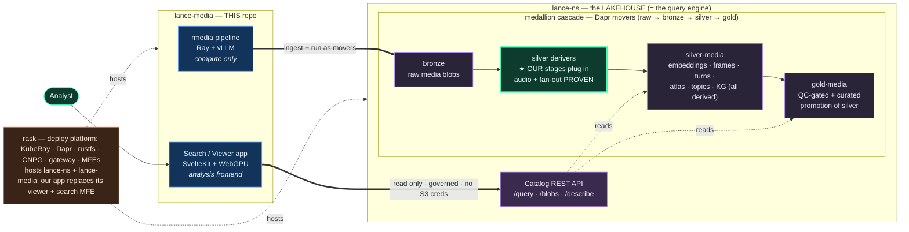

# lance-media × lance-ns lakehouse — does the silver/gold layer work with us?

> **Short answer: yes, cleanly — and the fit is unusually good, because lance-ns
> already built the exact seams we need.** Our batch pipeline drops into the
> medallion **media lane** as silver derivers (gold is a later QC-gated curation
> of silver, not an aggregation layer — see §2); our
> search/viewer app becomes a read-only **application layer** over the catalog.
> There is exactly **one** real design decision (single-table derivers vs our
> multi-table fan-out, §4) and a set of governance wires we gain for free.
>
> Grounded in a full read of `Borg93/lance-ns@419101f` (not the local checkout):
> `docs/{MEDALLION,RASK-INTEGRATION,DATA-CONTRACT}.md`,
> `services/medallion/{mover,producer}.py` +
> `services/medallion/services/{derivers,compute,ingest,quality,ray_submit}.py`,
> `services/catalog/api/v1/endpoints/data.py`, `services/common/{sources,sinks}.py`,
> and `frontend/apps/web`.

---

## At a glance

Two things live in this repo — **compute** and an **app** — and they attach to
the lance-ns lakehouse at two different points. The batch pipeline plugs into the
medallion cascade as **silver/gold derivers** (★ = proven, see §4); the app is a
**read-only client** of the catalog, which *is* the query engine.



**In one line:** our *compute* becomes lakehouse silver/gold; our *app* reads that
data back through the catalog; rask hosts everything. No merge is performed here —
this is the map plus the de-risking proof.

---

## 1. The three repos and who owns "the query engine"

| repo | role | is it the query engine? |
|---|---|---|
| **lance-ns** | the **lakehouse**: Lance Namespace REST catalog over pylance `DirectoryNamespace` on S3/rustfs + the event-driven medallion cascade + lineage (→ AGE) + OpenFGA governance + compaction. Ships its **own** frontend (`apps/web` — a lineage/catalog explorer). | **YES.** The catalog's `POST /v1/table/{id}/query`, `/count_rows`, `GET /{id}/blobs` (`data.py:512,570,578`) + Lance's own indexes are the query/data-access engine. |
| **rask** | the **deployment platform**: operators (CloudNativePG, rustfs-operator, KubeRay+Kueue, NATS, Dapr, Traefik), the service-kit bricks, the SvelteKit MFEs, the gateway. | no — it hosts. |
| **lance-media** (this repo) | (a) **batch compute** — the rmedia Ray pipeline; (b) a **search/viewer app** — the media-content frontend. | **no — and that's the point.** We are *compute* + an *analysis frontend*, not a catalog. |

lance-ns's own `docs/RASK-INTEGRATION.md` already plans to **contribute the
lakehouse into rask** (using rask's operators). So all three converge on rask.
Your framing — *"our batch processing is just for compute; this is the search
application layer to look at the data in the lakehouse; not our query engine;
this replaces the viewer + search MFE in rask"* — is exactly the boundary
lance-ns already draws. We slot into two named seams it left open.

---

## 2. The medallion cascade, and where we plug in

lance-ns runs **raw → bronze → silver → gold** as Dapr movers over NATS
JetStream (`docs/MEDALLION.md`). The movers are **one generic binary**
(`medallion.mover:app`) differing only by `MEDALLION_*` env; each reads its
upstream Lance dataset at the triggered version, runs a **compute seam**
(`read → transform → write → version`), emits a `DERIVED_FROM` OpenLineage edge,
and fires the next trigger. There is already a **media lane**:

```
POST /ingest-media ─▶ lance-ray head ─▶ bronze-media$objects (blob-v2, fmt 2.2)
                                         │  medallion.media
                                         ▼
                              media-to-silver mover ─▶ silver-media$features
                              (derivers.py: image → thumbnail + embedding)   (terminal today)
```

The multimodality lives in **one file**: `services/medallion/services/derivers.py`.
`_DERIVERS: tuple[(content_probe, Deriver)]` is content-dispatched, and its
docstring is an open invitation:

> *"an audio deriver slots into `_DERIVERS` later … Adding a media type = one
> probe + one deriver here; the platform and the chart do not change."*

**That is our merge surface.** Our rmedia stage registry is a much richer set of
derivers than the single `is_image → thumbnail+embedding` one that ships:

| rmedia stage | medallion mapping | layer |
|---|---|---|
| `transcribe`/`htr`/`ocr` (media blob → text rows) | a **deriver** reading the bronze media blob, fanning out chunk/line rows (§4) — *not built as a stage today; see §7* | silver |
| `extract_frames` (video → frame JPEGs) | a **video deriver** (new `_DERIVERS` entry) — but it *fans out rows* (see §4) | silver |
| `text_embedding`, `frame_embedding`, `caption`, `caption_embedding` | derivers that **add columns** to the carried table — the exact `Deriver = (table, payloads) -> table` shape | silver |
| `diarize` (→ speaker_turns), `voiceprint` (→ speaker_embeddings) | **audio derivers** — also row-fan-out (§4) | silver |
| atlas projections, topic tree, KG | **still silver** — derived TABLES over silver embeddings (aggregation ≠ a medallion tier) | silver |

**Correction (the gold layer is NOT "aggregations" — verified against lance-ns
2026-07-20).** In lance-ns the medallion tier is defined by **trust/promotion, not
by per-item-vs-aggregate**:

- **silver** = every derived artifact — our embeddings, chunks/lines, frames,
  voiceprints, AND the atlas/topics/KG aggregations. They are all just derivations;
  the `bronze→silver` mover writes them with the **writer** role `can_create_table`.
- **gold** = a **QC-gated, curated PROMOTION of silver**: the `silver→gold` mover
  needs the **validator** role `can_promote`, runs the quality gate
  (`services/medallion/services/quality.py`: row-count, not-null key, blob-resolves;
  PII scan in the aspirational sketch), and on PASS writes gold + embeds the whole
  upstream lineage JSONB; on FAIL the version is **quarantined** and no gold is
  written. Gold is *silver with columns selected/added/dropped, validated, and
  trust-stamped* — a published replica, not a new computation.

So the right mapping: **all our compute is silver.** Gold, for us, is a later
curation/QC step — e.g. a `chunks_gold` carrying only the columns the viewer reads,
asserted (keys non-null, embeddings present, `media_blob` resolves) and
lineage-stamped — which our app then reads as the trustworthy surface. That gold
step is **net-new and not yet designed**; it is a QC/curation concern, not an
aggregation stage.

---

## 3. What we already match (the seams line up)

We independently built to the same contracts, so these need **no change**:

- **Ingest seam.** lance-ns: `SourceAdapter.iter_objects() -> SourceObject{uri, data}`
  (`services/common/sources.py`, adapters `LocalDirSource`/`S3Source`). Ours:
  `src/rmedia/ingest/sources.py` — same `SourceAdapter` + content-sniffed MIME.
  Our documents-table ingest ≙ their `ingest_to_bronze` (blob-v2 at fmt 2.2,
  `source_uri` provenance, `enable_stable_row_ids=True`).
- **Blob-v2 at 2.2.** Our `transcripts_v2.lance` is already
  `data_storage_version=2.2` with `lance.blob.v2` columns — the format the whole
  media lane assumes.
- **Blob flow rule.** lance-ns notes lance-ray exposes blob-v2 as plain
  `LargeBinary`, so blob stages re-attach `blob_field` via `read_blobs`/`blob_array`
  on write — **identical** to our invariants §7.10/§7.11 (heavy blobs never
  transit Ray blocks; `take_blobs`→`BlobFile` streaming; driver commits).
- **The compute seam is our driver.** Their `compute.py` "fake-Ray"
  `read → stamp → write → version` is the in-process stand-in for *"a distributed
  Ray Data job (lance-ray on KubeRay)"* — which is precisely our
  `read_lance → map_batches(actor pool) → driver commit`.

---

## 4. The one real design decision — single-table derivers vs our fan-out DAG

The medallion `Deriver` signature is **column-additive on one table**:
`Callable[[pa.Table, list[bytes]], pa.Table]` — it adds columns (thumbnail,
embedding) and carries the rest forward (`ARTIFACT_COLUMNS` classifies
DERIVED-vs-IDENTITY for column-level lineage). It **cannot express a stage that
emits a new table with a different row cardinality.**

Our pipeline is a **multi-table DAG**:
- `chunks` (N rows) → `extract_frames` → `chunk_frames` (M rows, new table)
- `documents` → `diarize` → `speaker_turns` (new table) → `voiceprint` → `speaker_embeddings`

Three ways to reconcile (pick at merge time):
1. **Sub-lanes** — model each fan-out as its own medallion lane
   (`silver-frames`, `silver-turns`, `silver-voiceprints`), each a
   generic-mover hop keyed off the media trigger. Most faithful to the current
   platform; more movers/values.
2. **Extend the deriver contract** to `(table, payloads) -> dict[str, pa.Table]`
   (a stage may emit sibling tables). One platform change, then our whole
   registry drops in as derivers. Cleanest for us; a real (small) platform PR.
3. **Composite silver deriver** — our pipeline runs its internal DAG inside one
   `media-to-silver` step and writes the fan-out tables itself, presenting a
   single silver "features" output to the cascade. Fewest platform changes; hides
   the sub-graph from medallion lineage (we'd emit our own sub-edges).

The column-additive stages (embeddings, captions) fit model 1/2/3 unchanged;
only the row-fan-out stages force the choice. **Recommendation: model 2** — it is
the smallest change that keeps every stage first-class in lineage/quality, and it
matches the docstring's "one probe + one deriver" ethos.

> **PROVEN 2026-07-16 (both halves) — `docs/proofs/lance-ns-media-derivers.patch`.**
> Against a fresh `lance-ns@419101f` clone, two lance-media stages were wired in
> and run through the platform's **real** compute seam on real Lance datasets:
> - **Silver deriver (audio).** An `is_audio` probe + `derive_voiceprint` added to
>   `_DERIVERS` (~40 lines): an audio blob flows bronze→silver through the
>   *unchanged* `transform_stage` and gains a content-derived `voiceprint` column,
>   blob carried at 2.2, `source_uri` + `stage` provenance intact, the column
>   recorded on the lineage WROTE facet. It also corrected `is_audio` to
>   content-verify (matching their `is_image`), fixing a test that had used a fake
>   WAV header as "junk media."
> - **Fan-out (model 2).** A parallel `_FANOUT_DERIVERS` registry + `derive_fanout`
>   + an additive `transform_stage_fanout`: a video blob emits a **new `frames`
>   sibling table** (1 video → N frame rows, each keyed to its parent by
>   `source_rowid` + `id`), blob-v2 at 2.2 — the exact shape `extract_frames` /
>   `diarize` / `voiceprint` need. **Zero change** to the mover, cascade, lineage,
>   or gates; it composes as a second registry alongside the column-additive one.
>
> Result: **166/166** of their medallion/media/blob/cascade/compute unit tests
> pass (their full suite + the two new proofs). Model 2 is not just recommended —
> it's demonstrated to drop in additively.

---

## 5. Governance we gain for free (today we have none)

By becoming medallion movers, our stages inherit lance-ns's three enforcement
points (`docs/DATA-CONTRACT.md`) at zero code cost to us:

- **Version handshake** — read upstream at the triggered version, write a new
  version, emit `DatasetVersionDatasetFacet`. *"The manifest is the schema; the
  version is the handshake."* Our descriptor's vector/identity/search bindings
  become the consumer **`requiredColumns`** declaration the quality gate asserts
  landed (turns a runtime "missing column" stall into a pre-promotion block).
- **OpenFGA gates** — `can_create_table` (writer) on silver, `can_promote`
  (validator) on gold, checked as the mover's own service identity. Our pipeline
  has no authz today; it gets ReBAC.
- **Quality gate** — `row_count_positive` + `not_null(key)` + `blob_resolves`
  (a 1-byte probe that catches a dangling external `media_blob` at promotion, not
  at first playback — directly relevant to our external-URI videos).
- **Lineage → AGE** — every hop is a `DERIVED_FROM` edge; our
  chunks→frames→embeddings→atlas DAG becomes a queryable provenance graph
  (`GET /datasets/<gold>/upstream`). rask has **zero** lineage today; we'd arrive
  already wired into it.

### 5a. Lineage is OpenLineage — and the HARNESS emits it, not the job

Verified against lance-ns source (2026-07-20): lineage is **OpenLineage spec
2-0-2** (`openlineage-python`), hand-built `RunEvent`s published as Dapr
CloudEvents on a shared lineage topic, consumed by `services/lineage` into the
graph. `services/common/openlineage.py` is the single spec-constant module
(`RUN_EVENT_SCHEMA_URL`, `run_id_for(seed)` deterministic run ids,
`schema_facet`, `column_lineage_facet`, `ErrorMessageRunFacet` on FAIL) so every
emitter stamps the same spec version. The cascade *head* is itself a lineage
event: `ingest_trigger` subscribes to the raw-write `RunEvent` and fires the
pipeline (loop-guarded against the movers' own writes).

**The emission contract that matters for us:** a deriver does NOT emit.
`compute.transform_stage` returns a `StageResult` — read/written versions,
measured output rows+bytes, and a `column_map` (`IDENTITY` for carried columns,
`TRANSFORMATION` for derived ones) — and the **mover harness** turns that into
the START/COMPLETE/FAIL `RunEvent` with `outputStatistics`, `schema`, and
`columnLineage` facets. Our deriver proof (`docs/proofs/lance-ns-media-derivers.patch`)
conformed to exactly this: the stages return results, the harness emits — which
is why their lineage-emit tests stayed green without our patch containing a
single OpenLineage line.

**Consequences:**
- Merged as derivers, our stages inherit spec-true OpenLineage **for free**;
  we must supply an honest `column_map` per stage (our `Stage` declarations
  already carry `read_columns`/`key_columns`/`output_columns`, which map 1:1).
- **Standalone rmedia today emits NOTHING** — running the pipeline outside
  lance-ns (make targets, local Ray) produces no lineage events. Deliberate:
  emission is the harness's job, and duplicating an emitter in rmedia would
  drift from their pinned spec constants. If pre-merge lineage is ever needed,
  the right shape is a thin optional emitter that imports THEIR
  `common/openlineage.py` helpers, not a reimplementation.
- **Creds** — workload identity (KubeRay projected SA) + short-TTL table-scoped
  creds via `POST /v1/table/{id}/credentials`. **No durable secret on compute** —
  which resolves the S3-wiring open question from `RASK_LANDING.md §4` in the
  lakehouse's favor: compute vends creds per-table rather than holding static S3
  keys.

---

## 6. The application layer — our search/viewer app over the catalog

Your other half — *"the search application layer to analyze and look at the data
in the lakehouse … replaces the viewer + search MFE"* — maps to the catalog's
**read surface**, governed at reader tier:

| our app needs | catalog endpoint | notes |
|---|---|---|
| schema/descriptor discovery | `POST /v1/table/{id}/describe` | feeds our runtime introspection (vector cols via `list_size`, blob cols, indexes) |
| FTS / vector / hybrid search | `POST /v1/table/{id}/query` (Arrow IPC) | Lance indexes are the engine; we pass predicates + `vector_column_name` |
| row counts, facets | `POST /v1/table/{id}/count_rows` | |
| media / frame bytes | `GET /v1/table/{id}/blobs?column=&row=&version=` | **Range-capable (206/416)**, governed `can_read_data` — our player/atlas fetch here **with no S3 creds** (browser-safe), replacing today's direct `lance.dataset` blob open |

This is the resolution of the local-filesystem gap in `RASK_LANDING.md §4`: the
app stops opening datasets directly and instead reads through the governed
catalog — the app never needs `storage_options` at all; the **catalog** holds
storage, the app holds a bearer token.

Two important distinctions:
- **We are complementary to lance-ns's `apps/web`, not a duplicate.** Their
  frontend is a **governance/lineage explorer** (routes: `lineage`, `tables`,
  `warehouses`, `models`) — it shows the *platform*. Ours shows the *content*
  (media search, playback, the WebGPU atlas, topic tree, KG). Same monorepo shape
  (SvelteKit 2 + Svelte 5 + turborepo + bun + a shared `packages/ui`), so ours
  lands as a **sibling app** (`apps/media`) or a rask MFE, reusing the shared UI.
- **Our descriptor is the semantic render-contract on top of the structural data
  contract.** lance-ns governs the physical dataset (manifest/version/lineage/FGA);
  our descriptor governs how a corpus *renders* (identity, display, search modes,
  atlas spaces, capabilities). They compose — descriptor discovery is a `/describe`
  call plus our declared half (the `lance_media.descriptor` schema-metadata key).

### 6a. Caching — which tier is ours, which is the engine's

We are a **visual analysis frontend, not a query engine**, so caching splits cleanly
by layer (reference model: **Firn/firnflow** — LanceDB + object storage + a tiered
`foyer` cache):

| Cache | Owner | Why | Status |
|---|---|---|---|
| **Result cache** — query → hits, keyed `(dataset, table-version, query-hash)`, invalidate-by-version | **us (the viewer)** | It memoizes *our* read patterns (search/atlas/graph); a viewer has high repeat locality (re-run, page back/forth). View-layer concern. | **built** — `backend/search_api/result_cache.py`, opt-in `MEDIA_SEARCH_CACHE_SIZE` (0=off), mirrors the atlas `points_cache` |
| **Object-byte cache** — S3 fragment/index bytes on NVMe, survives restarts | **the query engine / lance-ns** | Storage-tier concern; makes *cold* queries fast. Wrong layer to hand-roll in Python. | **deferred** — belongs in a Rust serving layer via `foyer` (Firn's L4), or Lance's own object-store cache |
| Reader metadata cache (page/index/dictionary LRU) | **Lance, already** | Keeps a live reader fast; not results, not persistent | free |

Key points for the merge:
- **`foyer` is the engine's, not ours — 4 reasons (strongest first):** (1) it caches the
  **object-byte tier** (S3 fragment/index bytes on NVMe), owned by whoever does the S3 reads
  at scale = the query engine (we read *through* the catalog at merge). (2) It's an embedded
  **Rust** crate; our backend is Python → FFI/sidecar only, and "a Rust process caching bytes
  near storage" *is* the engine's serving layer. (3) **Wrong shape** — our cache holds small
  hot query *results*; foyer is for large cold *byte blobs*. (4) Lance already has object-store
  + reader caching (+ the OS page cache), and the result cache short-circuits repeats → no cold
  gap for foyer here. It's the right tool for the engine's byte tier, wrong house for a viewer.
- **Store is deployment-dependent — NOT "redis unnecessary".** The result cache is per-process
  on `AppState` today, and the version-key makes it *coherent by construction* (a write bumps
  the Lance version → stale entry unreachable). That's correct for a **single process** (a Tauri/
  desktop Studio instance or one dev backend), where an in-process dict beats redis (zero hop).
  But the **multi-replica web deploy** (this K8s/Dapr merge) wants a **shared store** — N pods
  otherwise each run a cold cache (cross-pod misses recompute the vLLM+rerank+Lance path, N×
  memory, cold-start per pod). **Redis (or the engine's shared cache) is the right store there**,
  and the cluster already runs redis for Dapr state. The version-keyed KEY DESIGN is
  store-agnostic and `run_cached(cache, …)` takes the store as a param → **dict↔redis is a small
  localized swap**, same coherence guarantee. It was never "cache vs none"; it's which store.
- **Portable seam** — `run_search` stayed pure; the cache is a router wrapper
  (`_cached_search`) that's opt-in. When a real query engine takes over search, flip the
  size to 0 and delete one module — the durable artifact is the *key design*, which the
  engine reuses. This is exactly a "part replaced by a query engine later."

---

## 7. Verdict + sequence

**Will silver/gold work with this? Yes — now demonstrated, not just argued.**
Silver = our per-item derivers; gold = our global aggregations (net-new
media-gold stage). The seams (ingest, blob-v2/2.2, blob-flow, compute) already
match by independent convergence; the governance (version/FGA/quality/lineage/
creds) is a free upgrade; and the one real design choice — the fan-out deriver
contract — is **proven to drop in additively** (§4: audio silver deriver + video
fan-out both run through their real compute seam; 166/166 of their tests green;
patch in `docs/proofs/lance-ns-media-derivers.patch`).

Merge sequence (all *after* the lance-ns→rask fold-in, none in this repo now):
1. **Land rmedia as media-lane derivers** — contribute `modalities/` derivers +
   the stage registry into `services/medallion/services/derivers.py` (+ the §4
   fan-out contract). The generic mover, cascade, lineage, FGA, quality stay put.
2. **Add the media-gold stage** — atlas/topics/KG as `silver→gold` movers writing
   gold datasets with the embedded lineage JSONB.
3. **Submit as a KubeRay job** — our `read_lance→map_batches→commit` becomes the
   real Ray Data job behind the agnostic Jobs-REST submit seam
   (`ray_submit.py`); honor the 4-point lance-ray seam contract.
4. **Re-point the app at the catalog** — swap direct `lance.dataset` opens for
   `/query` + `/blobs` + `/describe`; land it as `apps/media` (or a rask MFE)
   reusing `packages/ui`; descriptor discovery via `/describe` + the metadata key.
   **PROTOTYPED (in-repo):** `backend/lancekit/reader.py` puts direct-Lance and the
   catalog `/query` client behind ONE duck-typed `TableReader`, selected by
   `MEDIA_READ_BACKEND=direct|catalog` (+ `MEDIA_CATALOG_URI`). The scan path
   (`to_table`/`count_rows`) reads through the lance-ns `QueryTableRequest` client
   (empty vector + large `k` = scan) and decodes the Arrow-IPC-file response;
   `tests/test_lancekit_reader.py` proves it row-identical to direct Lance. Host-
   agnostic + retry-friendly (no hard-coded host) so it drops into a Dapr service-
   invocation / Ray-Serve-fronted catalog. Open items: blob-by-`_rowid` + hybrid
   `search` stay direct (the analysis's HIGH-risk phases); a live-server probe of
   empty-vector-scan acceptance; per-request auth-token threading.
5. **Declare consumer columns** — feed our descriptor's search/identity bindings
   into the gold mover's `requiredColumns` so the quality gate guards them.

The batch pipeline stays *just compute*; the catalog stays *the query engine*;
our app stays *the analysis frontend* — which is exactly the boundary you set.
