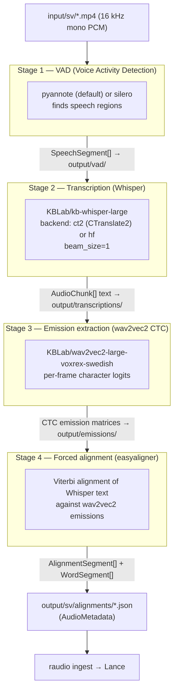
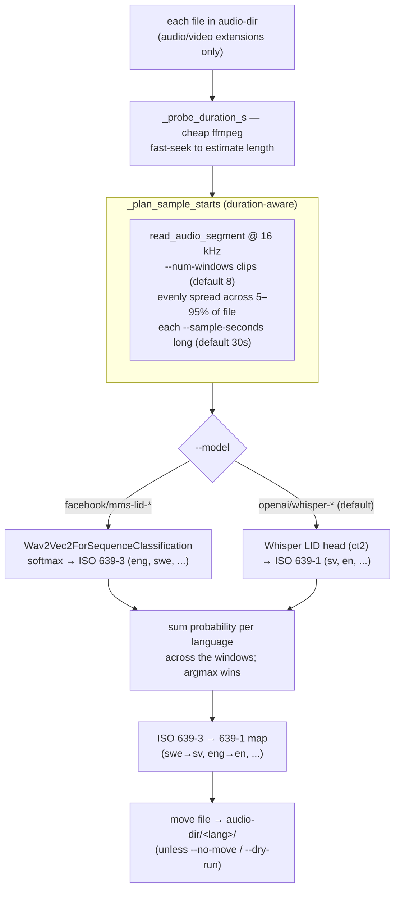
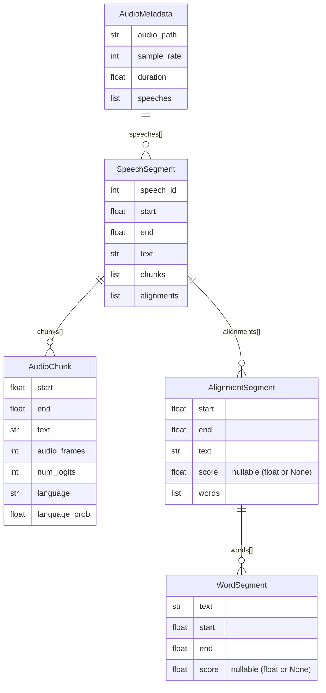
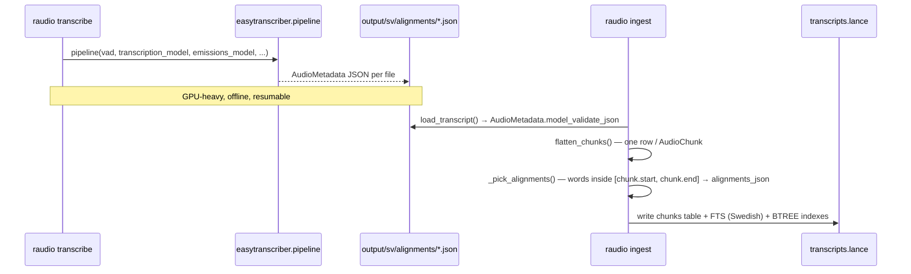
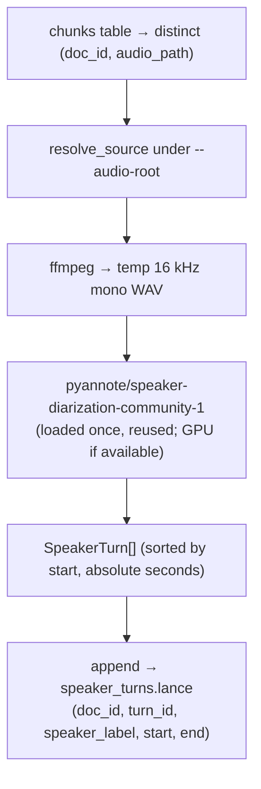

# From audio to searchable text: the ASR pipeline & models

> How a Swedish press-conference MP4 becomes word-aligned transcript JSON that
> `raudio ingest` can load. This is the **upstream half** of the write side
> sketched in the [Architecture Guide](../GUIDE.md) §5 — everything that
> happens *before* a Lance table exists. For the schema those JSONs land in,
> see [GUIDE.md §4](../GUIDE.md#4-the-data-model--four-lance-tables); for the
> running task list see [TODO.md](../TODO.md).

`raudio` does **not** implement ASR. It is a thin operator wrapper around two
KBLab libraries — [`easytranscriber`](https://github.com/kb-labb/easytranscriber)
(the pipeline) and `easyaligner` (the forced-alignment backend) — pinning the
*models* and *defaults* appropriate for a Swedish video archive. The two repo
modules that matter here are:

| Module | Subcommand | What it does |
|---|---|---|
| [`src/raudio/asr/transcribe.py`](../src/raudio/asr/transcribe.py) | `raudio transcribe` | Runs the 4-stage `easytranscriber` pipeline → alignment JSONs |
| [`src/raudio/asr/detect_language.py`](../src/raudio/asr/detect_language.py) | `raudio detect-language` | Pre-step: classify each file's language, sort into `<lang>/` |
| [`src/raudio/model/datamodel.py`](../src/raudio/model/datamodel.py) | — | The Pydantic v2 models that *describe* the JSON output |

---

## 1. The 4-stage pipeline at a glance

`easytranscriber.pipelines.pipeline(...)` runs four models in sequence. Each
stage writes its intermediate output to its own directory under
`--output-root` (default `output/`), so a crash mid-run is resumable and you
can inspect any stage. `raudio transcribe` wires all four together with one call
in [`run_transcribe`](../src/raudio/asr/transcribe.py).



**Why two acoustic models?** Whisper (Stage 2) is excellent at *what* was said
but its timestamps are coarse and drift. A wav2vec2 CTC model (Stage 3) emits
fine-grained per-frame character probabilities; forced alignment (Stage 4) then
snaps Whisper's words onto that grid via Viterbi, yielding **millisecond word
timestamps**. The Whisper text is the transcript; the wav2vec2 emissions are
only used to *time* it. This is the same split popularized by WhisperX, which
`transcribe.py` cites directly in its emissions-model comment.

---

## 2. The models this repo pins

All values below are the **actual defaults** in
[`src/raudio/cli/`](../src/raudio/cli/) (`cmd_transcribe`) and the
`DEFAULT_EMISSIONS_MODEL` map in
[`src/raudio/asr/transcribe.py`](../src/raudio/asr/transcribe.py) — not invented.

| Stage | Flag | Default | Notes |
|---|---|---|---|
| 1 VAD | `--vad` | `pyannote` | `silero` is the alternative; validated in `cmd_transcribe` |
| 2 Transcribe | `--model` | `KBLab/kb-whisper-large` | Swedish-fine-tuned Whisper-large |
| 2 Backend | `--backend` | `ct2` | CTranslate2 (fast); `hf` = HF transformers |
| 2 Beam | `--beam-size` | `1` | ~3–5× faster than Whisper's default 5; "negligible quality loss on clean audio" |
| 3 Emissions | `--emissions-model` | `None` → resolved per language | see below |
| — Language | `--language` | `sv` | ISO 639-1; drives emissions model + Punkt tokenizer |
| — Device | `--device` | `cuda` | |
| — Throughput | `--batch-size-features` | `64` | "64 fits ~25 GB on a 96 GB GPU"; default upstream is 8 |

### Emissions model is chosen by language

When `--emissions-model` is omitted (the default), `run_transcribe` resolves it
from `DEFAULT_EMISSIONS_MODEL` keyed on `--language`:

```python
# src/raudio/asr/transcribe.py
DEFAULT_EMISSIONS_MODEL = {
    "sv": "KBLab/wav2vec2-large-voxrex-swedish",
    "en": "facebook/wav2vec2-base-960h",
}
# fallback when the language isn't in the map:
emissions_model = emissions_model or DEFAULT_EMISSIONS_MODEL.get(language, "facebook/wav2vec2-base-960h")
```

`easyaligner` also needs a sentence tokenizer; `transcribe.py` maps the ISO code
to a Punkt model name via `PUNKT_LANG = {"sv": "swedish", "en": "english"}` and
passes `load_tokenizer(...)` plus `easytranscriber`'s `text_normalizer` into the
pipeline.

### The torch pin (why install is fussy)

[`pyproject.toml`](../pyproject.toml) hard-pins the GPU stack:

```toml
torch==2.11.0+cu128
torchaudio==2.11.0+cu128   # from the explicit pytorch-cu128 index
```

The comment is load-bearing: *"driver 570.x supports up to CUDA 12.8, and cu130
wheels fail to initialize (driver too old)."* `easytranscriber`, `easyaligner`,
and `torch` are **core dependencies** (installed by a plain `uv sync`), but
heavy — so `transcribe.py` imports them **lazily** inside `run_transcribe` and
raises a clear hint to re-run `uv sync` if they are somehow missing. That keeps
`raudio --help` fast and lets the FTS-only / search-only paths run without
touching the GPU. (The *optional* extras are `multimodal`, the client-side
embedding/reranker stack, and `atlas` (evoc / scikit-learn, for `raudio feature
atlas`) — both unrelated to ASR.)

---

## 3. The `detect-language` pre-step

Before transcription you usually have a folder of mixed-language files. Stage 3
(emissions) needs the *correct* language-specific wav2vec2 model, so running
the wrong one wrecks alignment. `raudio detect-language` samples each file,
classifies it, and sorts files into `<audio-dir>/<lang>/` subfolders that
`transcribe` then processes one language at a time.



Grounded details from [`detect_language.py`](../src/raudio/asr/detect_language.py):

- **Two backends, picked by `--model`.** `_mms_probe` loads
  `Wav2Vec2ForSequenceClassification` and softmaxes over its 256 language
  labels (MMS-LID emits ISO 639-3); `_whisper_probe` runs a multilingual
  Whisper's LID head through CTranslate2 (emits ISO 639-1 like `<|sv|>`, braces
  stripped). The module docstring calls `facebook/mms-lid-256` *"state-of-the-art
  for this exact task"*.
- **The CLI default is `openai/whisper-large-v3`** (`cmd_detect_language`'s
  `--model` default) — a multilingual Whisper, *not* a language-fine-tuned one;
  `facebook/mms-lid-256` is the recommended higher-accuracy alternative. Both
  the CLI help and the module docstring warn: **never** pass
  `KBLab/kb-whisper-large` here — fine-tuned models over-predict their training
  language so every file comes back `sv`.
- **Duration-aware multi-window voting.** Each file's length is first estimated
  cheaply (`_probe_duration_s` binary-searches the EOF with tiny ffmpeg
  fast-seek reads — no full decode). `_plan_sample_starts` then spreads
  `--num-windows` clips (default **8**, each `--sample-seconds` = **30 s**)
  evenly across ~5–95% of the duration. The probe runs on every clip and the
  per-language probabilities are summed; the argmax language wins, reported with
  its mean top-1 probability. Spreading across the whole recording (rather than
  fixed early offsets) keeps a long file from being judged by its intro and
  avoids sampling past the end of a short one — a single 30 s window can land on
  silence, a leader tone, or an archive voiceover.
- **ISO 639-3 → 639-1 mapping.** `ISO_639_3_TO_1` translates MMS output
  (`swe`, `eng`, `nor`, `dan`, …) into the 2-letter codes the transcribe
  pipeline expects (`sv`, `en`, `no`, `da`, …); unmapped codes pass through
  unchanged. A `✓` is logged when the detected language has a default
  emissions model in `DEFAULT_EMISSIONS_MODEL`, `!` otherwise.

---

## 4. The data model the pipeline produces

The final alignment JSON deserializes into one `AudioMetadata` per file. The
nesting is the contract between `easytranscriber` and `raudio ingest`;
[`src/raudio/model/datamodel.py`](../src/raudio/model/datamodel.py) vendors the Pydantic v2 models so ingest can `AudioMetadata.model_validate_json(raw)` *without*
importing torch. Field names and shapes match upstream exactly.



Two parallel children hang off each `SpeechSegment`, and understanding *why* is
the key to ingest:

- **`chunks` (`AudioChunk[]`)** = Whisper's ~15–30 s transcription windows. The
  `text` here is what becomes a Lance `chunks` row and what the FTS index is
  built on. Carries `audio_frames` / `num_logits` (acoustic bookkeeping) and an
  optional per-chunk `language` / `language_prob` from Whisper auto-detect.
- **`alignments` (`AlignmentSegment[]`)** = the forced-alignment output, each
  holding `WordSegment[]` with millisecond `start`/`end` and a confidence
  `score`. These are the word-level timestamps that power "jump to this word in
  the video."

At ingest, [`flatten_chunks`](../src/raudio/ingest/ingest.py) emits one row per
`AudioChunk` and `_pick_alignments` attaches *only the alignments fully
contained in that chunk's `[start, end]` window* (`a.start >= start and a.end <=
end`), serialized into the `alignments_json` JSONB column. So the chunk grain is
the search unit; the words inside it ride along for precise seeking.

---

## 5. The alignment JSON shape (real example)

Below is the actual structure of
`output/sv/alignments/T0000234_00001.json` (values trimmed for length, but the
field names, types, and nesting are verbatim from the file). Note the
millisecond word timings and the per-word confidence `score`.

```jsonc
{
  "audio_path": "T0000234_00001.mp4",
  "sample_rate": 16000,
  "duration": 4825.824,
  "metadata": { },
  "speeches": [
    {
      "speech_id": 0,
      "start": 7.050968750000001,
      "end": 4784.515343749999,
      "text": "Ett annat skäl till att jag vill gå ut med principmodellen nu ...",
      "chunks": [
        {
          "start": 7.050968750000001,
          "end": 22.17096875,
          "text": "Ett annat skäl till att jag vill gå ut med principmodellen nu ...",
          "duration": 15.12,
          "audio_frames": 241920,
          "num_logits": 755,
          "language": null,
          "language_prob": null,
          "id": "0-0"
        }
        // ... 196 chunks in this speech
      ],
      "alignments": [
        {
          "start": 7.091,
          "end": 21.00112,
          "text": "Ett annat skäl till att jag vill gå ut med principmodellen ...",
          "duration": 13.91,
          "score": 0.97,
          "words": [
            { "text": "Ett ",   "start": 7.091,   "end": 7.19107, "score": 0.99854 },
            { "text": "annat ",  "start": 7.2311,  "end": 7.43125, "score": 0.9998  },
            { "text": "skäl ",   "start": 7.47127, "end": 7.69143, "score": 0.95207 }
            // ... 33 words in this alignment segment
          ]
        }
        // ... 633 alignment segments in this speech
      ]
    }
  ]
}
```

For this one ~80-minute press conference: **1 speech → 196 chunks + 633
alignment segments**, each segment carrying its own word list. `sample_rate` is
`16000` because every stage runs on 16 kHz mono PCM (the rate VAD, Whisper, and
wav2vec2 all expect).

---

## 6. How this feeds `raudio ingest`

The alignment JSONs are the *only* input `raudio ingest` consumes. Their path
follows the `--output-root` you pass to `transcribe`: the **Makefile** pipeline
uses `output/<lang>/` (`OUTPUT_ROOT = ./output/$(LANGUAGE)`), so the Swedish run
writes `output/sv/alignments/`; the **bare CLI** default for `--output-root` is
`output`, so it writes `output/alignments/`. Ingest then points at that dir:

```bash
# Makefile pipeline (per-language):
raudio ingest output/sv/alignments/*.json
# bare CLI default (no --output-root):
raudio ingest output/alignments/*.json
```



The handoff is purely by convention:

- **Language inference.** `cmd_ingest` infers `doc_language` from the directory
  layout — `output/sv/alignments/foo.json` → `parent.parent.name == "sv"` — so
  the `chunks.language` / `documents.language` columns get stamped correctly
  without an extra flag. This is exactly why `detect-language` sorts into
  `<lang>/` subfolders first.
- **FTS language.** `ingest` builds the Tantivy index with `--fts-language`
  (default `English`, but **use `Swedish`** for this corpus — the English
  stemmer can't reduce forms like `ministern` / `vägen` / `ansåg`). See
  [GUIDE.md §4](../GUIDE.md#4-the-data-model--four-lance-tables) and
  `raudio reindex-fts` for fixing the stemmer after the fact.
- **What the words are for.** The per-word `start`/`end` preserved in
  `alignments_json` is what the search API surfaces as exact word timestamps
  (`raudio search --words`) and what the frontend uses to seek the `<video>`
  element. The full read path picks up from
  [GUIDE.md §5 (read side)](../GUIDE.md#5-end-to-end-information-flow).

In short: **`transcribe` (4 models) → alignment JSON (`AudioMetadata`) →
`ingest` (Lance `chunks`/`documents`)**. Everything downstream — embeddings,
frames, FTS, semantic and visual search — operates on the rows `ingest`
materializes from these JSONs.

---

## 7. Speaker diarization (a separate per-video build stage)

Diarization — **"who spoke when"** — is an independent offline stage that runs
**after `ingest`** but does *not* touch the ASR/alignment chain above: it reads
the **source MP4** again (not the alignment JSON) and writes a brand-new
[`speaker_turns`](../GUIDE.md#4-the-data-model--four-lance-tables) Lance table.
Unlike the embedding stages, it needs **no vLLM server** — `pyannote.audio` is in
the main venv and runs **in-process** (no isolated worker), GPU-accelerated when a
CUDA device is present.

| Module | Subcommand | Make target | What it does |
|---|---|---|---|
| [`src/raudio/media/diarize.py`](../src/raudio/media/diarize.py) | `raudio extract-speaker-turns` | `make speaker-turns` | pyannote diarization per video → `speaker_turns.lance` |



```bash
# default model + audio root (input/sv); resumable, one video at a time
raudio --db transcripts_v2.lance extract-speaker-turns --audio-root ./input/sv
#   or, equivalently, the Make target (honours LIMIT=N for a debug subset):
make speaker-turns DB=transcripts_v2.lance
```

Grounded details from [`diarize.py`](../src/raudio/media/diarize.py) /
[`cli/media.py`](../src/raudio/cli/media.py):

- **In-process, no server.** A `Diarizer` loads
  `pyannote/speaker-diarization-community-1` (the `--model` default) once and
  moves it onto `cuda` if available (else CPU), then reuses it across all videos —
  loading per video would dominate the wall-clock (~90 s/video). Each video is
  first transcoded to a temp **16 kHz mono WAV** (what the pyannote models expect)
  that is deleted after inference.
- **HF token + gated model.** The token is read from the **ambient cached
  credentials** (`hf auth login` / `HF_TOKEN`) — the module never takes a token
  argument — and the `speaker-diarization-community-1` **model terms must be
  accepted** on the Hub, or `Pipeline.from_pretrained` returns `None` and the
  command raises with that exact hint.
- **Resumable at video granularity.** The default `--only-null` skips any
  `doc_id` already present in `speaker_turns`; `--all` drops the table for a clean
  rebuild. `--limit N` diarizes only the first N videos (use it — the full corpus
  is slow). `--jobs` is **reserved/ignored**: diarization runs one video at a time
  on the GPU. One bad video is logged and skipped, never killing the batch.
- **Anonymous, per-video labels.** `speaker_label` is pyannote's local
  `SPEAKER_00` / `SPEAKER_01` / … — stable only *within* one recording, **never**
  across videos. `start`/`end` are **absolute video seconds**, `turn_id` the
  per-video enumerate index over turns sorted by `start`.
- **Append-only, no vector index.** `write_speaker_turns` mirrors
  `write_chunk_frames` (one `lance.write_dataset` append per video). The table has
  no embedding/blob column, so there is **no** IVF/vector index to build; an
  optional scalar BTREE on `doc_id` is the only useful index.

The read side serves this via `GET /api/diarization/{doc_id}` into the player's
**Speakers** tab — see [GUIDE.md §5](../GUIDE.md#5-end-to-end-information-flow).
**`raudio serve` has no auto-reload: restart the backend after building the table**
so it serves the route (the [REPRODUCE.md](REPRODUCE.md) runbook calls this out).

> This is **diarization only** (segment the audio by speaker turn). The separate
> cross-video *voice search* / speaker-embedding axis (matching the *same* person
> across recordings) is **not shipped** — de-risking found it only ~0.74 AUC
> cross-video (AMBER); see [TODO.md](../TODO.md). The anonymous per-video labels
> here deliberately make no cross-video identity claim.
