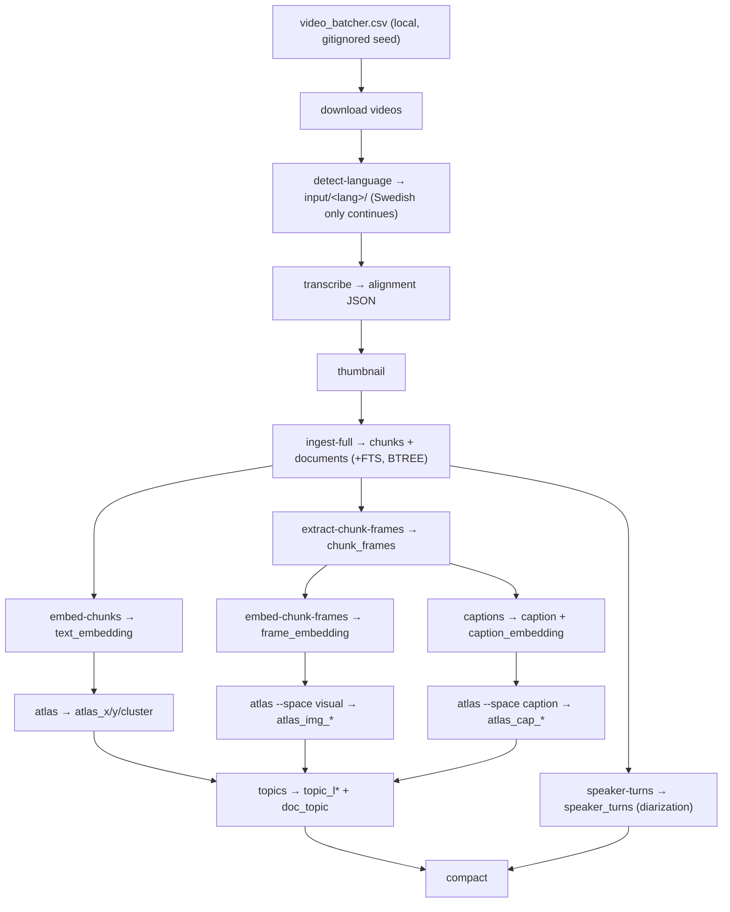

# Reproducing raudio from scratch

> The single authoritative runbook: from a fresh clone to a running, searchable
> system. For *what each stage does* see [PIPELINE.md](PIPELINE.md) (ASR) and
> [GUIDE.md](GUIDE.md) (architecture); this doc is the **ordered, exact
> command sequence + verification gates**.

There are **two** things people mean by "reproduce", and they need different
paths. Pick one:

| Path | You want… | Cost | Result |
|---|---|---|---|
| **A — Restore the artifact** | the *exact published results* (the demo DB) | minutes + bandwidth | **bit-identical** `transcripts_v2.lance` |
| **B — Rebuild from raw** | to regenerate the corpus from videos (new data, or verify the method) | **hours of GPU** | functionally equivalent, **not** byte-identical |

> [!IMPORTANT]
> **"Exact" reproduction = Path A.** The build pipeline (Path B) is **not
> bit-reproducible**: Whisper beam search, IVF_PQ k-means (random init), the EVōC
> 2-D layout, Toponymy clustering, and Gemma caption sampling are all
> unseeded/stochastic. Two clean rebuilds produce *equivalent* search behaviour
> but different bytes, vectors, and cluster ids. If you need the exact numbers
> behind a result, restore the artifact.

> [!NOTE]
> **Database name.** The default DB is already **`transcripts_v2.lance`** (the
> `Makefile` `DB ?=` default and the `rmedia --db` CLI default both point at it).
> The commands below still pass `DB=transcripts_v2.lance` explicitly for clarity;
> override `DB=…` only to build a throwaway or alternate corpus.

---

## 0. Prerequisites (both paths)

```bash
make check-deps        # verifies uv + ffmpeg + hf + GPU, prints install hints
```

| Tool / pin | Required | Notes |
|---|---|---|
| **uv** | yes | `curl -LsSf https://astral.sh/uv/install.sh \| sh` — drives all Python |
| **Python ≥ 3.11** | yes | `requires-python` in `pyproject.toml` |
| **ffmpeg** | Path B | frame/thumbnail extraction + ASR audio decode |
| **Bun** | viewer | builds + serves the SvelteKit frontend |
| **NVIDIA GPU** | semantic/visual/scene | a 96 GB card hosts both 2 B vLLM models at 0.45 mem-frac |
| **Docker** | optional | only for the `*-server-docker` vLLM route (bundles CUDA) |
| **hf CLI** | Path A + uploads | `pip install "huggingface_hub[cli]" && hf auth login` |

**Version pins that matter** (don't drift these without re-reading
[INVESTIGATION.md](INVESTIGATION.md)):

- `torch==2.11.0+cu128` / `torchaudio==2.11.0+cu128` (the `pytorch-cu128` index) —
  driver 570.x supports CUDA 12.8; cu130 wheels fail "driver too old".
- **vLLM `0.22.0`** (`VLLM_PIN`) for both embed + rerank servers.
- Driver tension: vLLM ≥ 0.20 wants driver ≥ 575 (CUDA 12.9) for the *native*
  (uvx) server. On a 12.8 driver, use the **Docker** variant (`make
  embed-server-docker`) which ships its own CUDA.
- Blackwell (sm_120): pre-fetch FA3 kernels once — `make kernels-prepare`.

**Models** (downloaded on first use, cached in `~/.cache/huggingface`):

| Role | Model id | Served by |
|---|---|---|
| Language ID | `openai/whisper-large-v3` | in-process (Path B) |
| ASR transcribe | `KBLab/kb-whisper-large` | in-process (Path B) |
| ASR align (sv) | `KBLab/wav2vec2-large-voxrex-swedish` | in-process (Path B) |
| Text/image embed | `Qwen/Qwen3-VL-Embedding-2B` | vLLM `:8001` |
| Reranker | `Qwen/Qwen3-VL-Reranker-2B` | vLLM `:8002` |
| Captioner | `google/gemma-4-31B-it` | **your** Gemma at `:8003` (external — raudio is only a client) |

Install Python deps:

```bash
make install                       # = uv sync (core: ASR + torch + FastAPI)
# extras are pulled per-command by `uv run --extra …`, or eagerly:
uv sync --extra multimodal --extra atlas
```

---

## Path A — Restore the published artifact (exact)

The corpus + videos live in a HuggingFace bucket. Pull them, then serve.

```bash
export HF_BUCKET=<namespace>/<bucket>      # the published bucket
export DB=transcripts_v2.lance

hf auth login                              # once
make hf-download-all HF_BUCKET=$HF_BUCKET DB=$DB
#   ↳ pulls transcripts_v2.lance/ + videos + output/ + thumbnails/
```

Verify the restore (counts should match the published numbers):

```bash
uv run python - <<'PY'
import lance
for t in ("chunks", "chunk_frames", "speaker_turns"):
    ds = lance.dataset(f"transcripts_v2.lance/{t}.lance")
    print(t, "rows:", ds.count_rows(), "indices:",
          sorted(i["name"] for i in ds.list_indices()))
PY
# expect: chunks ~145k (text_idx, text_embedding_idx, doc_id_idx, …);
#         chunk_frames ~145k (frame_embedding_idx, caption_idx,
#                             caption_embedding_idx, doc_id_idx);
#         speaker_turns — diarization turns (no vector index; optional doc_id BTREE)
```

Then jump to [§ Serving the stack](#serving-the-stack). Done — this *is* the
exact result.

---

## Path B — Rebuild from raw (method reproduction)

The full DAG, in dependency order. Each stage is **resumable** (skips already-
populated rows / files), so a crash is safe to re-run. Run every command with
`DB=transcripts_v2.lance`.

> [!NOTE]
> **Two equivalent execution paths for the derived columns.** The per-column
> `make embed-chunks` / `feature …` targets below are the original in-process
> path. The **Ray Data pipeline** (`rmedia pipeline`, added in Phase 1 of
> [LANCE_MEDIA_MERGE.md](LANCE_MEDIA_MERGE.md)) runs the *same* stages as
> `read_lance → map_batches(actor pool) → driver-side commit` — the form that
> submits unchanged to KubeRay in production (see
> [RASK_LANDING.md](RASK_LANDING.md)). Inspect the stage DAG and run it with:
>
> ```bash
> make pipeline-plan  DB=$DB                       # print the stage DAG (shape/table/gate/client/actors×GPU)
> make pipeline-run   DB=$DB STAGE=text_embedding  # one stage, distributed over a Ray actor pool
> make pipeline-index DB=$DB                        # IVF_PQ cosine + FTS/BTREE via lance-ray
> make features-all-ray DB=$DB                      # every per-row stage → index → EVōC atlas + topics → compact
> ```
>
> The two paths write byte-for-byte-equivalent columns (Phase-1 parity gate,
> `scripts/parity_check.py`); pick either. The global fits (EVōC atlas layout,
> Toponymy topics) are single-driver in both — they cannot be row-parallel.



### Provenance — what produces every table & column

> **Source-of-truth chain:** `video_batcher.csv` (local, gitignored seed) + the
> Riksarkivet **MP4s** → `detect-language` (sort into `input/<lang>/`, keep `sv`)
> → `transcribe` (alignment JSON) → `ingest` (`chunks` + `documents`) →
> feature/CLI steps (everything else). If you lose the Lance dataset, replay Path B
> from those two inputs to regenerate all of the below. This is the exact map of
> *what writes which column, from where*.

**`chunks.lance`** — one row per transcript chunk. Identity + payload written at **ingest**; vectors/derived columns **added later** via `add_columns`.

| Column(s) | Written by | From |
|---|---|---|
| `doc_id · speech_id · chunk_id · audio_path · start · end · duration · text · sample_rate · audio_duration · audio_frames · num_logits · language · language_prob · alignments_json · metadata` | `make ingest-full` (`rmedia ingest`) | the per-video **alignment JSON** from `make transcribe` (easytranscriber 0.2.3 + easyaligner 0.2.3: pyannote VAD → KB-Whisper → wav2vec2-large-voxrex-swedish CTC emissions → forced align). `doc_id`=SHA1(audio_path); `text` is Swedish-FTS-indexed; `alignments_json` is word-level JSONB |
| `referenskod · namn · bildid · extraid` | `make ingest-full` | **`video_batcher.csv`**, keyed by `bildid` (= `audio_path` stem) |
| `text_embedding` (2048-d) | `make embed-chunks` (`feature text_embedding`) | `chunks.text` → embed server `:8001` (Qwen3-VL-Embedding-2B) |
| `frame_embedding` (2048-d) | `make atlas-visual` (join) | `chunk_frames.frame_embedding` @ frame_idx=0 |
| `caption_embedding` (2048-d) | `make atlas-caption` (join) | `chunk_frames.caption_embedding` @ frame_idx=0 |
| `atlas_x/y/cluster` | `make atlas` | EVōC 2-D over `text_embedding` |
| `atlas_img_x/y/cluster` | `make atlas-visual` | EVōC over `frame_embedding` |
| `atlas_cap_x/y/cluster` | `make atlas-caption` | EVōC over `caption_embedding` |
| `topic_l0…topic_l{N} · doc_topic` | `make topics` (`feature topics`) | Toponymy clusters over the atlas map, named by Gemma `:8003` (isolated PEP-723 worker) |
| `summary` *(not built on live DB)* | `rmedia feature summary` | `chunks.text` → instruct LLM |

**`chunk_frames.lance`** — one representative frame per chunk (append-only, separate table).

| Column(s) | Written by | From |
|---|---|---|
| `doc_id · speech_id · chunk_id · frame_idx · frame_blob · frame_mime · frame_width · frame_height` | `make extract-chunk-frames` | one JPEG/chunk via **ffmpeg** fast-seek from the source MP4 (`--audio-root`) |
| `frame_embedding` (2048-d) | `make embed-chunk-frames` (`feature frame_embedding`) | `frame_blob` → embed server `:8001` |
| `caption` | `make captions` (`feature caption`) | `frame_blob` → **your** Gemma `:8003` |
| `caption_embedding` (2048-d) | `make captions` (`feature caption_embedding`) | `caption` → embed server `:8001` |

**`documents.lance`** — one row per source media file.

| Column(s) | Written by | From |
|---|---|---|
| `doc_id · media metadata · media_blob (URI, Blob V2 External) · thumbnail` | `make ingest-full` (`--audio-root`/`--media-base-uri`) | `audio_path` → `file://`/`hf://` URI; `thumbnail` from `make thumbnail` (`thumbnails/<stem>.jpg`) |

**`topics.lance`** — single row.

| Column(s) | Written by | From |
|---|---|---|
| `layers · n_chunks · hierarchy` (JSONB) | `make topics` (`build_topic_tree`) | the per-chunk `topic_l*` columns folded into a nested tree |

**`speaker_turns.lance`** — diarization, one set of rows per video (append-only).

| Column(s) | Written by | From |
|---|---|---|
| `doc_id · turn_id · speaker_label · start · end` | `make speaker-turns` (`rmedia extract-speaker-turns`) | source MP4 (`--audio-root`) → **pyannote** `speaker-diarization-community-1`, in-process. `speaker_label` is anonymous & **per-video only**. No vector column → no IVF index (optional `doc_id` BTREE) |

> **`video_batcher.csv`** (local-only, **gitignored** — `.gitignore:32`; a fresh
> clone does **not** have it) is the one human-curated bootstrap input,
> **semicolon-separated**: `referenskod;namn;extraid;bildid` (~1575 data rows).
> `ingest` keys it by `bildid` (= the `audio_path` stem, e.g. `T0001641_00001`) to
> fill the four `chunks`/`documents` metadata columns; `make download` uses its
> `bildid` column to fetch the MP4s. It is **not** version-controlled — keep your
> own copy (or restore it via Path A); everything else is regenerable from it + the videos.

### B.1 — Acquire + transcribe (CPU/GPU, hours)

```bash
export DB=transcripts_v2.lance LANGUAGE=sv AUDIO_DIR=./input/sv

make download                         # video_batcher.csv `bildid` → input/sv/*.mp4
#   ↳ fetches https://iiifintern-ai.ra.se/api/audiovideo/{bildid}.mp4 (RA-internal host)
make detect-language                  # Whisper-large-v3 LID → moves each file into a <lang>/ subdir
make transcribe AUDIO_DIR=$AUDIO_DIR  # easytranscriber 0.2.3 + easyaligner 0.2.3 → output/sv/alignments/*.json  (GPU)
make thumbnail                        # → thumbnails/*.jpg
```

> **Swedish only, for now.** `detect-language` (Whisper-large-v3; full detail in
> [PIPELINE.md §3](PIPELINE.md)) classifies every downloaded file and **moves it
> into a `<lang>/` subfolder** of its `--audio-dir`. The corpus continues with
> **Swedish (`sv`) only** — `LANGUAGE:=sv`, and the forced-aligner ships emission
> models for `sv`/`en` only; other languages are parked, not transcribed. Point
> `transcribe --audio-dir` at the Swedish subfolder the sort produced.

Gate: `ls output/sv/alignments/*.json | wc -l` should equal your video count.

### B.2 — Ingest → `chunks` + `documents`

```bash
make ingest-full DB=$DB               # builds chunks (+ Swedish FTS, BTREE) + documents
```

Gate:

```bash
uv run python -c "import lance; ds=lance.dataset('$DB/chunks.lance'); \
print('chunks:', ds.count_rows(), '| indices:', [i['name'] for i in ds.list_indices()])"
```

### B.3 — Multimodal columns (needs the embed server up — see §Serving)

> Start `make embed-server` (or `-docker`) **first** — these are its clients.

```bash
make embed-chunks DB=$DB              # chunks.text_embedding + IVF_PQ   (~25 min/145k)
make extract-chunk-frames DB=$DB      # chunk_frames table + frame_blob  (ffmpeg, ~30 min)
make embed-chunk-frames DB=$DB        # chunk_frames.frame_embedding + IVF_PQ
make captions DB=$DB                  # caption (needs your Gemma :8003) + caption_embedding
#   = caption-chunk-frames + embed-captions; resumable via $(DB).caption.ckpt
```

Gate (no NULLs in the embedding columns):

```bash
uv run python - <<'PY'
import lance
c  = lance.dataset("transcripts_v2.lance/chunks.lance")
cf = lance.dataset("transcripts_v2.lance/chunk_frames.lance")
print("text_embedding NULLs:", c.count_rows(filter="text_embedding IS NULL"))
print("frame_embedding NULLs:", cf.count_rows(filter="frame_embedding IS NULL"))
print("caption_embedding NULLs:", cf.count_rows(filter="caption_embedding IS NULL"))
PY
```

### B.4 — Atlas projections + topics (CPU EVōC + Gemma naming)

```bash
make atlas-all DB=$DB                 # atlas (text) + atlas-visual + atlas-caption
make topics DB=$DB                    # Toponymy layers named by Gemma over the atlas map
make compact DB=$DB TABLE=chunk_frames  # merge fragments + rebuild indexes (optional housekeeping)
```

> `make atlas-all`, `make atlas`, and `features-all` were added to fill the
> previous gap where the atlas step had no Make target. `make features-all
> DB=$DB` runs B.3 + B.4 as one chain.

Gate: `make atlas` columns present →
`uv run python -c "import lance; print([n for n in lance.dataset('$DB/chunks.lance').schema.names if n.startswith('atlas_') or n.startswith('topic_')])"`.

### B.5 — Speaker diarization → `speaker_turns` (no server, GPU optional)

Diarization ("who spoke when") is **independent of the embed/Gemma servers** —
`pyannote.audio` runs **in-process** (GPU-accelerated when available, ~90 s/video,
crash-resumable). It needs only the `chunks` table (for the `doc_id` → source-MP4
map), the source MP4s under `--audio-root`, a **cached HF token** (`hf auth
login`), and the **`pyannote/speaker-diarization-community-1` model terms accepted**
on the Hub.

```bash
make speaker-turns DB=$DB AUDIO_DIR=$AUDIO_DIR        # → speaker_turns.lance (all videos)
make speaker-turns DB=$DB AUDIO_DIR=$AUDIO_DIR LIMIT=5  # debug: first 5 videos only
#   = raudio --db $DB extract-speaker-turns --audio-root $AUDIO_DIR
#     (--only-null by default skips already-diarized videos; --all rebuilds clean)
```

Gate (table built + per-video labels present):

```bash
uv run python -c "import lance; ds=lance.dataset('$DB/speaker_turns.lance'); \
print('turns:', ds.count_rows(), '| videos:', len(set(ds.to_table(columns=['doc_id'])['doc_id'].to_pylist())))"
```

> **No vector reindex.** `speaker_turns` carries **no** embedding column, so there
> is nothing to IVF-index and **no `feature … embedding` step** for it. Optional
> housekeeping only: `make compact DB=$DB TABLE=speaker_turns` (=`rmedia --db $DB
> --table speaker_turns compact`) consolidates the per-video append fragments
> (exactly like `chunk_frames`), and a scalar **BTREE on `doc_id`** speeds the
> per-video lookup at full-corpus scale.
>
> **No restart needed.** `/api/diarization/{doc_id}` opens `speaker_turns.lance`
> **on demand per request** (`services/viewer/api/v1/endpoints/diarization.py`), so a freshly-built
> or rebuilt table is served immediately — the player's **Speakers** tab picks it
> up without bouncing the backend.

### B.6 — Knowledge graph → `kg_entities` / `kg_chunks` / `kg_mentions` / `kg_relationships`

A Swedish entity/relation graph extracted from the transcripts by **LightRAG**
(gemma-4-31B), folded into four `kg_*` Lance tables that the `/api/graph` router
queries live via **lance-graph**'s Cypher engine. **Full guide + knobs:
[`scripts/kg/README.md`](../scripts/kg/README.md); how to use the graph +
Cypher cookbook: [`docs/GRAPH.md`](GRAPH.md).** Three steps because LightRAG's
deps must stay **isolated** from the project venv:

```bash
# 1. export chunks → JSONL (project venv)
uv run python scripts/kg/export_chunks.py --db $DB --out kg_work/chunks.jsonl

# 2. LightRAG extraction (ISOLATED ephemeral env — never the project venv).
#    Prefer your LOCAL Gemma at :8003 — single-tenant, no network, identical
#    model to the shared remote. Resumable: re-run after any interruption.
uv run --no-project --with lightrag-hku --with openai --with tiktoken \
    --with nano-vectordb --with networkx --with numpy \
    python scripts/kg/build_kg.py --chunks kg_work/chunks.jsonl --work kg_work/rag \
    --gemma-url http://localhost:8003/v1 --gleaning 0 --persist-interval 300 --dummy-embeddings

# 3. fold LightRAG output → kg_* Lance tables (project venv). DETERMINISTIC:
#    adapter.py + generic_sv.py clean junk + demote generic group/role/category
#    nouns to OTHER by pure morphology/blocklist — no LLM, byte-stable re-runs.
uv run --with networkx python scripts/kg/adapter.py --work kg_work/rag --db $DB
```

Gate (tables built + counts):

```bash
curl -sS http://localhost:8101/api/graph/status   # {"built":true,"entities":…,"relations":…,"mentions":…,"videos":…}
```

> **Corpus-scale speed.** A full run shards across GPUs: launch N copies of step 2
> with `--num-shards N --shard-index i` into per-shard `--work` dirs, then fold all
> of them in one step 3 (`adapter.py --work dir0 dir1 … --db $DB`). The flags above
> (debounced persists + dummy embeddings + `--gleaning 0`) take it from ~8 to ~190
> docs/min — see `scripts/kg/README.md`.
>
> **No restart needed.** The `/api/graph` router's **version-keyed cache** picks up
> the rewritten `kg_*` tables on the next query — the `/graph` page updates without
> bouncing the backend.

---

## Serving the stack

Four processes. The two vLLM servers **must start sequentially** (launching both
at once trips vLLM's memory-profiling race). One script does it all, health-gated
and detached:

```bash
make stack-up DB=transcripts_v2.lance     # embed:8001 → rerank:8002 → viewer:8101/search:8102/annotator:8103 → frontend:5274
# … or the underlying script directly, with knobs:
DB=transcripts_v2.lance VLLM_GPU=0 bash scripts/serve-all.sh up
make stack-down                            # stop them all
```

What it brings up (idempotent — skips any port already healthy):

| Service | Port | Command it runs | GPU |
|---|---|---|---|
| vLLM embed | 8001 | `make embed-server` | `VLLM_GPU` (default 0) |
| vLLM rerank | 8002 | `make rerank-server` | `VLLM_GPU` |
| FastAPI backend | 8000 | `rmedia --db $DB serve` | — |
| Frontend (Bun) | 5274 | `frontend/server.ts` (prod build, proxies `/api`) | — |

> FTS-only / search-only? You can skip the vLLM servers and run just `make
> backend` + `make frontend` — semantic/visual/scene degrade to empty, FTS works.
> Remote box? Forward `-L 5274:127.0.0.1:5274` and open `localhost:5274`.

---

## Serving from S3 (MinIO / RustFS) — object-store backing

The backend reads Lance from an S3-compatible store when the `MEDIA_S3_*` env is
set; unset, it uses the local `db_root` (byte-identical). Three steps: make the
dataset self-contained, move it, serve it.

```bash
# 1. Make media self-contained (the lance-ns way): external file:// media_blob
#    → managed blob-v2 bytes, so a plain copy carries them and they resolve
#    off-box. Run LOCALLY (where the file:// sources still resolve), BEFORE moving.
uv run rmedia --db transcripts_v2.lance materialize-blobs   # → MATERIALIZE OK

# 2. Move the dataset to the bucket + verify tabular/vector/blob reads over S3.
uv run --with numpy python scripts/move_to_s3.py transcripts_v2.lance \
    --endpoint http://127.0.0.1:9000 --key <key> --secret <secret> \
    --bucket lance-media                                    # → S3 READ OK

# 3. Serve the backend from S3 (env only — no code change).
MEDIA_S3_ENDPOINT=http://127.0.0.1:9000 \
MEDIA_S3_ACCESS_KEY_ID=<key> MEDIA_S3_SECRET_ACCESS_KEY=<secret> \
MEDIA_S3_DB_ROOT=s3://lance-media MEDIA_DB=transcripts_v2.lance \
    MEDIA_DB=transcripts_v2.lance make services-up   # viewer:8101 search:8102 annotator:8103
```

Every read path serves from S3: `GET /api/datasets`, `/datasets/{id}/descriptor`,
FTS/vector `/api/search`, blob/Range `/api/media/{doc}` (206 + `Content-Range`),
and the capabilities `/api/voice/status`, `/api/diarization/{doc}`, `/api/topics`,
`/api/graph/status` + `POST /api/graph/cypher` — all verified on MinIO **and**
RustFS (`rustfs` uses `--endpoint http://127.0.0.1:9100`; path-style is forced, as
both stores reject virtual-hosted addressing). Full detail: `docs/RASK_LANDING.md`
§4.

---

## Final verification (the smoke test)

```bash
# all four up?
for p in 8000 8001 8002 5274; do
  printf "%s " $p; curl -s -o /dev/null -w '%{http_code}\n' \
    "http://127.0.0.1:$p/$([ $p = 8000 ] && echo api/health || ([ $p = 5274 ] && echo '' || echo health))"
done

# every search mode returns hits on the live data
for m in fts semantic visual scene scene_fts hybrid all; do
  printf "%-10s " $m
  curl -s "http://127.0.0.1:8102/api/search?q=regeringen&mode=$m&n=3" \
    | python3 -c "import sys,json;print('hits:', len(json.load(sys.stdin)))"
done

# diarization built? (pick any doc_id from a search hit above)
curl -s "http://127.0.0.1:8101/api/diarization/<doc_id>" \
  | python3 -c "import sys,json;d=json.load(sys.stdin);print('built:', d['built'], '| turns:', len(d['turns']), '| speakers:', len(d['speakers']))"
# built:false simply means speaker_turns isn't built for that video (or at all).
```

`scripts/e2e_smoke.py` (`make e2e-smoke`) runs **ingest → text + frame embeddings
→ backend smoke** on a 2-doc throwaway DB (it consumes existing alignment JSON —
no transcribe — and skips the caption/scene half). It covers
fts/semantic/visual/hybrid/all, so it's the fastest proof the core write+search
path works without the full corpus; it does **not** exercise transcribe or scene.

---

## Footgun checklist

- [ ] Start vLLM **embed before rerank**, never simultaneously (`serve-all.sh`
      enforces this).
- [ ] On a CUDA-12.8 driver, use `make embed-server-docker` / `rerank-server-docker`.
- [ ] Blackwell: `make kernels-prepare` once before the native `embed-server`.
- [ ] Captions/topics need **your own Gemma at `:8003`** — raudio never starts it.
- [ ] FTS must be built with `--fts-language Swedish` (the English stemmer mangles
      `ministern`/`vägen`); `make ingest-full` does this, or `make reindex-fts`.
- [ ] Diarization (`make speaker-turns`) needs a **cached HF token** (`hf auth
      login`) + the **`speaker-diarization-community-1` model terms accepted**; it
      runs in-process (no server). No backend restart needed — `/api/diarization`
      reads `speaker_turns.lance` on demand. No vector reindex — `speaker_turns`
      has no embeddings.
