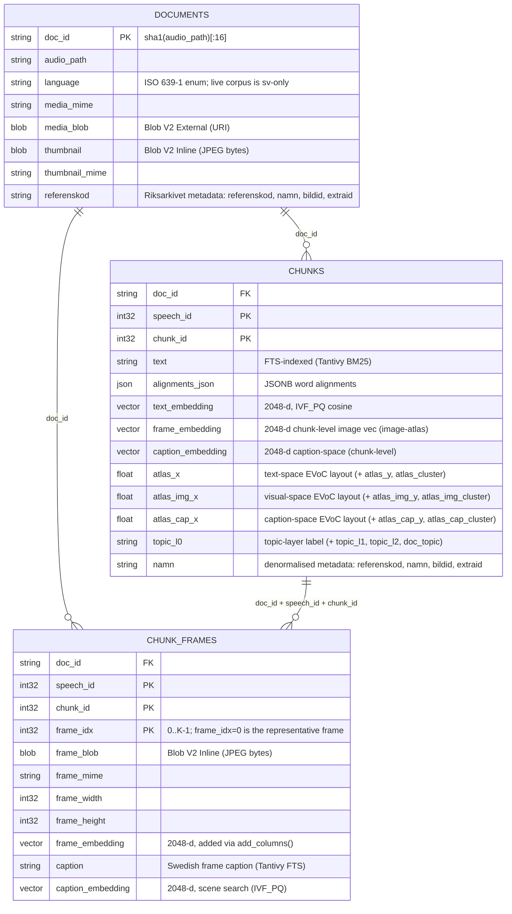
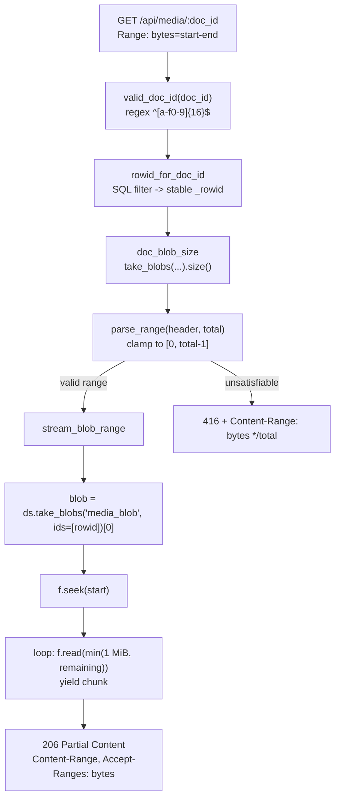
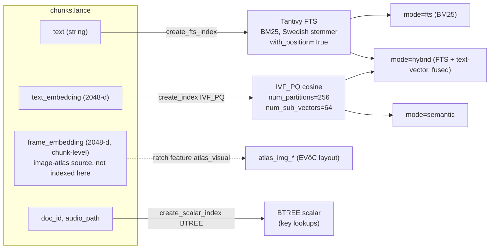

# How ratch uses Lance

> The storage layer in depth. The [README](../README.md) is the quickstart and
> [GUIDE.md](GUIDE.md) is the architecture map; **this doc is the contract
> between the schema and the Lance file format**. Read it when you touch
> [`src/ratch/model/schema.py`](../src/ratch/model/schema.py),
> [`src/ratch/ingest/ingest.py`](../src/ratch/ingest/ingest.py), or the blob/range code in
> [`services/viewer/api/v1/endpoints/media.py`](../services/viewer/api/v1/endpoints/media.py). For the indexation gotchas that bit us
> (the `merge_insert` crash, `nprobes` recall) see [INVESTIGATION.md](INVESTIGATION.md).

Everything ratch stores — transcript text, metadata, word alignments, three
families of 2048-d embeddings, JPEG thumbnails, per-chunk video frames, and the
URIs of the source MP4s — lives in **one Lance dataset directory** (the live one
on this machine is `transcripts_v2.lance/`; see [§1](#1-the-tables)). There
are no sidecar JSON files and no disk walks at query time. This is only possible
because ratch leans on four specific **Lance file format 2.2** capabilities:

| Feature | What it buys ratch | Where |
|---|---|---|
| **Columnar tables** | Cheap full-table FTS/metadata scans without touching media bytes | every table |
| **Blob V2** (4 storage tiers) | Media URIs *and* small bytes in the same row, range-readable | `media_blob`, `thumbnail`, `frame_blob` |
| **JSONB** (`pa.json_()`) | Word-alignment trees + topic tree as queryable binary JSON, no nested-struct decode | `chunks.alignments_json`, `topics.hierarchy` |
| **Native indexes** | Tantivy BM25 FTS + IVF_PQ cosine ANN over the same rows | `text`/`caption`, `text_embedding`, `frame_embedding`, `caption_embedding` |

A `blob_field` column **requires** `data_storage_version="2.2"`. Today only
`documents` (`media_blob`, `thumbnail`) and `chunk_frames` (`frame_blob`) carry
blob columns; `chunks` no longer does (frames moved to `chunk_frames`), but every
table is pinned to `"2.2"` for consistency. That constraint shapes how
`ingest/ingest.py` and `media/frames.py` write their first dataset
(see [§ Why `lance.write_dataset` not `create_table`](#why-lancewrite_dataset-not-create_table)).

---

## 1. The tables



These are physical Lance datasets under one directory:
`<db>.lance/{chunks,documents,chunk_frames}.lance`, plus two more ratch-produced
tables — `speaker_turns.lance` (diarized turns, see [`speaker_turns`](#speaker_turns--the-diarization-table))
and `topics.lance` (the topic tree, see [`topics`](#topics--the-topic-tree)).
They are joined **only by key columns**, never by a stored
foreign-key relation — the backend resolves keys to stable row ids with SQL
filters (`_rowid_for_filter`, `rowid_for_doc_id` in
[`services/viewer/api/v1/endpoints/media.py`](../services/viewer/api/v1/endpoints/media.py)). (A knowledge-graph layer
also writes sibling `kg_chunks`/`kg_entities`/`kg_mentions`/`kg_relationships`
tables into the same directory from `runners/kg/adapter.py`, read by
[`services/viewer/api/v1/endpoints/graph.py`](../services/viewer/api/v1/endpoints/graph.py); those are out of scope
for this doc.)

> **Which DB is live** — the served dataset is **`transcripts_v2.lance/`** (chunks
> = 145,175 rows; documents = 1,154; chunk_frames = 145,175), and it is also the
> default (`Makefile` `DB ?= ./transcripts_v2.lance`, and the `ratch --db` CLI
> default). An older empty `./transcripts.lance` may linger on some machines, so
> confirm you are pointed at `transcripts_v2.lance`.

### The keys

- **`doc_id = sha1(audio_path)[:16]`** — a 16-char hex string. Deterministic, so
  re-ingesting the same file produces the same id (idempotent). Computed by
  `_doc_id()` in `ingest/ingest.py`. The backend validates it against the regex
  `^[a-f0-9]{16}$` before it ever reaches a SQL filter (`valid_doc_id`).
- **`(doc_id, speech_id, chunk_id)`** — the composite chunk key. `speech_id` is
  the speech index from the transcript; `chunk_id` is the 0-based position of the
  chunk within that speech (`enumerate(speech.chunks)` in `flatten_chunks`).
- **`(doc_id, speech_id, chunk_id, frame_idx)`** — the composite `chunk_frames`
  key. A single chunk can hold N frames (`frame_idx` 0..K-1); `frame_idx=0` is
  the single representative frame.

### `chunks` — the scan-cheap text table

One row per transcript chunk ([`CHUNK_SCHEMA`](../src/ratch/model/schema.py)).
It deliberately carries **no audio bytes** — the source media lives on the
`documents` table keyed by `doc_id`, and the audio rides inside the source MP4
served by the backend — so FTS and metadata scans stay cheap no matter how much
media the DB holds. Notable columns:

- `text` (`nullable=False`) — the column the Tantivy FTS index is built on.
- `alignments_json` (`pa.json_()`) — JSONB word-alignment tree (§3).
- `text_embedding` (`FixedSizeList<float32, 2048>`, nullable) — the
  semantic-search vector. **Not in the base schema**: `ratch feature text_embedding`
  attaches it after ingest with `dataset.add_columns(...)` (Lance data
  evolution, via `upsert_scan_column` in `ratch.features.engine`), so ingest
  never writes a placeholder column.
- `frame_embedding` (`FixedSizeList<float32, 2048>`, nullable) — a **second
  vector column**, the *chunk-level* image vector for the image-atlas. It is the
  representative-frame (`frame_idx=0`) vector joined from `chunk_frames`
  (`ratch feature atlas_visual` for the visual atlas, via
  `chunk_frame_embedding_column`). (The IVF index lives on the `chunk_frames`
  copy; the `chunks` copy is the source for the visual atlas projection, not an
  indexed search column.)
- `caption_embedding` (`FixedSizeList<float32, 2048>`, nullable) — a **third
  vector column**, the chunk-level caption-space vector. The same representative-
  frame join (`chunk_frame_embedding_column`) brings the `frame_idx=0`
  `caption_embedding` over from `chunk_frames` for `ratch feature atlas_caption`.
  So `chunks` carries **three** vector columns (`text_embedding`,
  `frame_embedding`, `caption_embedding`).
- `atlas_x` / `atlas_y` / `atlas_cluster` (text-space), `atlas_img_x` /
  `atlas_img_y` / `atlas_img_cluster` (visual-space) and `atlas_cap_x` /
  `atlas_cap_y` / `atlas_cap_cluster` (caption-space) — nine EVōC projection
  columns for the Atlas view. The text triplet is written by `ratch feature
  atlas` from `text_embedding`; the visual triplet by `ratch feature
  atlas_visual` (= `ratch feature atlas --space visual`) from the chunk-level
  `frame_embedding`; the caption triplet by `ratch feature atlas_caption` from
  the chunk-level `caption_embedding`. See
  [`src/ratch/features/projection.py`](../src/ratch/features/projection.py).
- `topic_l0` / `topic_l1` / `topic_l2` / `doc_topic` (`string`, nullable) — the
  topic-layer labels written by `ratch feature topics`, which back the topic
  facet (`SearchSpec.topic`) and are Bitmap-indexed (`doc_topic_idx`,
  `topic_l2_idx`). See [`topics`](#topics--the-topic-tree) and
  [`src/ratch/features/topic_tree.py`](../src/ratch/features/topic_tree.py).

Riksarkivet archival metadata (`referenskod`, `namn`, `bildid`, `extraid`) is
**denormalised** onto every chunk row so retrieval needs no join — the search
projection `_HIT_COLUMNS` (in `services/search/services/constants.py`) reads them straight
off the hit.

### `documents` — the portable media catalog

One row per source media file ([`DOC_SCHEMA`](../src/ratch/model/schema.py)). It is
the only table with media-bearing columns, and both are Blob V2:

- `media_blob` — **Blob V2 External**: stores a URI *string*, not bytes (§2).
- `thumbnail` — **Blob V2 Inline**: small JPEG bytes in the main data page.

This table is *optional*: `ingest_many` only writes it when one of
`audio_root` / `media_base_uri` / `thumbnail_dir` is supplied. The backend
guards every media/thumbnail endpoint with `if state.docs_ds is None`.

### `chunk_frames` — the append-only frame table

One row per extracted video frame, captured via ffmpeg
([`CHUNK_FRAMES_SCHEMA`](../src/ratch/model/schema.py)). Keyed by
`(doc_id, speech_id, chunk_id, frame_idx)` — a chunk can hold N frames
(`frame_idx` 0..K-1), with `frame_idx=0` the single representative frame
captured at `chunk.start`. `frame_blob` is **Blob V2 Inline** (~50 KB JPEG,
comfortably under the 64 KB inline threshold). Beyond the frame bytes it also
carries the live caption columns `caption` (Swedish frame caption, Tantivy-indexed
`caption_idx`) and `caption_embedding` (`FixedSizeList<float32, 2048>`, IVF_PQ
`caption_embedding_idx`) — both fully populated — which back `mode=scene_fts` and
`mode=scene` (§4).

**Why it is a separate table and not just `frame_*` columns on `chunks`** —
this is the single most load-bearing schema decision. Lance 4.0's `merge_insert`
crashes its encoder when backfilling blob columns post-hoc on a *wide* schema
(multiple extension types at once), failing with
`Invalid user input: there were more fields in the schema than provided column
indices / infos` (decoder.rs:438), reproduced at 1, 100, and 145k rows. The Lance
2.2 docs recommend "append + `add_columns`" for data-evolution workloads instead,
so:

- `ratch extract-chunk-frames` **appends** new fragments (no `merge_insert`).
- `ratch feature frame_embedding` attaches `frame_embedding` via
  `dataset.add_columns(...)` — a column-level append that never touches existing
  files and bypasses the `merge_insert` join entirely.

Full post-mortem in [INVESTIGATION.md](INVESTIGATION.md).

### `speaker_turns` — the diarization table

One row per diarized speaker turn ([`SPEAKER_TURNS_SCHEMA`](../src/ratch/model/schema.py),
columns `doc_id`, `turn_id`, `speaker_label`, `start`, `end`). Written by
`ratch extract-speaker-turns` (`write_speaker_turns` in
[`src/ratch/media/diarize.py`](../src/ratch/media/diarize.py)) — `turn_id` is the
per-video `enumerate` index over that video's turns. It is **append-only** on the
same `"2.2"` storage version (`SPEAKER_TURNS_STORAGE_VERSION`) and is read on
demand by the backend diarization router (`GET /api/diarization/{doc_id}` in
[`services/viewer/api/v1/endpoints/diarization.py`](../services/viewer/api/v1/endpoints/diarization.py)) — no backend
restart needed.

### `topics` — the topic tree

A single-row table (`topics.lance`) holding the nested topic hierarchy: `hierarchy`
(`pa.json_()` JSONB — another JSONB consumer alongside `chunks.alignments_json`),
`layers` (`int32`), `n_chunks` (`int64`). Written by `ratch feature topics`
(`write_topics_table` in
[`src/ratch/features/topic_tree.py`](../src/ratch/features/topic_tree.py)) from the
`chunks.topic_l*` layer columns; pinned to `"2.2"` like the rest.

---

## 2. Blob V2 — the four storage tiers

Lance Blob V2 lets a single logical "blob" column pick, per value, *where* the
bytes physically live. There are **four storage semantics**:

| Tier | Size range | Where bytes live | ratch use |
|---|---|---|---|
| **Inline** | ≤ 64 KB | Packed into the main data page, alongside scalar columns | `thumbnail`, `frame_blob` |
| **Packed** | 64 KB – 4 MB | Co-located in a packed blob region of the fragment | — (not used) |
| **Dedicated** | > 4 MB | Its own blob file in the fragment | — (not used) |
| **External** | any (URI) | *Outside the dataset* — bytes are wherever the URI points | `media_blob` |

ratch uses exactly **two** of these tiers, on purpose:

- **Inline** for `thumbnail` and `frame_blob`: both are small JPEGs (tens of KB).
  Keeping them in the main data page means no sidecar files and one fewer I/O
  hop on read.
- **External** for `media_blob`: the MP4s are large and may live anywhere. The
  column stores a **URI** — `file://` (local dev), `hf://` (Hugging Face), or
  `s3://` — *not the bytes*. This keeps `documents.lance` a tiny portable catalog
  while the media stays where it already is. URIs are composed by
  `compose_media_uri()` (in `ingest/audio.py`) and written with
  `lance.blob_array([uri, ...])` in `_write_documents_table`.

> **Why `allow_external_blob_outside_bases=True`** — our URIs (`file://…`,
> `hf://…`) don't map to registered Lance "base paths" yet, so the writer passes
> this flag to permit external blobs outside known bases. `ingest/ingest.py` has
> a TODO to register base paths for true multi-base lifecycle governance.

### How writes wrap blob columns

A `blob_field` (or `pa.json_()`) column **cannot** be built with
`pa.array(values, type=...)` — that raises a schema mismatch. The writers in
`ingest/ingest.py` and `media/frames.py` special-case this: every non-blob
column is built per its declared field type, and blob columns are wrapped with
`lance.blob_array(...)`:

```python
# _write_documents_table — media_blob is External URIs, thumbnail is Inline bytes
media_col = blob_array(cols.pop("media_blob"))   # ["file://…", "hf://…", …]
thumb_col = blob_array(cols.pop("thumbnail"))    # [b"\xff\xd8…", None, …]
```

`media/frames.py` does the same for `frame_blob`
(`"frame_blob": blob_array([f.jpeg_bytes for f in good])`).

### Why `lance.write_dataset` not `create_table`

`lancedb.create_table` does not expose `data_storage_version`, but any
`blob_field` column **requires** `"2.2"`. So the *first* write of each dataset
goes directly through `lance.write_dataset(...)`, and the table is then re-opened
through lancedb:

```python
lance.write_dataset(
    chunks_table, chunks_path, mode="create",
    data_storage_version=CHUNK_STORAGE_VERSION,        # "2.2"
    allow_external_blob_outside_bases=True,
)
table = db.open_table(table_name)                      # re-open via lancedb
```

The three `*_STORAGE_VERSION` constants in `model/schema.py` are all `"2.2"` and
typed `Final` so they satisfy Lance's `Literal["2.2"]` parameter type.

### The blob read path (HTTP Range → `seek()` + `read()`)

The reason Inline/External is invisible to readers is `ds.take_blobs(...)`: it
returns a **lazy, seekable `BlobFile` handle** regardless of where the bytes
live. The backend maps an HTTP `Range` header straight onto `seek(start)` +
`read(length)`, so video scrubbing streams only the requested bytes — for
External URIs this becomes an HTTP Range request to the underlying object store,
never a full download.



Key facts grounded in `services/viewer/api/v1/endpoints/media.py` and `services/viewer/api/v1/endpoints/media.py`:

- Blobs are read by **`ds.take_blobs(column, ids=[rowid])`**. `ids` are *stable
  logical row ids* that survive deletes and compaction; positional `indices` are
  not stable, so they are never used here. Every endpoint first resolves its key
  (`doc_id`, or the `(doc_id, speech_id, chunk_id, frame_idx)` tuple) to a
  `_rowid` via a SQL filter (`with_row_id=True`), then takes the blob by that id.
- `stream_blob_range` opens the blob with `with blob as f:`, `f.seek(start)`,
  then yields `f.read(min(_STREAM_CHUNK, remaining))` until satisfied.
  `_STREAM_CHUNK = 1 << 20` (1 MiB) — big enough to amortize seek cost, small
  enough to bound memory under concurrent streams.
- `doc_blob_size` probes size *without* reading the body: tries `f.size()`, falls
  back to `f.seek(0, 2); f.tell()`.
- `thumbnail` and `chunk_frame` read the whole small blob in one `f.read()` and
  return it with `Cache-Control: public, max-age=86400`; `media` uses
  `Cache-Control: no-store` because it is range-streamed.
- `chunk_frame` (`GET /api/chunk-frame/{doc_id}/{speech_id}/{chunk_id}?frame_idx=N`,
  default `frame_idx=0`) reads `chunk_frames.frame_blob`. It returns 404 until
  `ratch extract-chunk-frames` has populated the `chunk_frames` table.

---

## 3. JSONB — `alignments_json`

`chunks.alignments_json` is declared `pa.json_()`. Lance stores it as **compact
binary JSONB**, not as a deeply-nested PyArrow struct. Each value is the list of
word-level alignments fully contained in that chunk's `[start, end]` window:

```json
[{"start": 12.3, "end": 14.8, "text": "...", "duration": 2.5, "score": 0.97,
  "words": [{"text": "...", "start": 12.3, "end": 12.6, "score": 0.99}, ...]}]
```

**Why JSONB instead of a native nested struct** (`alignment_struct` *is* defined
in `model/schema.py` but deliberately not used for this column):

- Writers pass plain **JSON strings** (`json.dumps(...)` in `flatten_chunks`) and
  readers get JSON **text** back — no binding-specific nested-struct
  encode/decode dance across the Python/Lance boundary.
- It keeps the door open to add **scalar or FTS indexes on JSON paths** later via
  Lance's JSON functions (`json_extract`, `json_get_*`) without a schema
  migration.

> **Ingest gotcha** — from a `list[dict]`, PyArrow infers `large_string`, but the
> column type is `pa.json_()` (an extension over `large_string`), and Lance's
> append refuses the mismatch. `_build_chunks_table` fixes this by building every
> column with its *declared* field type, which promotes the JSON strings into the
> extension array.

On read, `parse_alignments_json` (in
[`src/ratch/retrieval/search.py`](../src/ratch/retrieval/search.py))
defensively handles both shapes: if Lance already decoded it (not a `str`) it
passes through; otherwise `json.loads`. The backend calls this in
`_postprocess_hits` (`services/search/services/postprocess.py`) so every search hit ships an
`alignments` list.

---

## 4. Indexes

Two index families are built over the same rows: a Tantivy full-text index on
`text`, and IVF_PQ cosine vector indexes on the embedding columns.



`SearchMode` (`services/search/services/spec.py`) has **seven** modes:
`fts`, `semantic`, `visual`, `scene`, `scene_fts`, `hybrid`, and `all`. The
`frame_embedding` IVF_PQ index on `chunk_frames` backs `mode=visual` and the
frame leg of `mode=all`. The caption-backed modes — `scene` (cosine over
`chunk_frames.caption_embedding`) and `scene_fts` (BM25 over
`chunk_frames.caption`) — are **live**: captions are built on the served DB
(`chunk_frames.caption` Tantivy-indexed as `caption_idx`,
`chunk_frames.caption_embedding` IVF_PQ-indexed as `caption_embedding_idx`, both
fully populated), so `scene`/`scene_fts` return real hits. See
[EMBEDDINGS.md](EMBEDDINGS.md) for the full search-mode map.

### Tantivy full-text (BM25)

Built by `ingest_many` (and rebuilt standalone by `reindex_fts`, exposed as
`ratch reindex-fts`):

```python
table.create_fts_index(
    "text", replace=True,
    with_position=True,          # required for phrase queries
    remove_stop_words=False,     # keep "of"/"the"/"i"/"och" so phrases match verbatim
    language=fts_language,       # picks the stemmer + stop-word list
)
```

The non-default flags are each load-bearing:

- **`with_position=True`** — stores token positions so a `PhraseQuery` (used by
  the `phrase=true` search flag) can match exact word order.
- **`remove_stop_words=False`** — keeps stop words in the index so a phrase like
  `"spring of hope"` matches verbatim instead of silently degrading to
  `"spring hope"`.
- **`language` / stemmer** — for Swedish text the English stemmer can't reduce
  forms like `ministern` / `vägen` / `ansåg` to a shared stem, so those queries
  return zero hits. `reindex_fts` defaults to `language="Swedish"` (with
  `ascii_folding=True`) to fix exactly that. Use it to swap stemmers **without
  re-ingesting** — only the inverted index is rewritten.

Two **BTREE scalar indexes** are also built, on `doc_id` and `audio_path`, to
speed the key-lookup filters the backend runs constantly. The live `chunks` table
additionally carries two **BITMAP** indexes — `doc_topic_idx` and `topic_l2_idx`
— built by `ratch feature topics` to make the topic facet (`SearchSpec.topic`)
cheap to filter on.

### IVF_PQ cosine vector index

Built by `ensure_vector_index` (in `ratch.features.engine`, called from
`ratch feature text_embedding`, `ratch feature frame_embedding`, and
`ratch compact` when it rebuilds indexes — see [`src/ratch/cli/`](../src/ratch/cli/)):

```python
table.create_index(
    metric="cosine",
    vector_column_name=column,        # "text_embedding" or "frame_embedding"
    index_type="IVF_PQ",
    num_partitions=num_partitions,    # default 256: IVF coarse partitions
    num_sub_vectors=num_sub_vectors,  # default 64: PQ sub-quantizers per vector
    replace=True,
)
```

- **IVF** (inverted file) clusters vectors into `num_partitions` (default 256)
  coarse cells; a query only scans a few cells.
- **PQ** (product quantization) compresses each 2048-d vector into
  `num_sub_vectors` (default 64) quantized codes, shrinking the index and
  speeding distance math.
- **cosine** matches the embedding contract: Qwen3-VL vectors are the full
  2048-d output, **L2-normalized**, and `text_embedding` + `frame_embedding` share
  the *same* 2048-d space, so cross-modal (image→frame, text→frame) search is a
  direct cosine compare.

Two guard rails to know about, both enforced by `ensure_vector_index`:

- **Won't index a column with nulls.** It refuses to run while the column still
  has any `NULL` row (Lance's IVF trainer mishandles partial-NULL vector
  columns), so the embedding feature fully populates the column before the index
  is built.
- **Won't index below `num_partitions` rows.** IVF k-means needs at least one
  training vector per partition; below `num_partitions` rows the build is skipped
  and Lance falls back to flat (brute-force) search until the table grows.

A third operational fact:

- **Compaction invalidates ANN indexes.** Many small append writes
  (`extract-chunk-frames` flushes, incremental ingests) leave a long tail of small
  fragments and stale index row addresses; `ratch compact` runs
  `ds.optimize.compact_files(...)` then rebuilds whichever embedding indexes are
  fully populated.

> **`IVF_HNSW_SQ` as an option** — for the frame-embedding index, Lance's
> `IVF_HNSW_SQ` ("better recall at the cost of more memory") is a candidate swap;
> better recall could let `nprobes` stay low. Tracked as a stretch item in
> [TODO.md](TODO.md).

### Query-time recall (`nprobes` + `refine_factor`)

Lance's IVF_PQ default probes too few partitions (`nprobes=1` scans only 1 cell)
for good recall — the "feels broken, re-query" reflex. The backend fixes this with
**adaptive probing** (`services/search/services/service.py:244-246`,
`services/search/services/frames.py:84-86`): every vector query is issued with
`.minimum_nprobes(_VECTOR_NPROBES).maximum_nprobes(_VECTOR_MAX_NPROBES).refine_factor(_VECTOR_REFINE_FACTOR)`,
where `_VECTOR_NPROBES = 20`, `_VECTOR_MAX_NPROBES = 0` (uncapped — extends toward
a full-index scan when a *selective* prefilter leaves the first pass short of
`limit`), and `_VECTOR_REFINE_FACTOR = 3` re-scores the top candidates with
full-precision vectors (`services/search/services/constants.py:49-57`). Uncapped is cheap
here: the live table is ~35 IVF partitions at 145k rows, so worst case is a
full-index scan of a few ms. The history of this gotcha (and the `merge_insert`
crash) is documented in [INVESTIGATION.md](INVESTIGATION.md).

---

## 5. At a glance — which Lance feature each column uses

| Table.column | Lance feature | Tier / type | Built/written by |
|---|---|---|---|
| `chunks.text` | Tantivy FTS | BM25 inverted index | `create_fts_index` (ingest / `ratch reindex-fts`) |
| `chunks.text_embedding` | Vector index | IVF_PQ cosine, 2048-d | `ratch feature text_embedding` (`add_columns`) → `ensure_vector_index` |
| `chunks.frame_embedding` | Column (data evolution) | 2048-d chunk-level image vec (image-atlas; not indexed on `chunks`) | `ratch feature atlas_visual` (`chunk_frame_embedding_column`, `add_columns`) |
| `chunks.caption_embedding` | Column (data evolution) | 2048-d chunk-level caption vec (caption-atlas; not indexed on `chunks`) | `ratch feature atlas_caption` (`chunk_frame_embedding_column`, `add_columns`) |
| `chunks.atlas_x` / `atlas_y` / `atlas_cluster` | Column (data evolution) | float / int32 (text-space EVōC) | `ratch feature atlas` (`add_columns`) |
| `chunks.atlas_img_x` / `atlas_img_y` / `atlas_img_cluster` | Column (data evolution) | float / int32 (visual-space EVōC) | `ratch feature atlas_visual` (`add_columns`) |
| `chunks.atlas_cap_x` / `atlas_cap_y` / `atlas_cap_cluster` | Column (data evolution) | float / int32 (caption-space EVōC) | `ratch feature atlas_caption` (`add_columns`) |
| `chunks.topic_l0` / `topic_l1` / `topic_l2` / `doc_topic` | Column + Bitmap index | string (`doc_topic_idx`, `topic_l2_idx` Bitmap) | `ratch feature topics` (`add_columns`) |
| `chunks.alignments_json` | JSONB | `pa.json_()` | `flatten_chunks` (`json.dumps`) |
| `chunks.doc_id`, `audio_path` | Scalar index | BTREE | `create_scalar_index` |
| `documents.media_blob` | Blob V2 | **External** (URI) | `_write_documents_table` (`blob_array`) |
| `documents.thumbnail` | Blob V2 | Inline (bytes) | `_write_documents_table` (`blob_array`) |
| `chunk_frames.frame_blob` | Blob V2 | Inline (bytes) | `ratch extract-chunk-frames` (append, `blob_array`) |
| `chunk_frames.frame_embedding` | Vector index | IVF_PQ cosine, 2048-d | `ratch feature frame_embedding` (`add_columns`) → `ensure_vector_index` |
| `chunk_frames.caption` | Tantivy FTS | BM25 inverted index (`caption_idx`) | `ratch feature caption` |
| `chunk_frames.caption_embedding` | Vector index | IVF_PQ cosine, 2048-d (`caption_embedding_idx`) | `ratch feature caption_embedding` (`add_columns`) → `ensure_vector_index` |
| `speaker_turns.*` | Columnar table | `"2.2"` storage version | `ratch extract-speaker-turns` (append) |
| `topics.hierarchy` | JSONB | `pa.json_()` (topic tree) | `ratch feature topics` (`write_topics_table`) |

---

## See also

- [GUIDE.md](GUIDE.md) — architecture & onboarding map (write side vs read side).
- [EMBEDDINGS.md](EMBEDDINGS.md) — the embedding + search-mode contract (RRF, rerank).
- [INVESTIGATION.md](INVESTIGATION.md) — the `merge_insert` crash and `nprobes` recall, in depth.
- [`src/ratch/model/schema.py`](../src/ratch/model/schema.py) — the authoritative PyArrow schemas.
- [`src/ratch/ingest/ingest.py`](../src/ratch/ingest/ingest.py) — how blob/JSON columns are written.
- [`services/viewer/api/v1/endpoints/media.py`](../services/viewer/api/v1/endpoints/media.py) — the Blob V2 + HTTP-Range read path.
- [`services/search/services/service.py`](../services/search/services/service.py) — the framework-free search core.
