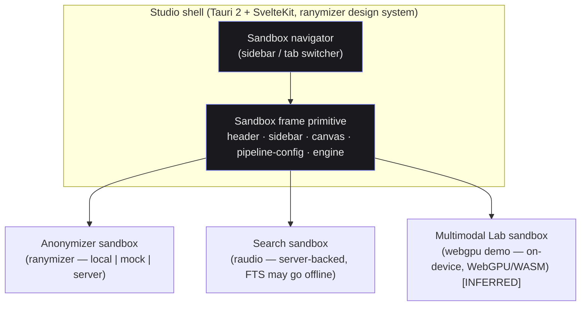
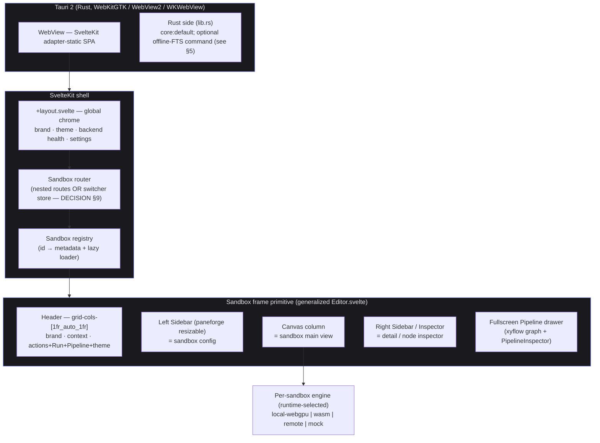
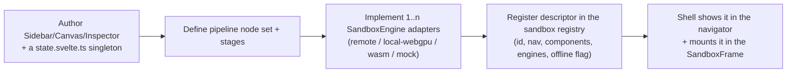
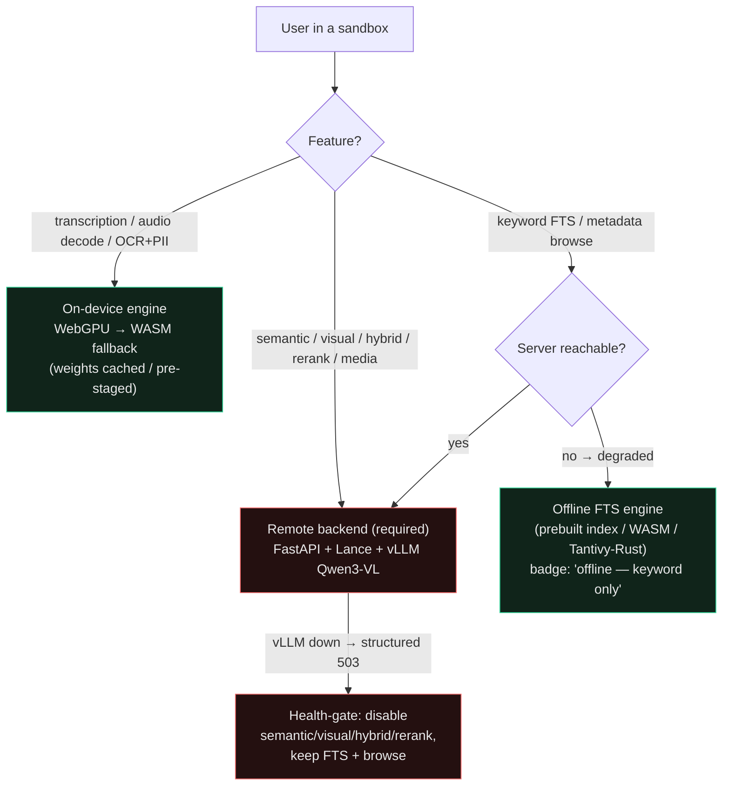
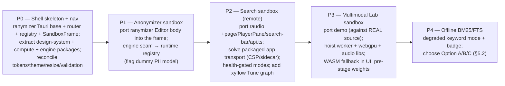

# Studio — merge plan (ranymizer · raudio · multimodal-webgpu-demo → one desktop app)

> This is the **why and how** for folding three independent SvelteKit SPAs into a single
> Tauri 2 desktop application called **Studio**. It is a *planning* document — architecture,
> contracts, trade-offs, and a phased roadmap. There is **no implementation code** here;
> mermaid diagrams, interface sketches, and decision tables stand in for it. Tone follows
> [`GUIDE.md`](../GUIDE.md): one mental model, stated decisions, honest unknowns.
>
> Status of inputs at time of writing (2026-05-29):
> - **ranymizer** source available at `/tmp/ranymizer-ref` — the structural + styling template.
> - **raudio** (this repo) source available — the server-backed Search sandbox.
> - **multimodal-webgpu-demo** — **only a static build** is on disk (`/home/blackwell/Desktop/multimodal-webgpu-demo`).
>   Its source has **not** arrived. Everything about its internals is *inferred* from the build
>   plus the sibling proxy at `/home/blackwell/Desktop/lance-audio/demo`. Claims about it are
>   flagged **[INFERRED]** throughout and must be re-verified when the real source lands.
>
> **Update 2026-06:** the local `lance-audio/demo` proxy was **deleted** (superseded by the real
> `frontend/`). The Multimodal Lab sandbox below now depends entirely on the real
> multimodal-webgpu-demo source arriving; the `[INFERRED via lance-audio/demo]` notes are historical.

---

## 1. Vision & goals

**Studio** is a single Tauri 2 + SvelteKit desktop application that hosts several **sandboxes**.
A sandbox is a self-contained workspace that all share one layout idiom — the **sandbox frame**
borrowed from ranymizer's `Editor.svelte`: a header, a resizable config **sidebar**, a **canvas**,
and a **pipeline-as-graph** configuration view, all sitting behind a swappable **engine/backend**.

Studio's job is the thing **none of the three apps has today**: a top-level **navigation shell**
that switches between sandboxes and carries the shared chrome (brand, theme, backend health,
settings) around whichever sandbox is mounted.



**What success looks like**
- One Tauri app, one `package.json`/dependency set, one `app.css`, one theme mechanism.
- A user opens Studio and **navigates** between Anonymizer, Search, and Multimodal Lab.
- Each sandbox reuses the same frame and the same **engine interface**, so backends are
  swappable **at runtime** (e.g. toggle Search between *remote* and *offline-FTS*).
- The on-device sandboxes (Multimodal Lab, Anonymizer-local) work **offline after first weights download**.
- Heavy semantic/visual/hybrid/rerank Search stays **server-backed** with clean health-gated degradation.

**Non-goals (explicit)**
- **Not** bundling vLLM, Lance, or the GPU embedding/reranker stack into the desktop app. Search's
  heavy tier remains an external service (remote origin or Tauri sidecar — see §9).
- **Not** byte-for-byte parity between offline FTS and server Tantivy FTS. Offline FTS is an explicit
  *degraded mode* with a visible badge (see §5).
- **Not** generalizing ranymizer's 2D redaction `Canvas.svelte` — only the *frame* around it is shared.
- **Not** a face pipeline or new ML scope (per stored design preferences for raudio).
- **Not** rewriting working pieces (api.ts, PlayerPane, the worker protocol) — they port forward.

---

## 2. The three sources at a glance

| App | Path | Role in Studio | Stack today | What Studio reuses |
|---|---|---|---|---|
| **ranymizer** | `/tmp/ranymizer-ref` | **Shell template** + the **Anonymizer** sandbox | Tauri 2, Svelte 5, Tailwind 4, shadcn/bits-ui, @xyflow/svelte 1.5, transformers.js v4, valibot, biome | The whole frame: `Editor.svelte` skeleton, `PipelineSketch`/`PipelineInspector` + nodes, the **engine seam** (`engine/{index,types,local,gradio,mock,webgpu,worker}.ts`), `app.css` tokens (dark-first), Tauri config + CSP + capabilities, `state.svelte.ts` singleton pattern, `webgpu.ts` detect/resolve |
| **raudio** (this repo) | `/home/blackwell/Desktop/lance-audio` | **Search** sandbox (server-backed) | SvelteKit 2, Svelte 5, Tailwind 4, shadcn/bits-ui ^2, zod; Python FastAPI + Lance + Tantivy FTS + vLLM Qwen3-VL | `api.ts` (zod-validated client), `ResizableSplit.svelte`, `PlayerPane` + `TranscriptHighlighter`, `search-bar.svelte` Tune popover, Hit/Doc cards + browse/search toggle, `feature-flags.svelte.ts`, `status-badge.svelte` + `/api/health`, the whole backend |
| **multimodal-webgpu-demo** | `/home/blackwell/Desktop/multimodal-webgpu-demo` (build only) | **Multimodal Lab** sandbox (on-device) **[INFERRED]** | SvelteKit 2, Svelte 5, Tailwind 4, shadcn/bits-ui ^1.3, transformers.js v4, ONNX Runtime Web, layerchart | **[INFERRED via `lance-audio/demo`]** `worker.ts` Whisper pipeline + message protocol, `webgpu.ts` (identical to ranymizer's), `models.ts` registry, `audio-decoder.ts`/`audio-source.ts`, `AudioVisualizerChart.svelte`, `transcript.ts` exporters, batch-job UX |

Key relationships worth stating plainly:
- ranymizer's `engine/webgpu.ts` is **a verbatim copy** of the demo's `webgpu.ts` (its own comment
  says "from the demo"). This is the first thing to hoist into a shared lib.
- raudio's backend already has the **offline/online seam baked in**: FTS works with *no GPU and no vLLM*;
  the first semantic/visual/hybrid/all call lazily connects to vLLM and returns a structured **503** if
  unreachable (never a 500). Studio inherits a clean degradation contract for free.
- All three share **byte-identical design tokens**; only dark/light `:root` placement differs (verified:
  ranymizer puts dark in `:root` + `.light` opt-in; raudio puts light in `:root` + `.dark` override).

---

## 3. Studio shell architecture

Studio is **ranymizer's Tauri+SvelteKit shell** plus a **net-new navigation layer** and a **generalized
sandbox frame**. The shell owns global chrome; each sandbox owns its frame's contents and its engine.



### 3.1 The sandbox frame primitive (generalized from `Editor.svelte`)

ranymizer's `Editor.svelte` (lines 229–441) is the authoritative skeleton:
`h-screen flex-col` → a `grid-cols-[1fr_auto_1fr]` header → a `flex min-h-0 flex-1` body of
`[left Sidebar][Canvas column][right TextSidebar]` → a sibling `SettingsDrawer` overlay.

Studio promotes this to a reusable `<SandboxFrame>` whose body panes are **slots/snippets** filled per
sandbox. The frame supplies: the header layout, the theme toggle, the **Run / Cancel** action, the
**Pipeline** toggle that opens the fullscreen graph, and the resizable sidebar plumbing. Each sandbox
supplies: its sidebar config component, its canvas component, its inspector cases, and its **node set**
for the pipeline graph.

| Frame region | Generic role | Anonymizer fills with | Search fills with | Multimodal Lab fills with **[INFERRED]** |
|---|---|---|---|---|
| Header center | context label | document/page paginator | query summary / mode | model + device label |
| Header actions | Run/Cancel + Pipeline | analyze image | run search | load model / transcribe |
| Left sidebar | config | OCR/PII toggles | query + Tune + Filters | ModelPicker (lang/size/backend) |
| Canvas | main view | 2D redaction canvas | `ResizableSplit(results \| PlayerPane)` | AudioVisualizer + streaming transcript |
| Right inspector | detail | selected-node form | hit detail (folded into player) | per-segment / export panel |
| Pipeline drawer | config-as-graph | OCR→GLiNER→done | query→[embed\|FTS]→fuse/rerank→hits | input→encoder→decoder→transcript |

The **pipeline-as-graph** is the most reusable cross-sandbox primitive: `PipelineSketch.svelte` (an
`@xyflow/svelte` graph with custom `nodeTypes`, fixed layout, `nodesConnectable=false`, edge-dash
animation driven by a live `pipelineStage`) + `PipelineInspector.svelte` (a right aside that switches on
`selectedId`). Each sandbox supplies its own node set + inspector cases; the **search Tune dials** map
directly onto search-pipeline node settings, and the demo's **load→warmup→generate→finalize** lifecycle
maps onto its node animation just like ranymizer animates `ocr→gliner→done`.

### 3.2 Resize + validation + theme — pick one of each

These three diverge across the apps and must be unified **before** merging or the design system fragments.

| Concern | ranymizer | raudio | demo **[INFERRED]** | **Studio decision** |
|---|---|---|---|---|
| Resize | `ResizeHandle.svelte` (single edge) + paneforge dep (unused) | `ResizableSplit.svelte` (two-pane, localStorage, pointer-capture) | sidebar collapse only | **paneforge** for sandbox sidebars (brief names it as the SIDEBAR idiom); keep raudio's `ResizableSplit` *only* inside the Search canvas (results↔player two-pane) since it is dependency-free and already tuned |
| Validation | valibot (pipeline config) | zod (API boundary) | — | **zod** at the API/data boundary (raudio's `api.ts` is the load-bearing untrusted-input gate); valibot may remain internal to the Anonymizer config if cheaper to keep than to port |
| Theme | manual `.dark`/`.light` toggle + `localStorage('ranymizer-theme')` | own `theme-toggle.svelte` flipping `.dark` | `mode-watcher` `defaultMode=system` | **one** mechanism in the shell. Carry raudio's hard-won lesson: theme reactivity must stay **local to the toggle component** (a store-based version failed in prod builds). Recommend the manual `.dark` toggle in the shell layout, persisted, defaulting dark |

---

## 4. The Sandbox contract

Every sandbox implements one interface so the shell can list it, route to it, mount its frame, and wire
its engine. This generalizes ranymizer's build-time `AnonymizerEngine` + `pickEngine()` into a **runtime
registry** keyed by sandbox id.

### 4.1 Sandbox descriptor (prose contract)

| Field | Type (conceptual) | Purpose |
|---|---|---|
| `id` | stable string (`"anonymizer"`, `"search"`, `"lab"`) | route key + registry key |
| `nav` | `{ label, icon, order, badge? }` | how it appears in the navigator (badge e.g. "WIP", "offline") |
| `Sidebar` | Svelte component | fills the frame's config sidebar |
| `Canvas` | Svelte component | fills the frame's main view |
| `Inspector?` | Svelte component | optional right-pane / node inspector |
| `pipeline` | `{ nodeTypes, layout, stages }` | node set + stage enum for the pipeline-as-graph view |
| `engines` | `EngineDescriptor[]` | the backends this sandbox can run on (see 4.2) |
| `defaultEngine` | engine name | initial backend |
| `state` | runes singleton (`*.svelte.ts`) | per-sandbox persisted state (survives navigation) |
| `offline` | `"always" \| "after-first-download" \| "never" \| "degraded"` | capability flag the shell surfaces |

### 4.2 The generic engine interface (`SandboxEngine`)

Generalized from `engine/types.ts` (`AnonymizerEngine{name, local, meta(), analyze(file,{config,onProgress,onStage}), dispose()}`)
and from raudio's implicit `RemoteSearchEngine` (the `api.ts` functions) + Python `EmbeddingClient` Protocol.

| Member | Meaning | Notes |
|---|---|---|
| `name` | `"local-webgpu" \| "wasm" \| "remote" \| "mock"` | shown in the backend selector |
| `local: boolean` | runs on-device (no server) | drives the offline badge + which modes enable |
| `meta()` | capabilities + readiness | e.g. which search modes are available, model load state |
| `run(input, { config, signal, onProgress, onStage })` | the work | generalizes `analyze()`; **must support an AbortSignal** for the Cancel action and **streaming** (Search hits, Whisper tokens) |
| `dispose()` | release worker / connections | called on sandbox unmount |

Two structural shifts from ranymizer's current design (called out as integration challenges):
1. **Build-time → runtime selection.** ranymizer picks the engine at build via `VITE_ENGINE`
   (tree-shaken). Studio has multiple sandboxes with different needs *simultaneously* (Lab is always
   local; Search is always remote-or-offline-FTS; Anonymizer is configurable), and the user may toggle a
   backend **inside the running app**. So `pickEngine()` becomes a **per-sandbox runtime registry**;
   the dev/prod tree-shaking benefit is traded for runtime flexibility (acceptable — engines are small
   adapters; the heavy weights/workers are lazy-loaded regardless).
2. **One interface, two shapes.** The anonymizer engine is single-shot; the search engine is
   mode-rich and streaming. `run()` carries an `AbortSignal` + `onProgress`/`onStage` so both fit.

### 4.3 How a new sandbox plugs in



No shell changes are needed beyond adding a registry entry — that is the test of whether the abstraction holds.

---

## 5. The online ↔ offline boundary

This is Studio's defining axis. WebGPU = the *offline capability* pillar; heavy Search = the *online*
pillar. "Offline" here means **offline after first weights download** (weights come from HF Hub on first
run, then `env.useBrowserCache=true`), **not** zero-network-ever — unless Studio pre-stages weights into
a Tauri resource dir (recommended for a truly air-gapped desktop build).

### 5.1 Capability matrix

| Feature | On-device (WebGPU→WASM) | Requires server | Notes |
|---|---|---|---|
| Whisper transcription (KB-Whisper sv / Whisper en) | ✅ **[INFERRED]** | — | WASM fallback is **load-bearing**, not optional — Tauri WebView WebGPU is inconsistent (the `webgpu.ts` comment says so) |
| Audio decode / mic / tab-system capture | ✅ decode + mic | tab/system audio **may need Tauri-native capture** | `getDisplayMedia` behaves differently in desktop WebViews — **flag for confirmation** |
| Anonymizer OCR + PII (`local` engine) | ✅ after download | — | **Caveat: model manifest is a dummy** (TrOCR + multilingual-NER placeholders); on-device PII parity is **not yet real** |
| **FTS / BM25 keyword search** | ⚠️ **possible — degraded mode** | currently server (Tantivy) | the offline opportunity — see 5.3 |
| Metadata browse/filter (language/namn/referenskod/extraid) | ⚠️ possible from shipped index | currently server | could ship a static index for offline browse |
| Transcript playback of a **sideloaded/cached** media file | ✅ | — | local file only |
| **Semantic / vector search** | ❌ | ✅ vLLM Qwen3-VL text embed + IVF_PQ over 145k×1024-d | ~25 GB VRAM; too heavy for device (user constraint) |
| **Visual / cross-modal search** | ❌ | ✅ Qwen3-VL image embed | **NOT validated end-to-end** (vLLM deepstack crash, 448-vs-392 mismatch) — do not assume it works |
| **Hybrid / "all" fusion + cross-encoder rerank** | ❌ | ✅ Qwen3-VL-Reranker-8B | the heaviest tier |
| Media streaming / thumbnails / chunk-frames | ❌ | ✅ Lance Blob V2 + HTTP Range | source MP4s are large, server-side |



The shell drives this from raudio's existing pieces: `status-badge.svelte` + `/api/health` report
reachability and **which modes are enabled**; `feature-flags.svelte.ts` already suppresses 404 storms
when a capability is absent — the exact pattern for "degrade gracefully when backend feature missing/offline".

### 5.2 The offline FTS opportunity — analysis

Today FTS is **Tantivy server-side** (`lancedb full_text_search`, `MatchQuery`/`PhraseQuery`, Swedish
stemmer, `with_position` for phrases, fuzziness, prefilter `WHERE`). Three concrete ways to make keyword
search work on-device, with trade-offs:

| Option | How | Pros | Cons / cost |
|---|---|---|---|
| **A. Ship a prebuilt index as a Tauri static asset, query in WASM** | Build `chunks.jsonl` at ingest → bundle an SQLite **FTS5** DB (queried via `sql.js`/`wa-sqlite`) **or** a JS index (MiniSearch/Orama/FlexSearch) loaded into the WebView | No new Rust commands; keeps Tauri minimal; pure-WebView; works fully offline | Largest WebView memory footprint; **won't reproduce** Swedish stemmer + phrase positions + fuzziness=2 → results diverge from online; index ships stale (rebuild on data change) |
| **B. Tantivy compiled to WASM** | Build a tantivy-wasm and load the **same** index format | Closest behavioral parity with the server's Tantivy | tantivy-wasm is heavy/finicky to build; large wasm payload; cross-origin isolation (COOP/COEP) concerns for threads |
| **C. Tantivy (or lancedb) embedded in Rust via a Tauri command** | A `#[tauri::command]` queries a tantivy/lancedb index shipped in a resource dir | **Best parity** (same Rust crate the server uses); fast; no WebView memory blow-up | **Breaks ranymizer's "no `#[tauri::command]`" minimalism**; needs a scoped `fs` capability; ships/updates an index; couples desktop build to a Rust search path |

**Recommendation.** Treat offline FTS as a **phase-gated, explicit degraded mode** (P4), not a launch
requirement. When tackled, prefer **Option C** for behavioral parity *if* the team accepts adding a Rust
command + `fs` capability (Studio already has a Rust side; this is the lowest-divergence path and reuses
the very crate the server uses). Fall back to **Option A** if keeping Tauri command-free is a hard
constraint. In **all** options: surface a clear **"offline — keyword only"** badge, and **hard-disable**
semantic/visual/hybrid/rerank (they require vLLM). Do **not** market offline FTS as a drop-in for online search.

### 5.3 Packaged-app transport for the heavy backend

raudio today is browser + a **Bun `/api/*` reverse proxy** (`frontend/server.ts`) that preserves HTTP
Range for media streaming. **In a packaged Tauri app there is no Bun proxy.** Two options (DECISION §9):

| Option | How | Implications |
|---|---|---|
| **Remote origin** | WebView calls an absolute API origin (e.g. a deployed FastAPI) | Widen Tauri **CSP `connect-src`** to that origin + handle CORS; validate `<video src=/api/media>` Range streaming inside the WebView; simplest packaging |
| **Tauri sidecar** | Tauri spawns/manages the Python FastAPI process locally | Heaviest packaging (Python + Lance + ffmpeg + GPU drivers); still cannot bundle vLLM's 25 GB GPU stack; useful only if the *DB+FTS* tier runs locally while vLLM stays remote |

The existing **lazy/503 seam** makes either viable: FTS works with no GPU; semantic et al. fail cleanly when vLLM is unreachable.

---

## 6. Repository / monorepo structure

A single Bun workspace. The shell is ranymizer's frontend, lifted to host sandboxes; shared concerns
(design system, compute/webgpu, engine interface) are extracted into packages; the Python backend and
Rust side move in mostly as-is.

```text
studio/
├─ package.json                     # Bun workspace root, one reconciled dependency set
├─ biome.json                       # one linter (from ranymizer; raudio has none today)
├─ apps/
│  └─ shell/                        # the Tauri + SvelteKit app (ex-ranymizer frontend)
│     ├─ src/
│     │  ├─ routes/                 # +layout.svelte (global chrome) + sandbox router
│     │  ├─ lib/
│     │  │  ├─ shell/               # navigator, SandboxFrame, registry
│     │  │  └─ sandboxes/
│     │  │     ├─ anonymizer/       # ex-ranymizer Editor body + engine + pipeline nodes
│     │  │     ├─ search/           # ex-raudio +page body, PlayerPane, search-bar, api.ts
│     │  │     └─ lab/              # ex-demo panels + worker [INFERRED — pending source]
│     │  └─ app.css                 # single reconciled token file (re-exports the package)
│     └─ src-tauri/                 # ex-ranymizer Tauri: tauri.conf.json, capabilities, lib.rs
│           (+ optional offline-FTS command + scoped fs capability — see §5.2 Option C)
├─ packages/
│  ├─ design-system/                # app.css tokens, shadcn-svelte components, theme toggle
│  ├─ compute/                      # webgpu.ts (detect/resolve) + worker message protocol + BACKENDS metadata
│  ├─ engine/                       # the generic SandboxEngine interface + mock helpers
│  └─ audio/                        # audio-decoder.ts, audio-source.ts, transcript.ts [from demo proxy]
└─ services/
   └─ search-backend/               # ex-raudio backend/ + src/raudio/ (FastAPI + Lance + vLLM client)
        (Python, uv, ruff, ty — unchanged; served remotely or as a sidecar per §5.3)
```

**How the three fold in**
- **ranymizer** → `apps/shell` (frame, router, Tauri base, CSP) **and** `apps/shell/.../sandboxes/anonymizer`.
- **raudio frontend** → `apps/shell/.../sandboxes/search`; `api.ts` is its data layer verbatim. **raudio
  backend + `src/raudio`** → `services/search-backend` essentially unchanged. The Bun `server.ts` proxy
  role is replaced by Tauri transport (§5.3).
- **multimodal-webgpu-demo** → `apps/shell/.../sandboxes/lab`, built against the **inferred** proxy shape;
  its worker co-located so Vite `worker.format='es'` + `optimizeDeps.exclude '@huggingface/transformers'`
  + `import.meta.url` resolution keep working. **Re-verify against real source.**

**Dependency reconciliation is real work** (versions diverge): ranymizer is bleeding-edge (svelte 5.55,
vite 8, ts 6, kit 2.60, bits-ui 2.18, xyflow 1.5), raudio lags (svelte 5.36, vite 7, ts 5.7, bits-ui 2.0),
the demo lags most (svelte 5.0, vite 6, **bits-ui 1.3**, mode-watcher, layerchart next.58). **bits-ui 1.x→2.x
is a breaking jump** — the demo's `Tabs`/`Select` usage must be ported. Pin one bits-ui + one tailwind-variants.

---

## 7. Design-system unification

The good news (verified): ranymizer's `app.css` and raudio's `app.css` carry a **byte-identical token set**
— dark indigo `#818cf8` / light `#4f46e5`, Inter/Lora/mono, `--radius 0.375rem`, surface/text/border
scales, `@theme inline` binding tokens to shadcn names. Both files explicitly comment that the palette is
"the design system shared with the sibling apps … so the three can merge into one UI cleanly." raudio is
already aligned to ranymizer's tokens/Button per stored memory.

**The one structural difference (verified):** dark/light `:root` placement is **mirrored**.
- ranymizer: dark in `:root`, `.light` opt-in (`:root.light`).
- raudio: light in `:root`, `.dark` override (`:where(.dark)`), boots dark via `app.html`.

**Decision:** adopt **one direction** — recommend ranymizer's **dark-in-`:root` + `.light` opt-in**, since
the shell defaults dark and ranymizer is the template. raudio's CSS header already flags this as
"reconcile at merge time." raudio also adds a `--highlight` (karaoke) token — keep it; it is additive and
sandbox-specific (Search/Lab playback).

**What remains to fully share**
1. Extract `app.css` + the shadcn-svelte components + the theme toggle into `packages/design-system`; all
   sandboxes import from it (one source of truth).
2. Reconcile the `:root` direction (above) and the theme mechanism (§3.2).
3. Adopt **paneforge** for sandbox sidebars across the board; the audio Search sandbox currently has no
   xyflow and a bespoke split — add the pipeline-as-graph view and migrate its sidebars onto the shared frame.
4. Pin **one bits-ui** (and tailwind-variants); port the demo's bits-ui 1.x components forward.

---

## 8. Phased migration roadmap

Incremental and de-risking-first: build the thing that doesn't exist (the shell + nav) before merging the
parts that already work. Each phase ships something runnable.



| Phase | Goal | Done when | Hard dependencies |
|---|---|---|---|
| **P0** | Shell + navigation that none of the apps has | App boots in Tauri, navigator switches between empty/placeholder sandboxes, one token file, one theme, paneforge frame | none — all in-hand |
| **P1** | Anonymizer as first sandbox; prove the frame + runtime engine registry | ranymizer's flow runs inside the frame; engine selectable at runtime | P0; **dummy PII model flagged** (parity not real) |
| **P2** | Search sandbox, server-backed | raudio search/browse/playback work in-WebView; health badge gates modes; Tune dials rendered as a pipeline graph | P0; **transport DECISION (§5.3)**; CSP widened; Range streaming validated in WebView |
| **P3** | Multimodal Lab, on-device | Whisper transcription runs via WebGPU with WASM fallback in the UI; weights pre-staged | **real demo source** (currently absent); WebGPU-in-WebView verification; audio capture in Tauri |
| **P4** | Offline keyword search | FTS + browse work offline behind an explicit degraded badge; semantic/visual/hybrid/rerank hard-disabled | P2; **offline-FTS DECISION (§5.2)** |

---

## 9. Risks & open questions / decisions needed

**Decisions needed (block specific phases):**
1. **Packaged-app API transport (blocks P2).** Remote FastAPI origin (widen CSP `connect-src` + CORS) vs
   Tauri Python sidecar. Affects CSP, capabilities, packaging, and Range streaming. *Recommendation:* start
   **remote origin** (simplest, vLLM is remote anyway); revisit sidecar only if a local DB/FTS tier is wanted.
2. **Offline-FTS strategy (blocks P4).** Option A (WASM/prebuilt index) vs B (tantivy-wasm) vs C
   (Rust `#[tauri::command]`). *Recommendation:* **C** for parity if a Rust command + scoped `fs` is
   acceptable; otherwise **A**. Either way it is a **degraded mode with a badge**, not a launch feature.
3. **Runtime backend switching (blocks P1).** Confirm `pickEngine()` becomes a per-sandbox runtime registry
   (vs ranymizer's build-time `VITE_ENGINE`). *Recommendation:* yes — the multi-sandbox shell requires it.
4. **Router shape (blocks P0).** Nested SvelteKit routes per sandbox vs single route + a switcher store.
   *Recommendation:* nested routes (clean deep-linking + lazy chunking), with the registry mapping id→route.
5. **`:root` theme direction + theme mechanism (P0).** *Recommendation:* dark-in-`:root` + `.light` opt-in;
   manual toggle kept **local to the component** (raudio's store-based version failed in prod).

**Known unknowns / risks:**
- **The webgpu-demo source is not on disk** — only a static build. The `/search` multimodal route is a
  **1.8 KB WorkInProgress stub** that merely *names* CLIP/SigLIP; the multimodal-search pipeline is
  essentially **unbuilt/greenfield**. Treat the Lab sandbox's internals (routes /, /batch, /search,
  /about; model IDs; batch-as-route vs tab) as **provisional until the real source arrives**. **[INFERRED]**
- **WebGPU in the Tauri WebView is not guaranteed** (WebKitGTK on Linux is immature). The WASM fallback is
  **load-bearing**; the current demo screen *hides* the app when WebGPU is absent — Studio must **degrade to
  WASM in the UI** instead. Cross-origin isolation (COOP/COEP for SharedArrayBuffer threads) needs
  validation; in Tauri this means custom-protocol responses set those headers, or use single-thread wasm.
- **Audio tab/system capture (`getDisplayMedia`)** may be unavailable in desktop WebViews → likely needs a
  Tauri-native capture replacement. **Flag for confirmation.**
- **Anonymizer on-device PII is not real yet** — `models.ts` is a dummy ONNX manifest; the worker falls back
  to TrOCR + multilingual-NER placeholders. On-device parity with the server is unfinished.
- **Visual search is not validated end-to-end** (vLLM deepstack/warmup crash, 448-vs-392 image-side
  mismatch — TODO blockers #2/#3). Do **not** assume image search works; gate it behind health + a clear state.
- **vLLM is the hardest external dependency** (~25 GB VRAM, two GPU-pinned servers). Studio **cannot bundle
  it** — it is an external service with health gating and clean 503 degradation (already implemented backend-side).
- **Media/blob URL coupling** — hits build `/api/media|thumbnail|chunk-frame` URLs hard-wired to the proxy
  origin; in Tauri these must resolve to the configured backend base, and Range streaming must work through
  the chosen transport path.
- **Dependency skew** (svelte/vite/ts/kit minors; **bits-ui 1.x vs 2.x**; tailwind-variants 2 vs 3;
  layerchart next.58 vs next.64). One reconciled set is required; the demo's bits-ui 1.x components are a
  breaking port.

---

## 10. Summary of cross-app decisions (one table)

| Topic | Decision | Why |
|---|---|---|
| Shell base | ranymizer's Tauri 2 + SvelteKit + `Editor.svelte` frame | only one with a Tauri shell + the canonical frame + CSP |
| Navigation | net-new router + sandbox registry (nested routes) | none of the three has it; required for a multi-sandbox shell |
| Frame primitive | `<SandboxFrame>` = header + paneforge sidebar + canvas + pipeline drawer | generalize `Editor.svelte`; slots filled per sandbox |
| Engine | generic `SandboxEngine` (run/AbortSignal/stream), **runtime** per-sandbox registry | multi-sandbox + in-app backend switching |
| Resize | paneforge for sidebars; raudio `ResizableSplit` only inside Search canvas | brief names paneforge; raudio split is tuned + dependency-free |
| Validation | zod at the data boundary | `api.ts` is the load-bearing untrusted-input gate |
| Theme | dark-in-`:root` + `.light` opt-in; toggle local to component | matches template; avoids the prod-build store regression |
| Search transport | remote FastAPI origin first; sidecar later if needed | vLLM is remote regardless; simplest packaging |
| Offline FTS | degraded mode, badge; Option C (Rust) for parity else A | parity vs Tauri-minimalism trade-off; phase-gated (P4) |
| Heavy ML | external service, never bundled; health-gated 503 | vLLM/Lance too heavy for device (user constraint) |
