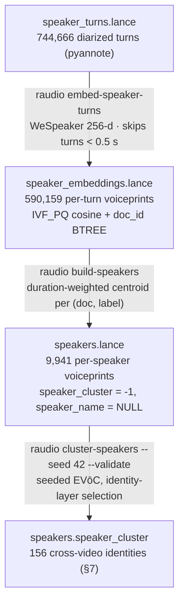

# Voice search (speaker voiceprints + pyannote WeSpeaker)

> How `raudio` answers **"where else does this voice speak?"** — per-turn
> 256-d speaker voiceprints over the diarized `speaker_turns`, cosine kNN at
> query time, and a seeded EVōC pass that links the same person across videos.
> This sits *on top of* diarization (who-spoke-when, see
> [GUIDE.md §5](GUIDE.md#5-end-to-end-information-flow)); it is a **separate
> embedding space** from the Qwen3-VL text/image space in
> [EMBEDDINGS.md](EMBEDDINGS.md) — different model, different dimension,
> different table. Open backlog: [TODO.md](TODO.md).

Source of truth: [`src/rmedia/media/voiceprint.py`](../src/rmedia/media/voiceprint.py)
(the encoder + slicing/batching/centroid logic),
[`src/rmedia/cli/speaker.py`](../src/rmedia/cli/speaker.py) (`embed-speaker-turns`,
`merge-speaker-embeddings`, `build-speakers`, `cluster-speakers`),
[`src/rmedia/model/schema.py`](../src/rmedia/model/schema.py) (`VOICE_EMBED_DIM`,
`SPEAKER_EMBEDDINGS_SCHEMA`, `SPEAKERS_SCHEMA`),
[`backend/voice/service.py`](../backend/voice/service.py) +
[`backend/voice/router.py`](../backend/voice/router.py) +
[`backend/voice/encoder.py`](../backend/voice/encoder.py) (the `/api/voice/*`
endpoints), [`backend/schemas/voice.py`](../backend/schemas/voice.py) (response
models), the frontend voice store
[`frontend/src/lib/voice-search.svelte.ts`](../frontend/src/lib/voice-search.svelte.ts)
(+ `hit-card.svelte`, `diarization-timeline.svelte`, `search-bar.svelte`,
`search-settings.svelte`), the human-labeled eval
[`evals/voice_labels_T0001889_c225.json`](../evals/voice_labels_T0001889_c225.json),
and [`tests/test_backend_voice.py`](../tests/test_backend_voice.py) (the API
contract over synthetic voiceprints).

> Row counts in this doc refer to the live DB, `transcripts_v2.lance`
> (the `Makefile`/CLI default): 744,666 `speaker_turns` · 590,159
> `speaker_embeddings` · 9,941 `speakers` · 145,175 `chunks`.

---

## 1. Why turn-level, not chunk-level

The unit of voice retrieval is the **diarized speaker turn**, not the ~30 s
transcript chunk. Three reasons, all load-bearing:

1. **Chunks are multi-speaker.** A 30 s press-conference chunk routinely spans
   a question and its answer; a chunk-level voiceprint averages everyone in it
   and matches neither. A pyannote turn is single-speaker *by construction* —
   the diarizer already separated voices, so the embedding is clean.
2. **Resolution.** 744,666 turns vs 145,175 chunks (~5× finer). A short
   interjection that would vanish inside a chunk average is its own searchable
   row.
3. **The diarization-clean requirement.** The original chunk-level de-risk
   (see §2) was poisoned by exactly this: its labels and its vectors both mixed
   speakers within a chunk, which both inflated channel similarity and added
   label noise. Re-running the evaluation on diarization-clean turn spans is
   what turned an AMBER verdict into a shippable feature.

Hits are still **chunks** at the UI boundary: the kNN ranks *turns*, then each
matched turn joins back to its max-overlap `chunks` row
(`backend/voice/service.py::_chunk_for_turn`) so the result list reuses the
uniform search Hit shape (text, alignments, thumbnail, playback). This mirrors
the `chunk_frames → chunks` join visual search does — rank in the fine-grained
table, present in the coarse one.

---

## 2. The encoder decision trail

Everything below was scored against one human-labeled ground truth:
[`evals/voice_labels_T0001889_c225.json`](../evals/voice_labels_T0001889_c225.json)
— 23 hand-verified (audio **and** video checked) hits for the query
`T0001889_00001.mp4` chunk 225: 15 cross-video hits (4 labeled `same` person)
and 8 same-video hits (3 labeled `diff` — a *different* speaker in the same
recording). The labels are encoder-independent same/different-person facts, so
every candidate encoder/transform re-scores the same pairs.

| Candidate | Verdict | Evidence (on the labeled pairs) |
|---|---|---|
| **Qwen3-Voice-Embedding-12Hz-0.6B**, chunk-level, raw cosine | ❌ rejected | Retrieval *works* (the genuine cross-video pair lands at ranks 1–2, AP 0.74) but **channel ≫ speaker**: same-video *different-person* hits score **0.785–0.869** while the cross-video *same-person* maximum is **0.522**. Raw cosine ranks the recording channel above the person. |
| **LavaSR denoiser** preprocessing (strip the channel before embedding) | ❌ rejected | Verified **harm** — re-scoring the labeled pairs after denoising separated same/different *worse*, not better. |
| **Score normalization**: S-norm, AS-norm, per-video centering | ❌ all failed | None flipped the channel < speaker ordering on the labels; the channel component survives cohort normalization at this corpus size. |
| **pyannote community-1's internal WeSpeaker-ResNet34** (256-d), turn-level, plain cosine | ✅ **won** | **AUC 1.000** on the labeled pairs — every same-person pair scores above every different-person pair, no normalization needed. |

The winner needs no tricks because it fixes the *inputs*, not the metric: a
purpose-built speaker-verification encoder over **single-speaker turn spans**.
It is loaded standalone from the same HF model the diarizer already uses —
`pyannote/speaker-diarization-community-1`, `subfolder="embedding"`
(`voiceprint.py::VoiceEncoder`) — so there is no new model dependency. The raw
outputs are not unit-norm; everything stored is **L2-normalized**
(`voiceprint.py::l2_normalize`) so cosine kNN is well-defined.

Two encoder facts shape the whole pipeline (documented in `voiceprint.py`):

- It was trained on **5.0 s** chunks and is unreliable below ~0.5 s → turns
  shorter than `MIN_TURN_DURATION_S = 0.5` are skipped (hence 590,159 embedded
  rows from 744,666 turns), with a `_MIN_EMBED_SPAN_S = 0.1` hard floor.
- Turns have arbitrary lengths → a batch is zero-padded to its longest member
  and the padded frames are **masked out of the statistics pooling** via the
  model's `weights` argument; batches are duration-sorted first
  (`duration_sorted_batches`) so similar-length turns share a batch and the
  padding (which the fbank mean-centering still sees) stays minimal.

The channel-inflation finding did not just pick the encoder — it is baked into
the product: same-video hits are excluded **by default** (§6), and the
similarity badges carry a calibration caveat.

---

## 3. The tables

Two new Lance tables, both inside `transcripts_v2.lance/`, schemas in
[`model/schema.py`](../src/rmedia/model/schema.py). `VOICE_EMBED_DIM = 256` is
deliberately a separate constant from the Qwen `EMBED_DIM = 2048` — the two
spaces must never be compared.

| | **`speaker_embeddings`** (590,159 rows) | **`speakers`** (9,941 rows) |
|---|---|---|
| Grain | one row per **embedded turn** (the `speaker_turns` rows ≥ 0.5 s) | one row per **(doc_id, speaker_label)** — a local diarization speaker |
| Key columns | `doc_id`, `turn_id`, `speaker_label`, `start`, `end`, `duration` (denormalized from `speaker_turns` so a hit needs no second lookup) | `doc_id`, `speaker_label`, `n_turns`, `total_duration`, `speaker_cluster` (int32, −1 = unclustered), `speaker_name` (string, NULL until someone names a cluster) |
| Vector | `embedding` — L2-normalized 256-d float32 | `embedding` — the **duration-weighted mean** of the speaker's turn embeddings, re-L2-normalized (`voiceprint.py::duration_weighted_centroid`) |
| Indexes | IVF_PQ cosine (`num_partitions=256`, `num_sub_vectors=16` — 16 dims each) + BTREE on `doc_id` | BTREE on `doc_id` (tiny table — kNN over it is a flat scan) |
| Write discipline | **append-only**, one flush per video (`write_speaker_embeddings`); shards stage to `speaker_embeddings_shard{i}` | **overwrite wholesale** each `build-speakers` / `cluster-speakers` run — the table is tiny, rebuild beats merge |
| Built by | `rmedia embed-speaker-turns` (+ `merge-speaker-embeddings`) | `rmedia build-speakers`, then `rmedia cluster-speakers` fills `speaker_cluster` |



Both follow the `speaker_turns` rationale ([GUIDE.md §4](GUIDE.md)): separate
append-only tables, never `merge_insert` into the wide `chunks` schema. The
backend opens them **optionally** (`backend/state.py`) — every `/api/voice`
route degrades to a structured 503 ("not built yet — run `rmedia …`") when a
table is absent, never a 500.

---

## 4. The CLI runbook

The full offline chain (each step resumable, each prerequisite checked with an
actionable error):

```bash
# 0. prerequisite — diarization (see REPRODUCE.md §B.5)
uv run rmedia --db transcripts_v2.lance extract-speaker-turns --audio-root input/sv
uv run rmedia --db transcripts_v2.lance merge-speaker-turns          # if sharded

# 1. per-turn voiceprints (GPU; shardable — one process per --shard-index)
uv run rmedia --db transcripts_v2.lance embed-speaker-turns \
    --audio-root input/sv --num-shards 12 --shard-index 0   # … repeat for 1..11
uv run rmedia --db transcripts_v2.lance merge-speaker-embeddings

# 2. per-speaker centroids (CPU, seconds)
uv run rmedia --db transcripts_v2.lance build-speakers

# 3. global identity clusters (CPU, needs the [atlas] extra for EVōC)
uv run --extra atlas raudio --db transcripts_v2.lance cluster-speakers --seed 42 --validate
```

**Sharding/resume semantics** (`cli/speaker.py::cmd_embed_speaker_turns`,
mirrors the diarization sharding):

- `--num-shards N --shard-index i` partitions videos by `shard_of(doc_id)`;
  each worker writes a disjoint slice to its own
  `speaker_embeddings_shard{i}.lance` staging table — separate tables avoid the
  concurrent-write commit conflicts N appenders to one table would hit.
- Resume is at **video granularity**: `--only-null` (the default) skips any
  `doc_id` already in this shard's table *and* anything already merged into the
  canonical table, so no worker ever re-embeds a finished video. One table
  flush per video bounds what a crash can lose.
- `merge-speaker-embeddings` folds the shards into the canonical
  `speaker_embeddings` (existing canonical rows win on a `doc_id` collision, so
  re-running is safe), rebuilds the `doc_id` BTREE + IVF_PQ vector indexes
  (`_speaker_embeddings_indexes`), and drops the staging tables.

### The OOM lesson (long-turn batches)

The full-corpus backfill ran **12 sharded GPU workers** on one card — and some
of them died with CUDA OOM. The mechanism: batches are duration-sorted, so each
video's *last* batch holds its longest turns; a single uninterrupted speech
turn can run many minutes, and a `--batch-size 32` batch zero-padded to a
multi-minute maximum is enormous. Memory spikes are therefore *bursty* — twelve
workers coexist fine on short-turn batches, then several hit their long-turn
batch at once and the spike kills whoever allocates last.

- **Recovery (what actually happened):** nothing was lost — per-video resume
  means a crashed shard forfeits only its in-flight video. After the shard
  fleet finished, a **single-process cleanup pass** (plain
  `embed-speaker-turns`, no shard flags, `--only-null` default) mopped up the
  handful of stragglers, then `merge-speaker-embeddings` folded everything.
- **Knobs today:** lower `--batch-size`, or run the cleanup pass with
  `--device cpu`.
- **The real fix (future):** cap the *embedded span* of a turn at ~30 s — the
  encoder was trained on 5 s chunks, so minutes of extra audio add memory and
  cost, not signal. The upload path already does exactly this
  (`_UPLOAD_EMBED_CAP_S = 30.0` in `backend/voice/service.py`); the batch path
  should mirror it. Until then the worst-case batch size is unbounded by turn
  length.

### `cluster-speakers` (the identity pass)

Fits a **seeded** `evoc.EVoC` over the `speakers` embedding matrix (identity
assignment must be reproducible — unlike the Atlas projection, `--seed 42` is
the default) and rewrites the table wholesale with the new `speaker_cluster`
column. Two non-obvious design points (`cli/speaker.py`):

- **It does NOT use EVoC's own `labels_`.** That is the *persistence-max*
  layer — the dominant density scale, which for these voiceprints is the
  **recording channel**, an order of magnitude coarser than people (measured:
  see §7). Instead `_select_identity_layer` walks `cluster_layers_` coarse →
  fine and takes the coarsest layer whose **within-video false-merge rate**
  stays ≤ 5 % (`_MAX_SAME_DOC_MERGE_RATE`). The metric needs no human labels:
  two *different* diarized labels in one video are almost surely different
  people (the diarizer separated them by voice), so same-doc co-membership
  inside a cluster directly counts demonstrable false merges. Diarization
  over-segmentation makes it overcount (re-uniting a split speaker is correct
  but penalized), so the bound biases toward precision.
- **`--validate` checks the human labels.** The confirmed same-person pair is
  pinned by explicit `(doc_id, speaker_label)` (`_VALIDATION_CONFIRMED_PAIR`,
  derived from the eval file): T0001889/`SPEAKER_13` ↔ T0001814/`SPEAKER_00`.
  Deliberately *not* "the doc's loudest speaker" — T0001889 is a 16-speaker
  panel whose duration-max speaker (`SPEAKER_01`) is a *different* person
  (centroid cosine 0.07 to the match, vs 0.79 for `SPEAKER_13`). A suspected
  (not human-confirmed) third appearance, T0001786's main speaker, is reported
  as an `[info]` line — never a hard FAIL.

---

## 5. The API (`/api/voice`)

Thin router ([`backend/voice/router.py`](../backend/voice/router.py)) over a
Lance-handle service ([`backend/voice/service.py`](../backend/voice/service.py));
`doc_id` is whitelisted (16-char hex) before any service code inlines it into a
filter literal.

| Endpoint | Anchor | Returns |
|---|---|---|
| `GET /api/voice/status` | — | `{built, turns, speakers}` — row counts, no error when absent. One probe gates every frontend voice affordance. |
| `GET /api/voice/similar` | **exactly one** of `turn_id` \| `speaker` \| `t` (+ `doc_id`, `n`, `exclude_same_doc`) | voice-ranked chunk hits (`VoiceSimilarResponse`) |
| `POST /api/voice/similar` | an uploaded audio/video snippet (multipart `file`) | same response shape; `query` is an all-`None` anchor |
| `GET /api/voice/identity` | `doc_id` + `speaker` | the speaker's global cluster: every `(doc_id, speaker_label)` appearance, most speech first (`VoiceIdentityResponse`) |

**The three GET anchor forms** (resolved from Lance — **no encoder runs at
query time**):

- `turn_id` — that turn's own embedding (one `speaker_embeddings` row);
- `speaker` — the speaker's duration-weighted **centroid** (`speakers` row;
  503 until `build-speakers` has run);
- `t` — the turn covering second `t` of the video; under overlapped speech the
  most recently *started* turn wins (the active speaker, and a deterministic
  pick).

Zero or two anchors → 400; unknown turn/speaker/time → 404; tables unbuilt →
503. `n` defaults to 20, hard-capped at `_MAX_N = 100` (a turn→chunk join runs
per hit).

**The shared post-anchor path** (`rank_similar_turns`): cosine kNN over
`speaker_embeddings.embedding` with the same recall knobs as text search
(`minimum_nprobes=20`, adaptive `maximum_nprobes`, `refine_factor=3` from
`backend/search/constants.py`); `exclude_same_doc=true` (the default) applies a
prefiltered `doc_id != …`; each matched turn joins to its max-overlap chunk;
turns whose span overlaps **no** chunk (diarized speech the ASR produced
nothing for) are dropped — so fewer than `n` hits can come back. Hits keep the
uniform search Hit shape plus `speaker_label` / `turn_id` / `turn_start` /
`turn_end` / `_distance` / `turn_score` (= 1 − cosine distance) /
`speaker_cluster` (batch-joined from `speakers`; `None` when unclustered).

**Cross-encoder rerank is deliberately not offered** — it scores transcript
*text*, which says nothing about voice identity.

### The upload form (wire details)

`POST /api/voice/similar` is the fourth, Lance-free anchor: query-by-example
from a user clip.

- **`n` is a query param, not a form field** — the multipart body carries only
  `file`, keeping the POST's params mirror of the GET's.
- **25 MB cap** (`_MAX_UPLOAD_BYTES`): the handler reads
  `_MAX_UPLOAD_BYTES + 1` bytes, so an oversize upload 400s without ever being
  buffered whole.
- ffmpeg sniffs the container itself (wav/mp3/mp4/m4a/… — no trust in the
  filename) and transcodes to the canonical 16 kHz mono PCM16 WAV; undecodable
  bytes → 400 (the uploader's problem, not server state). Snippets shorter
  than 0.5 s → 400; pure silence / degenerate embeddings → 400.
- **Only the first 30 s are embedded** (`_UPLOAD_EMBED_CAP_S`) — the encoder
  is trained on 5 s chunks; longer audio adds CPU cost, not signal.
- The encoder runs **in-process on the CPU by design** (the upload path must
  never contend for the GPUs), lazily loaded on first use behind a lock
  (`backend/voice/encoder.py::ensure_voice_encoder`, ~30 s first load → the
  attach button visibly spins) and passed as a thunk so it only loads if the
  snippet survives the size/decode/duration guards.

---

## 6. The UX

All voice UI is gated on one `GET /api/voice/status` probe
(`voice-search.svelte.ts` — `built: false` hides everything, so a DB without
the voice tables shows no dead buttons).

**Entry points** (all funnel through `voiceSearch.request(...)` — a shared
store, no prop drilling):

- **Hit card 🎙 button** (`hit-card.svelte`) — on *every* hit. A voice hit
  anchors on its own `turn_id`; a plain text hit anchors on the chunk's
  midpoint `t`, with the chunk *start* as a one-shot fallback (ASR chunk spans
  and diarization turns disagree at boundaries, so a midpoint can land in a
  mid-speech diarization gap and 404).
- **Diarization timeline** (`diarization-timeline.svelte`, the player's
  Speakers tab) — a per-lane button anchors on the **speaker centroid**;
  right-clicking an individual turn anchors on **that turn's** voiceprint.
- **Clip upload** (`search-bar.svelte` attach button) — any container ffmpeg
  decodes, ≤ 25 MB, client-side size check mirroring the backend cap.
- **Deep links** — `/?voice_doc=…&voice_turn=…|voice_speaker=…|voice_t=…`.

**Mode lifecycle** (`+page.svelte`): entering voice mode snapshots the current
text results and shows a **chip** (anchor label, e.g. the video filename stem
or "uploaded clip: …"); the chip's ✕ restores the snapshot — voice search is a
navigation detour, not a destination. Results auto-apply; load-more re-runs the
same anchor with a larger `n` (capped at the backend's 100).

**Similarity badges** (`api.ts::voiceBandOf`, rendered by `hit-card.svelte`):
`turn_score ≥ 0.7` → **Strong match** (emerald), `≥ 0.6` → **Possible**
(amber), below → the raw score, unlabeled. ⚠️ These thresholds are calibrated
on **one** labeled query (n=1, the §2 eval) — treat them as provisional bands,
not probabilities. Each badge's tooltip spells out the score definition.

**"Voice: include same video" toggle** (`search-settings.svelte`) — default
**OFF** (`exclude_same_doc=true` server-side), and the default is
evidence-based, not aesthetic: in the labeled eval, same-channel
*different-person* hits scored **0.79–0.87** while the cross-channel
*same-person* maximum was **0.52**
([`evals/voice_labels_T0001889_c225.json`](../evals/voice_labels_T0001889_c225.json)).
Same-recording matches are channel-inflated near-tautologies that would bury
the cross-video finds the feature exists for. Flipping the toggle re-runs an
active voice query immediately.

The results **table** view shows a Speaker column
(`speaker_label · turn span`) for voice hits, blank for text hits
(`hit-table.svelte`).

---

## 7. Phase 3 — global identity (`cluster-speakers` results)

Real run on the live `speakers.lance` (9,941 rows):

```bash
uv run --extra atlas raudio --db transcripts_v2.lance cluster-speakers --seed 42 --validate
```

- **Identity layer 2/6** (fine→coarse) selected by the within-video
  false-merge criterion at **4.2 %** (EVoC's own persistence-max layer:
  **45.1 %** — channel-scale, unusable as identity).
- **156 clusters**; noise **5,573/9,941 (56.1 %)** — most local speakers
  appear in one video only, so "unclustered" is the honest answer for them.
- Largest cluster **87**; top-10 sizes (id: size): 74:87, 151:82, 65:72,
  103:68, 140:67, 146:64, 107:62, 83:62, 138:62, 113:61.
- **Reproducible + idempotent:** a re-run with the same seed is byte-identical;
  the wholesale overwrite was integrity-verified post-write (all 7 columns
  intact, keyed spot-checks match pre-overwrite values, embeddings still
  L2-normed).
- **EVoC-defaults gotcha:** `fit_predict`'s `labels_` had produced 6
  channel-shaped lumps (largest 2,667) with *both* labeled speakers in noise —
  and `--min-cluster-size 2` vs `5` changed nothing, because that knob does
  not drive EVoC's layer choice. The `_select_identity_layer` override (§4) is
  what makes the output identity-shaped.

**Validation against the human labels:**

- ✅ The confirmed pair **PASSes**: T0001889/`SPEAKER_13` and
  T0001814/`SPEAKER_00` land in the same cluster (50).
- ℹ️ The *suspected* (not human-confirmed) T0001786 main speaker
  (doc `a25a39026e391939`, `SPEAKER_01`, 338.5 s) does **not** join it — it
  lands in cluster 82. Its centroid cosines are asymmetric: **0.701** to
  T0001814/`SPEAKER_00` (borderline genuine) but only **0.525** to
  T0001889/`SPEAKER_13` (impostor band) — so the clustering's "no" is
  plausible, not obviously wrong. Reported via the `[info]` line per design,
  never a hard FAIL.

On the read side, `GET /api/voice/identity` serves the clusters and every
`/similar` hit carries its `speaker_cluster` id — but nothing in the frontend
consumes the cluster beyond the hit field yet, and `speakers.speaker_name` is
still all-NULL. The remaining surface (speaker-naming UI, a Speakers browse
page, an atlas voice space) is tracked in [TODO.md](TODO.md).

---

## 8. Quick reference: "where do I look for…?"

| I want to… | Look at |
|---|---|
| Change the voice encoder / batching / centroid math | [`media/voiceprint.py`](../src/rmedia/media/voiceprint.py) (`VoiceEncoder`, `embed_turn_slices`, `duration_weighted_centroid`) |
| Change the voice vector width / table schemas | `VOICE_EMBED_DIM`, `SPEAKER_EMBEDDINGS_SCHEMA`, `SPEAKERS_SCHEMA` in [`model/schema.py`](../src/rmedia/model/schema.py) |
| Run / resume the offline passes | `embed-speaker-turns`, `merge-speaker-embeddings`, `build-speakers`, `cluster-speakers` in [`cli/speaker.py`](../src/rmedia/cli/speaker.py) |
| Change the identity-layer selection / validation pair | `select_identity_layer`, `same_doc_merge_rate`, `VALIDATION_CONFIRMED_PAIR` in [`media/cluster.py`](../src/rmedia/media/cluster.py) |
| Change anchor resolution / the kNN / the chunk join | [`backend/voice/service.py`](../backend/voice/service.py) (`similar_voices`, `rank_similar_turns`, `_chunk_for_turn`) |
| Change the upload caps / decode path | `_MAX_UPLOAD_BYTES`, `_UPLOAD_EMBED_CAP_S`, `_decode_upload_wav` in [`backend/voice/service.py`](../backend/voice/service.py) + [`backend/voice/encoder.py`](../backend/voice/encoder.py) |
| Change the response shapes | [`backend/schemas/voice.py`](../backend/schemas/voice.py) + the Zod mirrors in [`frontend/src/lib/api.ts`](../frontend/src/lib/api.ts) |
| Change the badge thresholds | `voiceBandOf` in [`frontend/src/lib/api.ts`](../frontend/src/lib/api.ts) (and re-read the n=1 caveat in §6 first) |
| Touch the voice UI entry points / chip / toggle | [`voice-search.svelte.ts`](../frontend/src/lib/voice-search.svelte.ts) + `hit-card.svelte`, `diarization-timeline.svelte`, `search-bar.svelte`, `search-settings.svelte`, `+page.svelte` |
| Re-score a new encoder candidate | [`evals/voice_labels_T0001889_c225.json`](../evals/voice_labels_T0001889_c225.json) (+ [`evals/README.md`](../evals/README.md)) |
| Test the API contract without an encoder | [`tests/test_backend_voice.py`](../tests/test_backend_voice.py) (planted one-hot voiceprints → exact cosine geometry) |
