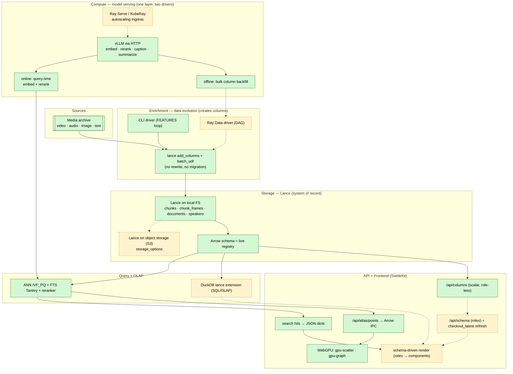

# What's left — the next architecture pass

> A forward-looking design brief for the **bigger structural bets** that aren't
> yet captured in [TODO.md](TODO.md). Where [TODO.md](TODO.md) is the
> value-per-effort backlog of shippable increments, this doc is the **"how the
> system should be shaped next"** discussion — rewrites, infra choices, and
> open questions that change the architecture rather than extend it. Read it
> alongside [GUIDE.md](GUIDE.md) (the current architecture map) and
> [STORAGE.md](STORAGE.md) (the Lance contract). For a code-grounded comparison
> against LightlyStudio (what we do better / can do better — it sharpens several
> bets below), see [COMPARISON_LIGHTLY.md](COMPARISON_LIGHTLY.md).

> Status legend: ✅ done · ⏳ in progress · 📋 planned · 🟡 optional/parked ·
> ❓ open question (decision needed before work starts).

The product is **shipped and working** — none of this is a blocker. These are
deliberate, larger investments, ordered roughly by how much they unlock for the
rest of the system.

---

## 0. Positioning & the architectural model

**What we are building: an Arrow-native multimodal lakehouse for media archives**
— the **target** is **Lance on object storage, KubeRay/vLLM compute, Arrow straight
to WebGPU**, with search · voice · KG built in. That architecture is the
differentiator, not the app surface: the *experience* is "Rerun for media
archives," but the *moat* is the data platform underneath. **Read the
shipped-vs-planned split below before treating any of this as current** — the
*seams* exist in today's code, but Ray, object storage, and the dynamic schema are
still planned (§1, §5). [Rerun](https://rerun.io) nailed the timeline experience
for robotics/CV (point clouds, 3D, `mcap`/`.rrd`); we aim the same
synchronized-multimodal-exploration idea at **video · image · audio · text**,
**modality-agnostic** — no modality (not even our original press-conference
*videos*) is privileged or hardcoded. **Multimodal data in general is the
first-class citizen.**

**Why the architecture is the moat (and not a borrowable app feature).** None of
the comparable tools separate storage from compute: FiftyOne couples both in
MongoDB, LightlyStudio in an embedded DuckDB/Postgres, Rerun in a closed `.rrd`
viewer. We don't. The whole stack speaks **one columnar language — Arrow — with no
serialization boundary anywhere**:

```
Lance (object store) vLLM / Ray Serve     Arrow IPC            Arrow JS           WebGPU
(Arrow columnar) ──▶ (Arrow batches) ──▶ (bulk: tableFromIPC)─▶ (typed arrays) ──▶ (GPU buffers)
   storage            compute               wire                browser            render
```

The aim is one columnar language — **Arrow — end to end, no serialization boundary
on the bulk path**. This is **already real for the embedding-map (Atlas) payload**:
`backend/atlas/points.py:170` serializes columns with `RecordBatchStreamWriter`,
`/api/atlas/points` returns `application/vnd.apache.arrow.stream`, and
`frontend/src/lib/api.ts:599` decodes it with `tableFromIPC` straight into the
`gpu-scatter` WebGPU/WGSL renderer (the KG uses `gpu-graph`; `embedding-atlas` is
WebGPU too). **Caveat (verified):** *search hits* currently travel as schema-
agnostic **JSON dicts** (`qb.to_list()`), not Arrow — so the zero-copy claim holds
for the bulk vector/point payloads (the part that actually needs it), not yet for
the per-hit list. Storage and compute are *designed* to scale independently — the
lakehouse decoupling, applied to multimodal/embedding data — once the Lance dataset
moves to object storage and a Ray driver lands (today both are local / CLI; §1).
This combination is a *category* none of FiftyOne/Lightly/Rerun occupy, and it's
validated by where data-infra is heading (Lance + Ray, Daft), not a lone bet. The
app surface (explorer UI, curation) is borrowable; **this pipeline is the part
that's genuinely ours.**

**The three-layer model** (the heart of every section below):

| Layer | Role | What it means concretely |
|---|---|---|
| **Lance** | **storage** | S3-native columnar media + vectors + FTS/ANN. The **Arrow schema is the live registry** of what has been enriched so far — the single source of truth for the dynamic schema (§5). |
| **Ray** | **data evolution + model serving** | The compute layer, on a **KubeRay** cluster, with **one model layer (Ray Serve + vLLM) driven two ways**: **online** — query-time embedding + reranking on the search path (low latency, one item); **offline** — batch column-evolution over the whole corpus (Ray Data jobs). It doesn't just "compute" — it **creates columns**: raw media → (ASR) `text` → (embed) `text_embedding` → (diarize) speakers → (topics/KG) facets → (select) `typicality`/`is_near_dup`. A dependency DAG of column-producing stages, incremental + idempotent. Both drivers hit the same serving layer through the same client `Protocol` and write via the same `add_columns` engine (§1, [MODULAR_PLAN §2](MODULAR_PLAN.md)). |
| **DuckDB (`lance` extension)** | **SQL / OLAP surface (optional)** | The analytical query layer over Lance — faceting, cross-filter, GROUP BY/JOIN/aggregates, stats (§3, §12). The official **`lance` DuckDB extension** (`INSTALL lance; LOAD lance;`) exposes Lance to DuckDB SQL (`lance_vector_search`/`lance_fts`/`lance_hybrid_search`, `ATTACH … (TYPE lance)`, index + maintenance ops). Because the data stays **Lance (MVCC/ACID)**, DuckDB is just a query engine over it — DuckDB's native single-writer limit (which LightlyStudio's *relational* DuckDB hits) doesn't apply. **Retrieval already runs on the LanceDB SDK** (see below); the extension's marginal value is the SQL/OLAP surface + a DuckDB-WASM in-browser path (§4), so it's **optional, scoped to analytics — not a replacement for the SDK.** |

These three imply the fourth: because **Ray continuously adds columns**, nothing
downstream can hardcode the column set — so the **schema must be dynamic** (§5),
read from `dataset.schema` at runtime. Modality-agnostic + Ray-evolves-columns +
dynamic-schema are one idea from three sides. For how this contrasts with
LightlyStudio / FiftyOne / Rerun, see
[COMPARISON_LIGHTLY.md](COMPARISON_LIGHTLY.md). For the **module boundaries** that
realize this model with low coupling — the storage/serving/enrichment/query/OLAP/
schema seams, grounded in the current code — see [MODULAR_PLAN.md](MODULAR_PLAN.md).

### Overall design (target) — shipped vs planned

> Green = shipped & verified in code (2026-06-14). Dashed amber = planned (the
> seam exists, the implementation doesn't yet). This is the **target** topology;
> the cross-check table below it is the honest current state.



**Cross-check — does the model hold against the code? (verified 2026-06-14)**

| Claim in this doc | Status | Evidence |
|---|---|---|
| Lance is the system of record; Arrow schema is the registry | ✅ shipped | `backend/state.py:74-109` opens Lance tables; `src/ratch/model/schema.py` |
| Data evolution via `add_columns` (no migration) | ✅ shipped | `features/engine.py:128-137` (`@lance.batch_udf`, `add_columns(udf, read_columns=, batch_size=)` — **lance core**, not lancedb) |
| One model layer, online + offline share a client `Protocol` | ✅ shipped | `vllm/base.py` `VLLMTransport`; online `backend/clients.py`, offline `features/columns.py:345-371` both build `VLLMEmbeddingClient(url)` |
| ANN (IVF_PQ) + FTS (Tantivy) + reranker | ✅ shipped | `backend/search/*`, `vllm/reranker.py` |
| Arrow IPC → WebGPU (bulk/Atlas path) | ✅ shipped | `atlas/points.py:170` `RecordBatchStreamWriter`; `api.ts:599` `tableFromIPC` → `gpu-scatter` |
| Search hits are Arrow on the wire | ❌ **JSON today** | `backend/search/*` return `qb.to_list()` / `to_pylist()` — schema-agnostic dicts, not Arrow |
| Serving runs on Ray Serve / KubeRay | 📋 planned | **no `ray` import anywhere, not a dependency**; serving is plain httpx→vLLM URL (Ray Serve is a URL swap behind the same Protocol — `MODULAR_PLAN §2`) |
| Offline backfill driven by Ray Data | 📋 planned | offline driver today is the **CLI loop** (`features/columns.py`); Ray Data driver not built |
| Lance on S3 / object storage | 📋 planned | `state.py` opens **local** paths; `s3://` appears only in media-URI docstrings (`schema.py:13,127`). `storage_options` not wired |
| Dynamic `/api/schema` + roles + `checkout_latest` refresh | 📋 planned | only `/api/columns` (scalar, role-less) exists; handle pinned at startup (`state.py:81`) |
| DuckDB `lance`-extension OLAP | 📋 planned | not in code; optional analytics module (§3) |

### Audit — is this design actually a good idea?

**Verdict: yes — the architecture is sound and the code is genuinely *structured
for it*, so the remaining work is implementation behind seams that already exist,
not a rewrite.** The honest detail:

- **Why it makes sense (the seams are real, verified above).** The enrichment core
  is *client-free pure functions over a path + a `compute` callable*
  (`features/engine.py`), so a Ray Data driver can fan them out **unchanged** — the
  hard part (idempotent, resumable, batched column creation) is done. Model access
  is a **URL behind a `Protocol`**, so "vLLM → Ray Serve" is a config swap, not a
  code change. The search wire is **open dicts**, so new columns ride the payload
  without a typed-model edit. And the one place zero-copy actually matters — bulk
  vectors → GPU — **already** runs Arrow-IPC→WebGPU. These are the expensive
  structural decisions, and they're already the right shape.
- **Why it's a good bet (not a lone gamble).** Lance + Ray + object storage is
  exactly the multimodal-lakehouse direction the data-infra field is converging on
  (Lance's own Ray integration; Daft). We're not inventing a format or a compute
  model — we're assembling proven pieces, with a domain (audio/voice/archive) the
  comparable tools don't touch.
- **Where it could *not* pan out (the honest risks).**
  1. **Ray is unproven *here*** — zero lines today. At single-node / 145k rows it's
     arguably **YAGNI**; its value is real only at corpus scale or true multi-tenant
     concurrency. Adopt it when a workload demands it, not preemptively (it adds a
     cluster, a control plane, and ops weight).
  2. **The dynamic schema has a real ceiling** (§5): generic for data/filters,
     **role-gated** for rich interactions — not infinitely generic. Fine, but don't
     over-invest in a fully generic renderer.
  3. **S3-native Lance changes the latency model** — object-store reads are not
     local-FS reads; ANN `nprobes`/caching tuned for local may need revisiting.
  4. **Two libraries in play** (`lance` core for evolution, `lancedb` for search) —
     keep API claims attributed to the right one (this audit corrected one such mix-up).
- **Recommended discipline.** Build **Phase 0** (the schema seam: `/api/schema` +
  `checkout_latest`) first — it's local, no-GPU, low-risk, and unblocks the dynamic
  UI. Defer **Ray and S3** until a real scale/concurrency need appears; they're the
  highest-effort, highest-uncertainty items and the code is already Ray-/S3-*ready*,
  so waiting costs nothing. **Don't** rebuild a generic explorer to rival FiftyOne —
  the moat is the pipeline + the domain, not the UI.

---

## 1. 📋 Rewrite inference — Ray as the data-evolution (enrichment) layer

> **Framing (see §0):** Ray is our **data-evolution layer**. Every enrichment is
> a job that reads existing Lance columns, computes, and **writes new column(s)
> back** via `add_columns` — `text` (ASR) → `text_embedding` (embed) → speakers
> (diarize) → `topic_l*` (topics) → `typicality`/`is_near_dup` (selection). These
> stages form a **dependency DAG** (embeddings need the transcript column; topics
> need embeddings). The §1 rewrite isn't "swap the executor" — it's promoting
> [`features/engine.py`](../src/ratch/features/engine.py)'s hand-rolled
> `add_columns` + resume into a first-class engine where each stage declares
> `input_columns → output_columns` and Ray walks the DAG incrementally and
> idempotently on the GPU pool. This is exactly the workflow Lance is *designed*
> for: per the LanceDB team, "adding columns or backfilling existing rows… only
> writes new files without touching existing ones… useful for workflows where
> columns are added incrementally, such as appending derived features or
> embeddings." The format is built for column-by-column data evolution.

Today inference is **split across two worlds** that don't share a runtime:

- **Offline** (the write side): batch feature passes driven by the CLI
  (`ratch feature text_embedding` / `frame_embedding`, captioning, summaries)
  talk to a **long-running vLLM HTTP server** (`make embed-server` /
  `rerank-server`, pinned to ports 8001/8002 — see
  [`scripts/serve-all.sh`](../scripts/serve-all.sh)). The embedding client
  ([`src/ratch/vllm/embedding.py`](../src/ratch/vllm/embedding.py)) fans out
  in-flight HTTP requests over a `ThreadPoolExecutor` (`TEXT_CONCURRENCY=32`,
  `IMAGE_CONCURRENCY=8`) and relies on vLLM's continuous batching. The
  **resume/checkpoint logic is hand-rolled** in
  [`src/ratch/features/engine.py`](../src/ratch/features/engine.py): a Lance
  `@batch_udf` with `merge_insert` null-fill for scan-derived columns, and a
  two-pass compute→attach with a **JSONL sidecar checkpoint** for blob-derived
  columns (frame embeds/captions). Orchestration is ad-hoc shell + Makefile
  targets, with separate one-off scripts (`services/models/topics/worker.py`,
  `src/ratch/kg/*`, `scripts/caption_eval.py`). **This is exactly the hand-rolled
  concurrency + resume machinery Ray Data's `map_batches` + actor pool replaces.**
- **Online** (the read side): the FastAPI backend calls the *same* vLLM servers
  per query for query-vector embedding and reranking. This is already cleanly
  dependency-injected — `run_search()` (`backend/search/service.py:385-401`)
  lazily gets the embedder via a factory (`backend/clients.py`), and upstream
  failures map to a 503 `ServiceUnavailableError` — so the *online* rewrite is
  mostly swapping what's behind the factory, not surgery on the search code.
- There isn't one model server but **four+**, each its own vLLM process on its
  own port: embed (`:8001`), rerank (`:8002`), caption/Gemma (`:8003`, external —
  we don't even start it), summarize (`:8004`). `serve-all.sh` brings them up
  **sequentially and health-gated** because starting embed+rerank at once trips
  vLLM's GPU memory-profiling race.

**What we want.** The Ray stack is **four distinct layers** — it helps to keep
them straight, because the names collide (Ray Core → Ray Data / Ray Serve →
KubeRay CRDs):

- **Substrate: Ray Core + actors.** An **actor** is a long-lived `@ray.remote`
  worker that loads a model **once** in `__init__` and reuses it across calls, so
  the GPU stays warm. Every layer below is actor-backed; the actor is the unit
  that replaces "a warm vLLM server process."
- **Offline → Ray Data (actor pool).** Model the feature passes as a streaming
  pipeline: `read_lance() → map_batches(EmbedActor, concurrency=N, num_gpus=1,
  batch_size=…) → write_lance()`. Handing `map_batches` a **class** (not a
  function) makes Ray Data stand up an **actor pool** of N warm replicas and
  stream batches through them with backpressure, retries, and checkpointing —
  replacing the hand-rolled `ThreadPoolExecutor` + JSONL-sidecar resume in
  `features/engine.py`. Each `EmbedActor` / `CaptionActor` / `RerankActor` is one
  warm model.
- **Online → Ray Serve + vLLM.** A Serve app of actor-backed **deployments**
  (autoscaling replicas, `@serve.batch` dynamic batching, a composition graph for
  embed + rerank + caption fronting vLLM) — replacing the four manually
  health-gated vLLM processes. *Naming caveat: "Ray Serve" is the Python serving
  library; "RayService" (below) is the Kubernetes resource that operates it — not
  the same thing.*
- **Kubernetes → KubeRay operator + its CRDs.** KubeRay provisions and reconciles
  the cluster on K8s. Three resources, mapped to the two workloads:
  - **`RayCluster`** — the raw cluster (head + autoscaling GPU worker groups) that
    everything runs on.
  - **`RayJob`** — runs a workload **to completion** (can create an ephemeral
    cluster, run, tear down). ← the **offline Ray Data** feature passes run here.
  - **`RayService`** — manages a **long-lived Ray Serve app** with health checks
    and **zero-downtime upgrades** (new cluster up → healthy → traffic switch). ←
    the **online** embed/rerank serving runs here.

  KubeRay owns provisioning, GPU scheduling, and autoscaling; we own the pipeline
  (RayJob) and Serve (RayService) definitions. This Kubernetes layer is the key
  piece that makes the actor model worth adopting at scale, vs. a hand-managed
  local Ray process.
- **Stop having "separate scripts."** Fold `services/models/topics/worker.py`,
  `src/ratch/kg/build_kg.py`, the eval scripts, etc. into the same Ray-driven
  pipeline surface so they're **integrated with the rest of the codebase**
  (shared config, shared dataset handles, shared actors) rather than detached
  entrypoints with their own argument parsing and lifecycle.

**Why it's worth it:** one runtime for batch + serving, real GPU scheduling
across the actor pool, native fault tolerance, and an end to the
serve-then-CLI-then-shell choreography in `serve-all.sh` / the Makefile.

> **The Ray/KubeRay/GPU stack must stay optional.** It's the heavy path for the
> full semantic/visual/hybrid experience. A user who only wants **FTS over a
> Lance dataset** must be able to run that with **none of it** — no Ray, no
> KubeRay, no GPU, no vLLM. The groundwork is already there: the backend defers
> all vLLM imports to request time (`backend/clients.py`), and the `fts` /
> `scene_fts` modes never touch the embedder. What's **missing** is graceful
> *cross-mode* fallback — today `hybrid`/`semantic` with `text_embedding` absent
> returns a 400, rather than degrading to FTS (see §4). Keep the no-GPU path
> first-class rather than making the GPU stack a hard dependency of "search the
> archive."

**❓ Open questions**

- Ray cluster shape on a single local GPU node — is the orchestration overhead
  worth it at ~145k rows, or do we adopt Ray purely for the programming model
  (local mode) and grow into a cluster later?
- Does Ray Data read Lance efficiently enough (fragment-parallel scans) to keep
  the GPU saturated, or do we need a custom datasource?
- Migration order: rewrite offline first (lower risk, no live traffic), then
  online once the actor abstractions are proven.

---

## 2. 📋 Lance table maintenance — GC, reindex, manifest compaction

The archive is really a **dozen Lance datasets** under `transcripts_v2.lance/`
(`chunks`, `documents`, `chunk_frames`, `speaker_turns`, `speaker_embeddings`,
`speakers`, `topics`, plus `kg_entities`/`kg_chunks`/`kg_mentions`/
`kg_relationships`). Every feature pass appends/merges and every reindex adds
versions, so fragments and superseded manifests pile up on disk.

**What exists today (and its gaps):**

- A `ratch compact` command **already exists** (`cli/media.py`): it runs
  `dataset.optimize.compact_files(target_rows_per_fragment=1M)` and rebuilds the
  **IVF_PQ vector + BTREE scalar** indices — **but it does not rebuild the
  Tantivy FTS index** (an oversight: the FTS tail silently goes stale after an
  append) and it's manual + chunks-only.
- `cleanup_old_versions()` is called in **exactly one place** — the KG adapter
  (`src/ratch/kg/adapter.py`, `older_than=timedelta(0)`). **Every other table
  never GCs**, so old versions accumulate indefinitely.

**What's actually missing — the first-class maintenance story:**

- **FTS reindex on compaction** — fold `create_fts_index(..., replace=True)` into
  `ratch compact` so BM25 covers the new tail (recall otherwise degrades — cf.
  the `nprobes`/recall gotchas in [INVESTIGATION.md](INVESTIGATION.md)).
- **Garbage collection across all tables** — `cleanup_old_versions(older_than=…)`
  with a real retention window, not just the KG table.
- **Cover every dataset** — extend compaction/GC/reindex beyond `chunks` to the
  frames/voice/topics/KG tables that the backfills churn hardest.
- **Scheduling** — a `ratch maintain` target / periodic job (a §1 Ray job?) so
  it isn't a manual ritual.
- **Mostly wiring existing SDK calls.** The LanceDB Table API already provides the
  whole toolkit: **`table.optimize(cleanup_older_than=…)`** does compaction +
  version prune + **incremental index optimization** (it folds *new* rows into the
  existing IVF/FTS indices — the tail our current `ratch compact` leaves
  unindexed; note the old `retrain=` flag is now a deprecated no-op);
  `cleanup_old_versions` for GC; `list_versions` / **`restore(version)`** for the
  "roll back a bad feature pass" case; `tags` / `branches` for named/experimental
  versions; **`clone_table`** (shallow, shares data files) for cheap variant
  builds — note this one is on the **async** `AsyncConnection` only, not the sync
  `DBConnection` our retrieval path uses, so a variant build would go through the
  async client (or `lance` core). So §2 is largely *adopting `optimize()` across all
  tables on a schedule*, not new machinery.

**❓ Open questions:** retention window for old versions (we sometimes want to
roll back a bad feature pass — now answered by `restore(version)`); compaction
during vs. between feature passes; whether maintenance becomes one of the Ray
jobs from §1.

---

## 3. 📋 Lance namespacing (+ maybe DuckDB-over-Lance)

Right now every table is addressed by **hardcoded filesystem path** —
`db / "chunks.lance"`, `db / "documents.lance"`, etc., with the root from
`MEDIA_DB` / the Makefile `DB`. There is **no catalog, no table registry, no
multi-dataset addressing** anywhere in the codebase. As the table count grows
(already ~11) and variant builds appear, that flat directory of `.lance` folders
stops scaling.

- **Adopt Lance Namespace** — a catalog/namespace layer so tables are addressed
  logically (namespace + table name) instead of by filesystem path, with
  consistent listing/versioning across the table set. This also cleans up the
  shard tables (`speaker_turns_shard{i}.lance`) and merge dance. **This is already
  in the LanceDB SDK** — `create_namespace` / `list_namespaces` / `namespace_path=`
  on `create_table`/`open_table`/`list_tables`/`rename_table`, plus
  `namespace_client()` — so it's *adopt the SDK's namespace API*, not build a
  catalog. (The `lance` DuckDB extension's `ATTACH 'dir' AS ns (TYPE lance)`,
  incl. REST namespaces / LanceDB Enterprise, is the SQL-side equivalent.)
- **DuckDB `lance` extension — the optional SQL/OLAP surface (§0).** There is
  **zero DuckDB in the repo today**, and **we don't need it for retrieval** —
  ratch already does vector/FTS/hybrid search + indexes + compaction on the
  **LanceDB SDK** (`ctx.chunks.search(...)`, `create_fts_index`, `create_index`).
  The extension's value is the **analytical** side: GROUP BY / JOIN / window /
  faceted stats / cross-filter (histograms, group-by-video, the curation panels
  in [TODO.md](TODO.md#curation--exploration-roadmap)) — one SQL surface over
  Lance, beating bespoke Python scans, and the DuckDB-WASM in-browser path (§4).
  **No concurrency hazard:** querying *Lance* via the extension means the data
  stays Lance (MVCC/ACID), so DuckDB's native single-writer limit (which
  LightlyStudio's relational DuckDB hits) doesn't apply — readers run *while Ray
  (§1) writes columns*.

**❓ Open questions:** is the LanceDB SDK + Arrow→polars enough for our analytics,
or do we adopt the DuckDB `lance` extension for a real SQL/cross-filter surface?
Which namespace backend (directory `ATTACH` vs. a REST catalog) for a single-node
deploy; how namespacing interacts with the maintenance jobs in §2.

---

## 4. 📋 Lightweight FTS path — DuckDB-WASM only, no GPU

Search currently assumes the **vLLM GPU stack is up** for the semantic/visual/
hybrid/fused modes. There's no graceful "no-GPU" mode for a lightweight or fully
in-browser deployment.

- **CPU/keyword fallback** — when no GPU is present, serve **FTS-only** search
  (Tantivy BM25 is already in the dataset; semantic legs disabled) so the app is
  still useful without the embedding/rerank servers.
- **DuckDB-WASM in the browser** — for a static/edge deployment, ship the
  columnar text + metadata so the frontend can run keyword search and faceted
  filters **entirely client-side** via DuckDB-WASM, no backend round-trip. Pairs
  with the DuckDB-over-Lance work in §3 and the schema-flexibility work in §5.

**❓ Open questions:** how much of the corpus is shippable to the browser (text +
metadata only, not media/embeddings); whether DuckDB-WASM can read Lance
directly — the native `lance` DuckDB extension (§3) is unlikely to be WASM-built,
so the browser path probably means **exporting a Parquet/Arrow slice** for the
client while the server-side OLAP uses the extension over Lance.

---

## 5. 📋 Schema flexibility — stop hardcoding columns (FiftyOne-style)

Both backend and frontend are **hardcoded against the current columns**
(`doc_id`, `namn`, `referenskod`, `bildid`, `extraid`, `text`, `caption`,
`text_embedding`, `frame_embedding`, … — see
[`src/ratch/model/schema.py`](../src/ratch/model/schema.py)). Adding a field
means touching the Pydantic models, API serializers, the zod schema, and the
SvelteKit components. This is the main thing blocking schema evolution.

**Where it's actually hardcoded** (frontend audit — the coupling is concrete,
not abstract):

- **The hit contract is a fixed zod struct** — `HitSchema` in
  [`frontend/src/lib/api.ts`](../frontend/src/lib/api.ts) pins ~17 named fields
  (`doc_id`, `speech_id`, `chunk_id`, `start`, `end`, `text`, `namn`,
  `referenskod`, `bildid`, `extraid`, `caption`, …). Any new column is invisible
  until this struct (and its TS type) is edited.
- **The results table is a hardcoded column list** — `TABLE_COLUMNS` in
  [`frontend/src/lib/components/hit-table.svelte`](../frontend/src/lib/components/hit-table.svelte)
  enumerates every column with a per-field `render`/`sortValue`; `DEFAULT_TABLE_COLS`
  / `MAP_TABLE_COLS` / `WRAP_KEYS` are hand-listed field names. The
  resizable-columns + visibility-toggle work is real but only toggles columns
  from this fixed set.
- **Detail + cards are hand-written field rows** — `player-pane.svelte` adds
  `Caption/File/Time/Name/Reference/Image ID/Extra ID/Language/Segment` one line
  at a time; `hit-card.svelte` / `doc-tile.svelte` hardcode `namn ?? audio_path
  ?? doc_id` as the title.
- **Quick filters are a fixed enum** — `SearchSpec` (`api.ts`) and the rendered
  pills (`active-filters.svelte`) only know `language`, `namn`, `referenskod`,
  `extraid`, `topic`; the language dropdown (`filter-popover.svelte`) hardcodes
  `sv`/`en`. Document browse (`DOC_COLUMNS`) is likewise a fixed 7-field list.
- **The backend already speaks open dicts — but `SELECT`s a fixed list.** Good
  news first: the search endpoints return `list[dict[str, Any]]` (raw
  `qb.to_list()` / `to_pylist()`, not a typed `Hit` model) — so the *transport*
  is already schema-agnostic. The catch is the **column list is a constant**:
  `_HIT_COLUMNS` / `_PAYLOAD_COLUMNS` in
  [`backend/search/constants.py`](../backend/search/constants.py) (`.select(_HIT_COLUMNS)`
  in [`backend/search/service.py`](../backend/search/service.py) `:122,:239`). A
  Ray-added column won't surface until it's added to that constant — *that* is the
  backend hardcode, not a Pydantic model.
- **The dataset handle is pinned at startup.** `open_resources`
  ([`backend/state.py`](../backend/state.py)) opens every Lance handle **once**
  and deliberately reuses `chunks_ds = chunks.to_lance()` (the comment notes
  re-wrapping per request re-seeds the index cache). A column Ray adds *after*
  startup is invisible to that snapshot until the handle is refreshed.

**What's already dynamic** (the seam to build on): `/api/columns` **exists** on
both ends — served by `backend/system/router.py` (introspects the `chunks`
schema, maps types to a `ColumnKind` of `number`/`boolean`/`time`/`text`, and
**skips `alignments_json` + every `*_embedding` column**) and consumed by the
*advanced* filter builder (`filter-popover.svelte` → `listColumns()` in
`api.ts`). The Atlas also reads its colour dimensions
(`language`/`namn`/`topic`/`doc_topic`) dynamically from the Arrow payload. So
the introspection endpoint is there — but it's **scalar-only and role-less**
(name+type, nothing about display/facet/embedding roles), and it doesn't yet
drive the results table, detail views, cards, or quick filters.

**Goal: FiftyOne-like flexibility** — the UI and API adapt to *whatever* columns
the dataset has, instead of a fixed contract:

- **Extend `/api/columns` into a real field-schema** — name, type, nullability,
  plus a **role/tag** (`filterable` / `displayable` / `embedding` / `blob` /
  `fts` / `facet`) and display hints (label, default-visible, detail-visible),
  the FiftyOne sample/field-schema idea adapted to Lance. **Store the roles where
  they belong: in Lance itself.** The LanceDB SDK exposes per-column metadata
  (`table.update_field_metadata(...)`, read back via `schema.field(x).metadata`),
  so the role/label registry lives *in the column schema* — no sidecar table, no
  second source of truth. `/api/schema` just reads `dataset.schema` (types) +
  field metadata (roles) and serves it.
- **Schema-driven rendering** — generate `TABLE_COLUMNS`, the detail field rows,
  card title/subtitle, and the quick-filter set from that schema instead of
  hardcoding. Keep `HitSchema` as a typed *core* with a dynamic "extras" bag so
  TS types stay honest for the known fields while new columns flow through.

**Can a Ray-added column reach the UI with no codegen and no restart? Yes —
given three changes.** This is the crux: the data schema *evolves* as Ray enriches
(see §1), so the UI must discover columns at **runtime**, not build time. The two
"schemas" have different lifecycles:

- **OpenAPI / generated TS types = the API *contract*** (endpoints, response
  *containers*, pagination). Generated at **build time**; **static**. Adding a data
  column does *not* change it, so no regen / no restart for a column — you only
  regenerate when you add an endpoint or change a container shape. (LightlyStudio
  proves the pattern: `export_schema.py` → `openapi.json` → `@hey-api/openapi-ts`,
  per `lightly_studio_view/openapi-ts.config.ts`. We should adopt it and delete the
  hand-written zod.)
- **The data field-schema = which columns exist right now.** Runtime data, served
  live from `dataset.schema`. This is the dynamic part. LightlyStudio's exact
  analogue is `GET /metadata/info → list[MetadataInfoView]`
  (`api/routes/api/metadata.py:26`, built per-call with name/type/min/max in
  `get_metadata_info.py:49`).

The three changes that make "new column, no restart" true:

1. **`/api/columns` → `/api/schema`** — read `state.chunks.schema` **live**, return
   every field with a `role` (`id`/`facet`/`text`/`embedding`/`blob`/`time`/`score`/
   `media`) + label, not just scalar filter columns.
2. **Stop the fixed `SELECT`** — derive the search column list from the schema (or
   select all non-blob columns) instead of the `_HIT_COLUMNS` constant, so new
   columns ride the (already-dict) payload automatically.
3. **Refresh the handle, don't restart the process** — two SDK options: pass
   **`read_consistency_interval=timedelta(...)`** to `lancedb.connect()` so reads
   auto-check for other processes' writes (the built-in answer), or call
   `table.checkout_latest()` (cheap: reads a manifest) explicitly on a §8
   "enrichment done" event. Either way the snapshot sees Ray's new columns without
   a process restart.

Then the frontend renders generically from `/api/schema` and re-fetches it; a new
column appears with **zero frontend edits, zero codegen, zero restart**. The only
thing that needs a rebuild/redeploy is a genuinely new *endpoint* (capability),
never a new *column* (data). On dynamic-but-typed storage, we beat both
references: LightlyStudio bolts a JSON `metadata_schema` type registry
(`models/metadata.py:104,131`) onto a fixed ORM, and FiftyOne keeps fields untyped
in Mongo — whereas **Lance's Arrow schema is already typed *and* evolvable
(`add_columns`, no migration)**, so the field-schema *is* the store.

**It's not just *display* — the *capabilities* are column-coupled too (the
deeper problem).** Schema-driven rendering fixes tables/filters/detail, but the
sharper coupling is that **what you can *do*** is hardcoded against named columns:

- **Search modes are a closed enum bound to specific columns.** `SearchMode`
  (`backend/search/spec.py:16`) lists `semantic/visual/scene/scene_fts/hybrid/…`,
  and each is a dedicated function naming a column: `_search_semantic` →
  `"text_embedding"` (`service.py:155`), `_search_hybrid` →
  `vector_column_name="text_embedding"` (`:232`), visual → `frame_embedding`,
  scene → `caption_embedding`. **Add a new embedding column (a Jina-omni unified
  vector, an `audio_embedding`) and there is no way to search it** until someone
  adds an enum member + a dispatch fn (backend) + a mode toggle (frontend).
- The same is true for **Atlas spaces** (`atlas_*` / `atlas_img_*` / `atlas_cap_*`
  triplets, `--space text|visual|caption`) and **per-hit actions** (play, frame,
  karaoke — bound to `audio_path` / `frame_blob` / `alignments_json`, so a
  modality without audio has no affordance).

So the field-schema must be a **capability descriptor**, and the backend's
*dispatch* + the frontend's *affordances* must be **derived from roles**, not from
column names:
- `role=embedding` → expose a generic `vector:<column>` search automatically (no
  new enum member); `role=fts` → keyword search; `role=facet` → a filter;
  `role=media,kind=audio|video|image` → the matching player/frame/image action;
  hybrid is derived from *which* embedding + fts columns exist.
- Then both layers "know" only **roles**, never column names — a Ray-added column
  with a role brings its operation for free. This is the real win: it removes the
  "frontend/backend know too much" coupling, not just the display hardcoding.

**Why now:** every other item here (new embedding spaces, voice/speaker columns,
KG-derived fields, configurable chunking in §6) adds columns — and §1 makes Ray
add columns *continuously*. Without this, each new column is a frontend+backend
edit across the files listed above.

**How flexible can the frontend actually get? — feasibility + the boundary.**
This is the right thing to be nervous about, so state it precisely. The schema-
driven UI is **a proven, shipping pattern, not research** — and one product ships
it on *our exact SvelteKit stack*: LightlyStudio's `GET /metadata/info` drives
generic rendering (`CombinedMetadataDimensionsFilters.svelte` loops fields →
sliders; `MetadataSegment.svelte` iterates `metadata_dict` → detail rows), and
FiftyOne generates its whole sidebar from the dataset schema. **Our gap is
narrower than theirs was**: the wire is *already* schema-agnostic (`list[dict]` /
Arrow IPC), so only three named spots are hardcoded (`_HIT_COLUMNS`, the pinned
handle, the zod `HitSchema`). So this part is **low-risk and achievable.**

But be calibrated about the limit — there are **two tiers**, and only the first is
fully generic:

1. **Data display + filters → fully generic.** Tables, facets, detail rows, scalar
   fields, quick filters render from `/api/schema` with zero per-column code. This
   is the proven 90%.
2. **Rich per-modality interactions → role-gated, not infinitely generic.** The
   synchronized A/V karaoke player, the WebGPU Atlas, voiceprint UX, the KG graph
   are bespoke components. The pattern is a **role → component registry**: a
   column's `role` (`media,kind=audio`, `embedding`, `alignments`) *conditionally
   mounts a known rich component*. A new **column** of a known role lights up
   automatically; a genuinely new **kind of interaction** still needs a component
   built once, then registered. You cannot render an interaction nobody has
   written — and neither can FiftyOne (typed per-field visualizers) or Rerun
   (per-component views). **Nobody achieves more than this.**

So the realistic, honest promise is: **"any column surfaces in tables/filters/
detail with zero edits, and known rich components activate by role"** — *not*
"arbitrary new UI materializes from a schema." That ceiling is fine: it's exactly
what the references deliver, and it's enough for everything on this roadmap.

**❓ Open questions (the genericity dial — feasibility itself is settled):** the
split above resolves "how far to genericize" → **generic typed core for data +
a role-keyed registry for rich affordances**. What remains: how to keep TS types
honest against a dynamic schema (typed core + an open `fields` bag); and how to
preserve curated, hand-tuned default views (title selection, default columns) as
*overrides* on top of the generic renderer.

---

## 6. 📋 Better preprocessing & configurable chunk units

Chunking is currently **fixed upstream** by the ASR pipeline
([PIPELINE.md](PIPELINE.md)) — speech segments → ~30 s `AudioChunk`s. ratch
itself **does not chunk at all**: `flatten_chunks()`
([`src/ratch/ingest/ingest.py`](../src/ratch/ingest/ingest.py)) just iterates
the transcriber's pre-cut chunks and copies each one's `start`/`end`/`text`
through verbatim — there are **no size limits, no windowing, no rechunking
parameters**. Hence the known "one press conference floods the page" redundancy
of near-identical adjacent chunks ([TODO.md](TODO.md#curation--exploration-roadmap)).

- **Configurable chunk units** — make the unit of a "chunk" (and thus a search
  hit) a configurable preprocessing step: fixed-duration windows, sentence/
  semantic boundaries, speaker-turn boundaries (we already have diarization),
  or overlapping windows — chosen per build via config, not hardcoded.
- **Better preprocessing** — text normalization, dedup/uniqueness collapse at
  ingest (cf. the planned `feature uniqueness`), and chunk-merge so retrieval
  units are meaningful rather than mechanical 30 s slices.
- **Config surface** — these knobs live in one place (a build config) and flow
  through the Ray pipeline (§1), not scattered constants.
- **Reuse LanceDB's `contextualize()`** — the SDK ships a rolling context-window
  builder (`contextualize(df).window(n).stride(k).groupby(col).text_col(...)`)
  that turns one-row-per-token/sentence into overlapping windows without crossing
  group boundaries. That's exactly the fixed/sliding-window chunking above —
  another built-in to lean on rather than hand-roll.

**❓ Open questions:** re-chunking means re-embedding (expensive) — do we keep
multiple chunk granularities side-by-side, or pick one per build? Interaction
with stored `alignments_json` word timings.

---

## 7. 📋 State management — Postgres for app state, Redis for cache

The first curation features (tags, saved views — [TODO.md](TODO.md#curation--exploration-roadmap)
item 5) introduce **mutable application state**, which Lance (append/columnar,
not a transactional KV) isn't the right home for. On-demand diarization caching,
speaker naming, and any user/session state need the same. Lance stays the
**immutable corpus** store; mutable state lives elsewhere.

The decision (not a menu — these are the two stores):

- **Postgres — the system of record for application/frontend state.** Tags,
  saved views, speaker names, user/session state, and any "work to do" queue
  for §8's eventing. Relational, transactional, multi-user — the durable home
  for everything that isn't the immutable Lance corpus.
- **Redis — the cache layer.** Hot, ephemeral data: query-vector cache (the
  parked "query-vector LRU cache" in [TODO.md](TODO.md#parked) belongs here),
  search-result caching, session/rate-limit data, and a fast scratch space in
  front of Postgres. Can double as the broker/coordination layer for §1's jobs
  and §8's events.

So: **Lance** = immutable corpus + vectors + FTS; **Postgres** = durable mutable
state; **Redis** = cache + ephemeral/coordination. Three stores, three clear
roles — no SQLite, no state sprawl across ad-hoc files.

**❓ Open questions:** does Redis also serve as the §8 event bus, or do we keep
events in Postgres (`LISTEN/NOTIFY` / an outbox table) and use Redis purely as a
cache? One nuance for **tags specifically**: Lance can hold a `List<string>` tag
column with a native **`LabelList` index** (`array_contains_all/any`), so
*read-side* tag filtering could stay Lance-native while Postgres owns the mutable
write/curation state — worth weighing vs. putting tags wholly in Postgres. How
much of the existing on-disk state (e.g. diarization shard tables)
migrates to Postgres vs. stays Lance.

---

## 8. ❓ Eventing / orchestration — Dapr? Data-arrival events vs. polling

The pipeline today is **manually triggered** (Makefile targets, batch backfills,
`serve-all.sh`). There's no event when new data lands or a feature pass
finishes — downstream steps are run by hand or chained in shell.

- **Event-driven ingestion** — emit/consume events ("new alignment JSON
  arrived", "embedding pass done", "video N diarized") so the pipeline reacts
  instead of being poked. Pairs with on-demand diarization
  ([TODO.md](TODO.md#in-flight)) and the Ray jobs in §1.
- **Dapr** — as a possible building-block layer (pub/sub, state store
  abstraction over §7, bindings, service invocation) so we don't hardcode a
  specific broker. Attractive if we go multi-service (Ray Serve + FastAPI + KG +
  workers); heavier than warranted for a single node.

**❓ Open questions:** is this premature at single-node scale (YAGNI), or does
on-demand diarization + the Ray rewrite already create enough moving parts to
justify a pub/sub spine? A "work to do" table in **Postgres** (§7) polled by
workers — or Postgres `LISTEN/NOTIFY` / a **Redis** stream — may beat a full
Dapr deployment until services actually multiply.

---

## 9. 📋 Knowledge graph — needs significant attention

The KG is the **least mature** subsystem. It's a fully detached **three-step
batch**: `export_chunks.py` dumps chunk text → JSONL, `build_kg.py` runs
**LightRAG** (in an isolated `uv run --no-project --with lightrag-hku` venv,
Gemma 4 31B for extraction + Qwen3-VL embeddings) into a GraphML, and
`adapter.py` folds that into four `kg_*` Lance tables, served via a Cypher engine
in the backend `graph/` surface (deep-dive: [GRAPH.md](GRAPH.md)). None
of it is triggered by the main pipeline; it's full-rebuild only
(`mode="overwrite"`).

The biggest weakness is **entity resolution**: it's purely **syntactic** —
`entity_id = sha1(name.lower())`, plus deterministic Swedish-suffix dedup and
single→multi-token person merges (`adapter.py`). So two different people named
"Anders" are **conflated into one node**, and name variants that the alias rules
miss become separate nodes. There is no semantic coreference.

Areas that need real investment:

- **Integration, not scripts** — fold KG construction into the unified pipeline
  (§1) so it's incremental and reproducible, not a one-off full-rebuild batch.
- **Real entity resolution / disambiguation** — replace name-hash identity with a
  proper coref/linking pass (the "which Anders" problem,
  [TODO.md](TODO.md)), ideally tied to the **voice/speaker identity clusters**
  ([VOICE.md](VOICE.md)) and named speakers so a person node is grounded in *who
  actually spoke*, not just a string.
- **Schema & storage** — decide how the graph is stored/queried (stay Lance
  tables + Cypher / DuckDB joins per §3? a dedicated graph store?) and how it
  stays in sync as chunks/entities change (incremental, not overwrite).
- **Quality** — extraction precision/recall, typing, relation quality, and an
  eval harness (the topic/caption evals are a template).
- **Surfacing** — richer graph queries and UI beyond the current examples rail.

**❓ Open questions:** graph storage backend (stay Lance-native vs. adopt a graph
DB); how tightly to couple KG entities to speaker identities; whether the graph
is rebuilt or incrementally maintained under the new eventing model (§8).

---

## 10. 📋 Unify multimodal search — evaluate Jina v5 Omni

Retrieval today runs on **three separate embedding families**, all from
Qwen3-VL-Embedding-2B over vLLM ([EMBEDDINGS.md](EMBEDDINGS.md),
[`src/ratch/vllm/embedding.py`](../src/ratch/vllm/embedding.py)): `text_embedding`
(transcript text), `frame_embedding` (chunk-level image vector), and
`caption_embedding`. The search modes (semantic / visual / scene / hybrid /
fused) exist partly *because* these are distinct vectors in distinct columns
that have to be combined at query time.

**Bet:** evaluate **Jina v5 Omni** (an omni-modal embedding model — text, image,
and audio into **one shared space**) as a path to *unify* search:

- **One embedding space** instead of three columns → semantic, visual, and (new)
  **audio** retrieval become one ANN query, not three legs to fuse. Simplifies
  the fused/hybrid logic in `backend/search/` and the schema in §5.
- **Native audio retrieval** — query the press-conference *audio* directly
  (prosody, non-speech cues), not only its transcript text, which the current
  text+image-only stack can't do.
- **Run it as a §1 actor** — slots straight into the Ray Data embed-actor model;
  it's just a different encoder behind the same `EmbeddingClient` protocol.

This is an **evaluation**, not a commitment: benchmark Jina v5 Omni retrieval
quality (the [`evals/`](../evals) + topic/caption eval harness) against the
current Qwen3-VL three-vector setup before migrating any column.

**❓ Open questions:** does a single unified space match per-modality specialist
vectors on recall, or do we keep both? Embedding dim / storage cost vs. the
current 2048-d columns; re-embedding the whole corpus is a §1 batch job;
licensing/serving (does it run under vLLM or need its own actor runtime?).

---

## 11. 📋 Replace easytranscriber — a Ray-native ASR pipeline

The entire write side starts with **easytranscriber** (+ easyaligner) — the
4-stage VAD → Whisper → wav2vec2 CTC → forced-alignment pipeline wrapped by
`ratch transcribe` ([PIPELINE.md](PIPELINE.md)). It works, but it's a poor fit
going forward: it's an **external dependency we don't control**, its stage-by-
stage, directory-dumping design (`output/vad/`, `output/transcriptions/`,
`output/emissions/`, …) is built for single-process batch runs, and it does **not
map cleanly onto Ray** (the actor/`map_batches` model in §1) — `pyannote` is only
a transitive dep through it ([TODO.md](TODO.md#in-flight)), and the resume story
is filesystem-staging, not a managed pipeline.

**Bet:** rewrite ASR as a **Ray-native pipeline** we own:

- Each stage (VAD, transcription, alignment) becomes a **Ray Data stage /
  actor** holding a warm model on the GPU, streaming Arrow batches between
  stages instead of staging interatchtes to per-stage directories.
- The KB models stay the same (KB-Whisper, wav2vec2-voxrex, pyannote VAD — the
  *quality* isn't the problem); what changes is the **orchestration**: managed
  GPU scheduling, backpressure, retries, and checkpointing from Ray, on the same
  KubeRay cluster as everything else in §1.
- `pyannote` becomes a **first-class dependency** rather than transitive.
- Output lands **directly in Lance** (no `output/*/` JSON hop), so transcription
  and the downstream feature passes share one runtime and one dataset.

**❓ Open questions:** how much of easyaligner's forced-alignment we reimplement
vs. vendor; whether to keep an easytranscriber-compatible path during migration;
validating the rewrite produces identical word alignments (regression-test
against the current `alignments_json`).

---

## 12. 📋 Analytics & charting — study the corpus, not just search it

There is **no analytical/visualization surface** for understanding the data in
aggregate. The Atlas map is a 2-D embedding projection and the topic treemap
exists, but there are **no charts** — no distributions, time series, or
faceted breakdowns to actually *study* the corpus. The
[TODO.md](TODO.md#curation--exploration-roadmap) "Stats / histograms" item is the
seed; this is the broader bet.

**Bet:** a real analytics layer to make graphs over the data:

- **Aggregate charts** — distributions and counts over any facet (per `namn`,
  `referenskod`, `language`, `topic`, speaker, time/duration): histograms, time
  series, top-N bars, co-occurrence. The frontend already ships LayerChart
  (used by the topic treemap) — extend it into a charts panel.
- **Powered by DuckDB-over-Lance (§3)** — these are `GROUP BY`/aggregate queries,
  exactly what DuckDB is for; a `/api/stats` (or DuckDB-WASM client-side, §4)
  surface rather than bespoke Python scans.
- **Schema-driven (§5)** — chartable dimensions come from the field-schema
  (anything tagged `facet`), so new columns become chartable automatically.
- **Curation loop** — feeds the faceted filter panel and group-by-video / near-
  dup work in [TODO.md](TODO.md#curation--exploration-roadmap); seeing the
  distribution is how you find the redundancy to collapse.

**❓ Open questions:** server-side `/api/stats` vs. fully client-side DuckDB-WASM
(§4); which chart library surface (lean on the existing LayerChart); precompute
vs. on-the-fly aggregation at 145k+ rows.

---

## 13. 📋 Documentation site — publish `docs/` with Zensical

The project already has a **substantial docs corpus** — 13 markdown files under
[`docs/`](.) (GUIDE, STORAGE, PIPELINE, EMBEDDINGS, VOICE, GRAPH, MCP,
INVESTIGATION, REPRODUCE, TESTING, STUDIO_MERGE, TODO, and this file) plus the
root [README](../README.md), heavy with Mermaid diagrams and cross-links. But
it's only ever read as **raw Markdown on GitHub** (the in-app `/guide` route is a
hand-built single page, not the docs). There's no rendered, searchable,
navigable documentation site.

**Bet:** publish `docs/` as a static site with **[Zensical](https://zensical.org)**
— the Material-for-MkDocs team's next-generation static-site generator (a faster,
ground-up successor to MkDocs/Material). It renders the existing Markdown +
Mermaid into a navigable site with full-text search, a nav tree, and versioning,
with little change to the source files.

- **Reuse what's there** — the docs are already written in interlinked Markdown
  with relative links and Mermaid blocks; Zensical consumes that directly. Mostly
  a `zensical.toml`/nav config + a CI build, not a rewrite.
- **Searchable + navigable** — client-side search and a generated nav over the 13
  docs beats grepping the repo or scrolling GitHub.
- **CI + hosting** — build on push (a §1 job or a plain GitHub Action) and deploy
  to GitHub Pages / static hosting, so the site tracks `main`.
- **Single source of truth** — the in-app `/guide` page and the README cheat-sheet
  can link into the published site instead of duplicating prose.

**❓ Open questions:** Zensical vs. plain Material-for-MkDocs (Zensical is newer /
less battle-tested — worth confirming Mermaid + our cross-link style render
cleanly); where to host (GitHub Pages vs. the app's own static route); whether
the docs build belongs in the §1 pipeline or stays a standalone Action.

---

## How these fit together

These bets reinforce each other, which is why they're one doc:

- **§1 (Ray/KubeRay)** is the new runtime that **§2, §6, §9, §10, §11** all run
  on, and that **§8** would coordinate. The ASR rewrite (§11) and the unified
  embedder (§10) are the first two encoders to live as §1 actors.
- **§3 (namespacing/DuckDB)** is the substrate for **§4 (DuckDB-WASM lightweight
  FTS)**, **§12 (analytics/charts)**, and **§5 (schema flexibility)** — together
  the "query & present any dataset" stack. §12's charts are §3's DuckDB
  aggregates rendered over §5's field-schema.
- **§7 (Postgres state + Redis cache)** and **§8 (events)** are the connective
  tissue once there's more than one moving service.

Suggested sequencing: **§5 (schema flexibility)** and **§2 (maintenance)** are
the highest leverage / lowest risk and unblock the most other work (and §2 is
half-built — it's mostly finishing `ratch compact`). **§1 (Ray rewrite on
KubeRay)** is the big foundational change to land before **§6/§9/§10/§11** build
on it. **§10 (Jina Omni)** should start as an *evaluation* in parallel since it
could simplify the schema §5 has to model. **§3/§4/§12** and the **§7/§8** infra
choices follow once the data and runtime shapes settle.

---

> **A note on grounding:** the "today" descriptions above were written after a
> full read of the inference stack (`src/ratch/vllm`, `features`, `ingest`,
> `cli`, `serve-all.sh`, the Makefile), the backend (`backend/**`), the
> storage/schema layer (`src/ratch/model/schema.py`, every `lance.write_dataset`
> / index call), the KG scripts (`src/ratch/kg/*`), and the SvelteKit frontend.
> Where a capability already exists in embryo (`/api/columns`, `ratch compact`,
> the DI'd online embedder, the no-GPU FTS path) it's called out as such, so the
> roadmap is about *finishing and reshaping* — not pretending the ground is bare.
