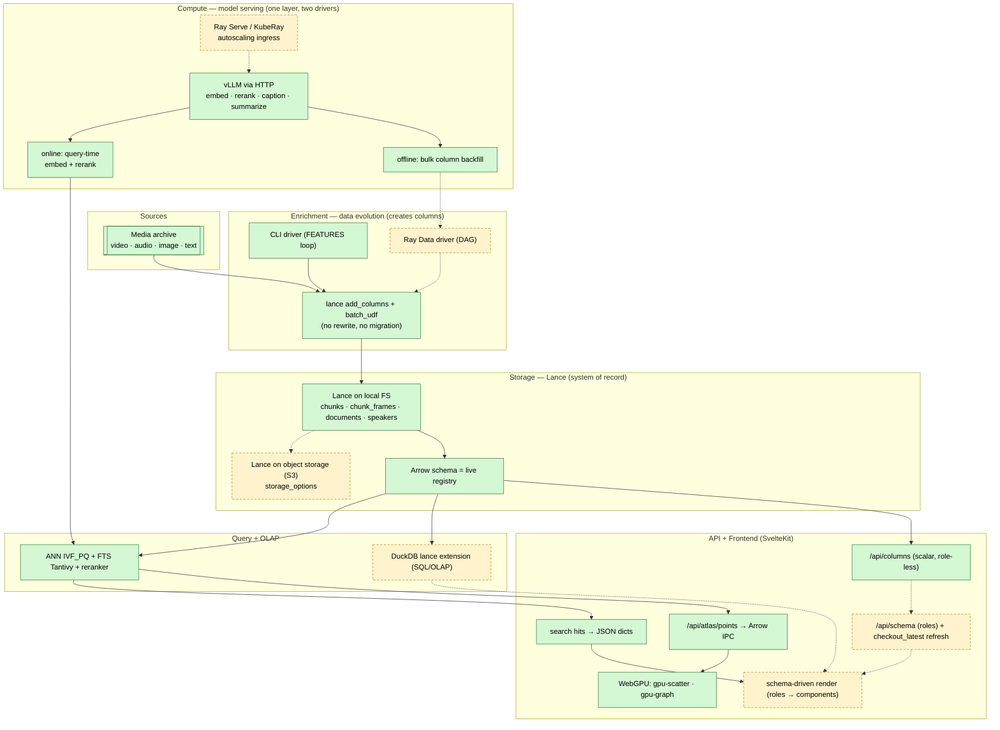

# What's left — the next architecture pass

> A forward-looking design brief for the **bigger structural bets** that aren't
> yet captured in [TODO.md](TODO.md). Where [TODO.md](TODO.md) is the
> value-per-effort backlog of shippable increments, this doc is the **"how the
> system should be shaped next"** discussion — rewrites, infra choices, and
> open questions that change the architecture rather than extend it. Read it
> alongside [GUIDE.md](GUIDE.md) (the current architecture map) and
> [STORAGE.md](STORAGE.md) (the Lance contract).

> Status legend: ✅ done · ⏳ in progress · 📋 planned · 🟡 optional/parked ·
> ❓ open question (decision needed before work starts).

The product is **shipped and working** — none of this is a blocker. These are
deliberate, larger investments, ordered roughly by how much they unlock for the
rest of the system.

---

## 0. Positioning & the architectural model

**What we are building: an Arrow-native multimodal lakehouse for media archives**
— the **target** is **Lance on object storage, KubeRay/vLLM compute, Arrow straight
to WebGPU**, with search · voice · KG built in. That architecture is the
differentiator, not the app surface: the *experience* is "Rerun for media
archives," but the *moat* is the data platform underneath. **Read the
shipped-vs-planned split below before treating any of this as current** — the
*seams* exist in today's code, but Ray, object storage, and the dynamic schema are
still planned (§1, §5). [Rerun](https://rerun.io) nailed the timeline experience
for robotics/CV (point clouds, 3D, `mcap`/`.rrd`); we aim the same
synchronized-multimodal-exploration idea at **video · image · audio · text**,
**modality-agnostic** — no modality (not even our original press-conference
*videos*) is privileged or hardcoded. **Multimodal data in general is the
first-class citizen.**

**Why the architecture is the moat (and not a borrowable app feature).** None of
the comparable tools separate storage from compute: FiftyOne couples both in
MongoDB, LightlyStudio in an embedded DuckDB/Postgres, Rerun in a closed `.rrd`
viewer. We don't. The whole stack speaks **one columnar language — Arrow — with no
serialization boundary anywhere**:

```
Lance (object store) vLLM / Ray Serve     Arrow IPC            Arrow JS           WebGPU
(Arrow columnar) ──▶ (Arrow batches) ──▶ (bulk: tableFromIPC)─▶ (typed arrays) ──▶ (GPU buffers)
   storage            compute               wire                browser            render
```

The aim is one columnar language — **Arrow — end to end, no serialization boundary
on the bulk path**. This is **already real for the embedding-map (Atlas) payload**:
`backend/atlas/points.py:170` serializes columns with `RecordBatchStreamWriter`,
`/api/atlas/points` returns `application/vnd.apache.arrow.stream`, and
`frontend/src/lib/api.ts:599` decodes it with `tableFromIPC` straight into the
`gpu-scatter` WebGPU/WGSL renderer (the KG uses `gpu-graph`; `embedding-atlas` is
WebGPU too). **Caveat (verified):** *search hits* currently travel as schema-
agnostic **JSON dicts** (`qb.to_list()`), not Arrow — so the zero-copy claim holds
for the bulk vector/point payloads (the part that actually needs it), not yet for
the per-hit list. Storage and compute are *designed* to scale independently — the
lakehouse decoupling, applied to multimodal/embedding data — once the Lance dataset
moves to object storage and a Ray driver lands (today both are local / CLI; §1).
This combination is a *category* none of FiftyOne/Lightly/Rerun occupy, and it's
validated by where data-infra is heading (Lance + Ray, Daft), not a lone bet. The
app surface (explorer UI, curation) is borrowable; **this pipeline is the part
that's genuinely ours.**

**The three-layer model** (the heart of every section below):

| Layer | Role | What it means concretely |
|---|---|---|
| **Lance** | **storage** | S3-native columnar media + vectors + FTS/ANN. The **Arrow schema is the live registry** of what has been enriched so far — the single source of truth for the dynamic schema (§5). |
| **Ray** | **data evolution + model serving** | The compute layer, on a **KubeRay** cluster, with **one model layer (Ray Serve + vLLM) driven two ways**: **online** — query-time embedding + reranking on the search path (low latency, one item); **offline** — batch column-evolution over the whole corpus (Ray Data jobs). It doesn't just "compute" — it **creates columns**: raw media → (ASR) `text` → (embed) `text_embedding` → (diarize) speakers → (topics/KG) facets → (select) `typicality`/`is_near_dup`. A dependency DAG of column-producing stages, incremental + idempotent. Both drivers hit the same serving layer through the same client `Protocol` and write via the same `add_columns` engine (§1). |
| **DuckDB (`lance` extension)** | **SQL / OLAP surface (optional)** | The analytical query layer over Lance — faceting, cross-filter, GROUP BY/JOIN/aggregates, stats (§3, §12). The official **`lance` DuckDB extension** (`INSTALL lance; LOAD lance;`) exposes Lance to DuckDB SQL (`lance_vector_search`/`lance_fts`/`lance_hybrid_search`, `ATTACH … (TYPE lance)`, index + maintenance ops). Because the data stays **Lance (MVCC/ACID)**, DuckDB is just a query engine over it — DuckDB's native single-writer limit (which LightlyStudio's *relational* DuckDB hits) doesn't apply. **Retrieval already runs on the LanceDB SDK** (see below); the extension's marginal value is the SQL/OLAP surface + a DuckDB-WASM in-browser path (§4), so it's **optional, scoped to analytics — not a replacement for the SDK.** |

These three imply the fourth: because **Ray continuously adds columns**, nothing
downstream can hardcode the column set — so the **schema must be dynamic** (§5),
read from `dataset.schema` at runtime. Modality-agnostic + Ray-evolves-columns +
dynamic-schema are one idea from three sides.

### Overall design (target) — shipped vs planned

> Green = shipped & verified in code (2026-06-14). Dashed amber = planned (the
> seam exists, the implementation doesn't yet). This is the **target** topology;
> the cross-check table below it is the honest current state.



**Cross-check — does the model hold against the code? (re-verified 2026-07-23)**

| Claim in this doc | Status | Evidence |
|---|---|---|
| Lance is the system of record; Arrow schema is the registry | ✅ shipped | `services/common/state.py` opens Lance tables; descriptor = declared + introspected halves (`services/common/lancekit/descriptor.py`) |
| Data evolution via `add_columns` (no migration) | ✅ shipped | `ratch/core/engine.py` (`@lance.batch_udf`, `add_columns` — **lance core**, not lancedb) |
| One model layer, online + offline share a client `Protocol` | ✅ shipped | `clients/base.py` `VLLMTransport`; online `services/search/services/clients.py`, offline `features/columns.py` both build `VLLMEmbeddingClient(url)` |
| ANN (IVF_PQ) + FTS (Tantivy) + reranker | ✅ shipped | `services/search/services/*`, `clients/reranker.py` |
| Arrow IPC → WebGPU (bulk/Atlas path) | ✅ shipped | `services/viewer/services/points.py` `RecordBatchStreamWriter`; `@lance/api` `tableFromIPC` → the WebGPU scatter |
| Search hits are Arrow on the wire | ❌ JSON today | search returns schema-agnostic dicts, not Arrow — the one remaining amber |
| Offline backfill driven by Ray Data | ✅ shipped | `ratch/core/driver.py` (`lance_ray.read_lance` → warm-actor `map_batches`); runners/ own the models; Ray Jobs seam in `ratch/core/jobs.py` |
| Lance on S3 / object storage | ✅ shipped | `MEDIA_S3_*` env → all read paths + the annotations write plane verified over MinIO/RustFS |
| Dynamic `/api/schema` + roles | ✅ shipped | the descriptor endpoint + type-classified search (`categoryOf` per column); drift-sync via `sync_table_info` |
| Serving on Ray Serve / KubeRay | 📋 merge-time | runners expose `deployment.py`; the cluster arrives with lance-ns |
| DuckDB `lance`-extension OLAP | 📋 planned | not in code; optional analytics module (§12) |

### Audit — is this design actually a good idea?

**Verdict: yes — the architecture is sound and the code is genuinely *structured
for it*, so the remaining work is implementation behind seams that already exist,
not a rewrite.** The honest detail:

- **Why it makes sense (the seams are real, verified above).** The enrichment core
  is *client-free pure functions over a path + a `compute` callable*
  (`features/engine.py`), so a Ray Data driver can fan them out **unchanged** — the
  hard part (idempotent, resumable, batched column creation) is done. Model access
  is a **URL behind a `Protocol`**, so "vLLM → Ray Serve" is a config swap, not a
  code change. The search wire is **open dicts**, so new columns ride the payload
  without a typed-model edit. And the one place zero-copy actually matters — bulk
  vectors → GPU — **already** runs Arrow-IPC→WebGPU. These are the expensive
  structural decisions, and they're already the right shape.
- **Why it's a good bet (not a lone gamble).** Lance + Ray + object storage is
  exactly the multimodal-lakehouse direction the data-infra field is converging on
  (Lance's own Ray integration; Daft). We're not inventing a format or a compute
  model — we're assembling proven pieces, with a domain (audio/voice/archive) the
  comparable tools don't touch.
- **Where it could *not* pan out (the honest risks).**
  1. **Ray is unproven *here*** — zero lines today. At single-node / 145k rows it's
     arguably **YAGNI**; its value is real only at corpus scale or true multi-tenant
     concurrency. Adopt it when a workload demands it, not preemptively (it adds a
     cluster, a control plane, and ops weight).
  2. **The dynamic schema has a real ceiling** (§5): generic for data/filters,
     **role-gated** for rich interactions — not infinitely generic. Fine, but don't
     over-invest in a fully generic renderer.
  3. **S3-native Lance changes the latency model** — object-store reads are not
     local-FS reads; ANN `nprobes`/caching tuned for local may need revisiting.
  4. **Two libraries in play** (`lance` core for evolution, `lancedb` for search) —
     keep API claims attributed to the right one (this audit corrected one such mix-up).
- **Recommended discipline.** Build **Phase 0** (the schema seam: `/api/schema` +
  `checkout_latest`) first — it's local, no-GPU, low-risk, and unblocks the dynamic
  UI. Defer **Ray and S3** until a real scale/concurrency need appears; they're the
  highest-effort, highest-uncertainty items and the code is already Ray-/S3-*ready*,
  so waiting costs nothing. **Don't** rebuild a generic explorer to rival FiftyOne —
  the moat is the pipeline + the domain, not the UI.

---

## 1. ✅ Rewrite inference — Ray as the data-evolution layer — SHIPPED

*(The Ray Data + warm-actor rewrite landed: `lance_ray.read_lance` fan-out,
per-stage actor pools, the runners/ model homes, and the Ray Jobs seam. See
[RATCH_MODEL_FREE.md](RATCH_MODEL_FREE.md); plan detail in git history.)*

---

## 2. 📋 Lance table maintenance — GC, reindex, manifest compaction

The archive is really a **dozen Lance datasets** under `transcripts_v2.lance/`
(`chunks`, `documents`, `chunk_frames`, `speaker_turns`, `speaker_embeddings`,
`speakers`, `topics`, plus `kg_entities`/`kg_chunks`/`kg_mentions`/
`kg_relationships`). Every feature pass appends/merges and every reindex adds
versions, so fragments and superseded manifests pile up on disk.

**What exists today (and its gaps):**

- A `ratch compact` command **already exists** (`cli/media.py`): it runs
  `dataset.optimize.compact_files(target_rows_per_fragment=1M)` and rebuilds the
  **IVF_PQ vector + BTREE scalar** indices — **but it does not rebuild the
  Tantivy FTS index** (an oversight: the FTS tail silently goes stale after an
  append) and it's manual + chunks-only.
- `cleanup_old_versions()` is called in **exactly one place** — the KG adapter
  (`runners/kg/adapter.py`, `older_than=timedelta(0)`). **Every other table
  never GCs**, so old versions accumulate indefinitely.

**What's actually missing — the first-class maintenance story:**

- **FTS reindex on compaction** — fold `create_fts_index(..., replace=True)` into
  `ratch compact` so BM25 covers the new tail (recall otherwise degrades — cf.
  the `nprobes`/recall gotchas in [INVESTIGATION.md](INVESTIGATION.md)).
- **Garbage collection across all tables** — `cleanup_old_versions(older_than=…)`
  with a real retention window, not just the KG table.
- **Cover every dataset** — extend compaction/GC/reindex beyond `chunks` to the
  frames/voice/topics/KG tables that the backfills churn hardest.
- **Scheduling** — a `ratch maintain` target / periodic job (a §1 Ray job?) so
  it isn't a manual ritual.
- **Mostly wiring existing SDK calls.** The LanceDB Table API already provides the
  whole toolkit: **`table.optimize(cleanup_older_than=…)`** does compaction +
  version prune + **incremental index optimization** (it folds *new* rows into the
  existing IVF/FTS indices — the tail our current `ratch compact` leaves
  unindexed; note the old `retrain=` flag is now a deprecated no-op);
  `cleanup_old_versions` for GC; `list_versions` / **`restore(version)`** for the
  "roll back a bad feature pass" case; `tags` / `branches` for named/experimental
  versions; **`clone_table`** (shallow, shares data files) for cheap variant
  builds — note this one is on the **async** `AsyncConnection` only, not the sync
  `DBConnection` our retrieval path uses, so a variant build would go through the
  async client (or `lance` core). So §2 is largely *adopting `optimize()` across all
  tables on a schedule*, not new machinery.

**❓ Open questions:** retention window for old versions (we sometimes want to
roll back a bad feature pass — now answered by `restore(version)`); compaction
during vs. between feature passes; whether maintenance becomes one of the Ray
jobs from §1.

---

## 3. ✅ Lance namespacing — answered by the lance-ns merge target

*(The catalog/namespace question is settled: lance-ns IS the namespace + catalog
layer this section shopped for; we merge into it rather than adopting one here.
See [LANCE_NS_INTEGRATION.md](LANCE_NS_INTEGRATION.md). Original survey in git
history.)*

---

## 4. 📋 Lightweight FTS path — DuckDB-WASM only, no GPU

Search currently assumes the **vLLM GPU stack is up** for the semantic/visual/
hybrid/fused modes. There's no graceful "no-GPU" mode for a lightweight or fully
in-browser deployment.

- **CPU/keyword fallback** — when no GPU is present, serve **FTS-only** search
  (Tantivy BM25 is already in the dataset; semantic legs disabled) so the app is
  still useful without the embedding/rerank servers.
- **DuckDB-WASM in the browser** — for a static/edge deployment, ship the
  columnar text + metadata so the frontend can run keyword search and faceted
  filters **entirely client-side** via DuckDB-WASM, no backend round-trip. Pairs
  with the DuckDB-over-Lance work in §3 and the schema-flexibility work in §5.

**❓ Open questions:** how much of the corpus is shippable to the browser (text +
metadata only, not media/embeddings); whether DuckDB-WASM can read Lance
directly — the native `lance` DuckDB extension (§3) is unlikely to be WASM-built,
so the browser path probably means **exporting a Parquet/Arrow slice** for the
client while the server-side OLAP uses the extension over Lance.

---

## 5. ✅ Schema flexibility — SHIPPED as the descriptor + type-driven search

*(The dataset descriptor (declared + introspected halves), the type-classified
search modes (any declared embedding column searchable, zero-edit new columns),
and the descriptor-rendered frontend all landed. See
[LANCE_NS_CONFORMANCE.md](LANCE_NS_CONFORMANCE.md); the original FiftyOne-style
design study is in git history.)*

---

## 6. 📋 Better preprocessing & configurable chunk units

Chunking is currently **fixed upstream** by the ASR pipeline
([PIPELINE.md](PIPELINE.md)) — speech segments → ~30 s `AudioChunk`s. ratch
itself **does not chunk at all**: `flatten_chunks()`
([`src/ratch/ingest/ingest.py`](../src/ratch/ingest/ingest.py)) just iterates
the transcriber's pre-cut chunks and copies each one's `start`/`end`/`text`
through verbatim — there are **no size limits, no windowing, no rechunking
parameters**. Hence the known "one press conference floods the page" redundancy
of near-identical adjacent chunks ([TODO.md](TODO.md#curation--exploration-roadmap)).

- **Configurable chunk units** — make the unit of a "chunk" (and thus a search
  hit) a configurable preprocessing step: fixed-duration windows, sentence/
  semantic boundaries, speaker-turn boundaries (we already have diarization),
  or overlapping windows — chosen per build via config, not hardcoded.
- **Better preprocessing** — text normalization, dedup/uniqueness collapse at
  ingest (cf. the planned `feature uniqueness`), and chunk-merge so retrieval
  units are meaningful rather than mechanical 30 s slices.
- **Config surface** — these knobs live in one place (a build config) and flow
  through the Ray pipeline (§1), not scattered constants.
- **Reuse LanceDB's `contextualize()`** — the SDK ships a rolling context-window
  builder (`contextualize(df).window(n).stride(k).groupby(col).text_col(...)`)
  that turns one-row-per-token/sentence into overlapping windows without crossing
  group boundaries. That's exactly the fixed/sliding-window chunking above —
  another built-in to lean on rather than hand-roll.

**❓ Open questions:** re-chunking means re-embedding (expensive) — do we keep
multiple chunk granularities side-by-side, or pick one per build? Interaction
with stored `alignments_json` word timings.

---

## 7–8. ✅ State & eventing — decisions taken

- **State/cache:** no Postgres/Redis — annotations and tags live in Lance (the
  write plane), the search RESULT cache is version-keyed in-process
  (`MEDIA_SEARCH_CACHE_SIZE`); we are a viewer, not a query engine.
- **Eventing/orchestration:** Dapr arrives with the lance-ns merge (sidecars per
  service); nothing event-driven is built here by design.

---

## 9. 📋 Knowledge graph — needs significant attention

The KG is the **least mature** subsystem. It's a fully detached **three-step
batch**: `export_chunks.py` dumps chunk text → JSONL, `build_kg.py` runs
**LightRAG** (in an isolated `uv run --no-project --with lightrag-hku` venv,
Gemma 4 31B for extraction + Qwen3-VL embeddings) into a GraphML, and
`adapter.py` folds that into four `kg_*` Lance tables, served via a Cypher engine
in the backend `graph/` surface (deep-dive: [GRAPH.md](GRAPH.md)). None
of it is triggered by the main pipeline; it's full-rebuild only
(`mode="overwrite"`).

The biggest weakness is **entity resolution**: it's purely **syntactic** —
`entity_id = sha1(name.lower())`, plus deterministic Swedish-suffix dedup and
single→multi-token person merges (`adapter.py`). So two different people named
"Anders" are **conflated into one node**, and name variants that the alias rules
miss become separate nodes. There is no semantic coreference.

Areas that need real investment:

- **Integration, not scripts** — fold KG construction into the unified pipeline
  (§1) so it's incremental and reproducible, not a one-off full-rebuild batch.
- **Real entity resolution / disambiguation** — replace name-hash identity with a
  proper coref/linking pass (the "which Anders" problem,
  [TODO.md](TODO.md)), ideally tied to the **voice/speaker identity clusters**
  ([VOICE.md](VOICE.md)) and named speakers so a person node is grounded in *who
  actually spoke*, not just a string.
- **Schema & storage** — decide how the graph is stored/queried (stay Lance
  tables + Cypher / DuckDB joins per §3? a dedicated graph store?) and how it
  stays in sync as chunks/entities change (incremental, not overwrite).
- **Quality** — extraction precision/recall, typing, relation quality, and an
  eval harness (the topic/caption evals are a template).
- **Surfacing** — richer graph queries and UI beyond the current examples rail.

**❓ Open questions:** graph storage backend (stay Lance-native vs. adopt a graph
DB); how tightly to couple KG entities to speaker identities; whether the graph
is rebuilt or incrementally maintained under the new eventing model (§8).

---

## 10. 📋 Unify multimodal search — evaluate Jina v5 Omni

Retrieval today runs on **three separate embedding families**, all from
Qwen3-VL-Embedding-2B over vLLM ([EMBEDDINGS.md](EMBEDDINGS.md),
[`src/ratch/clients/embedding.py`](../src/ratch/clients/embedding.py)): `text_embedding`
(transcript text), `frame_embedding` (chunk-level image vector), and
`caption_embedding`. The search modes (semantic / visual / scene / hybrid /
fused) exist partly *because* these are distinct vectors in distinct columns
that have to be combined at query time.

**Bet:** evaluate **Jina v5 Omni** (an omni-modal embedding model — text, image,
and audio into **one shared space**) as a path to *unify* search:

- **One embedding space** instead of three columns → semantic, visual, and (new)
  **audio** retrieval become one ANN query, not three legs to fuse. Simplifies
  the fused/hybrid logic in `backend/search/` and the schema in §5.
- **Native audio retrieval** — query the press-conference *audio* directly
  (prosody, non-speech cues), not only its transcript text, which the current
  text+image-only stack can't do.
- **Run it as a §1 actor** — slots straight into the Ray Data embed-actor model;
  it's just a different encoder behind the same `EmbeddingClient` protocol.

This is an **evaluation**, not a commitment: benchmark Jina v5 Omni retrieval
quality (the [`evals/`](../evals) + topic/caption eval harness) against the
current Qwen3-VL three-vector setup before migrating any column.

**❓ Open questions:** does a single unified space match per-modality specialist
vectors on recall, or do we keep both? Embedding dim / storage cost vs. the
current 2048-d columns; re-embedding the whole corpus is a §1 batch job;
licensing/serving (does it run under vLLM or need its own actor runtime?).

---

## 11. 📋 Replace easytranscriber — a Ray-native ASR pipeline

The entire write side starts with **easytranscriber** (+ easyaligner) — the
4-stage VAD → Whisper → wav2vec2 CTC → forced-alignment pipeline wrapped by
`ratch transcribe` ([PIPELINE.md](PIPELINE.md)). It works, but it's a poor fit
going forward: it's an **external dependency we don't control**, its stage-by-
stage, directory-dumping design (`output/vad/`, `output/transcriptions/`,
`output/emissions/`, …) is built for single-process batch runs, and it does **not
map cleanly onto Ray** (the actor/`map_batches` model in §1) — `pyannote` is now first-class in `runners/diarize` (no longer transitive-only), and the resume story
is filesystem-staging, not a managed pipeline.

**Bet:** rewrite ASR as a **Ray-native pipeline** we own:

- Each stage (VAD, transcription, alignment) becomes a **Ray Data stage /
  actor** holding a warm model on the GPU, streaming Arrow batches between
  stages instead of staging intermediates to per-stage directories.
- The KB models stay the same (KB-Whisper, wav2vec2-voxrex, pyannote VAD — the
  *quality* isn't the problem); what changes is the **orchestration**: managed
  GPU scheduling, backpressure, retries, and checkpointing from Ray, on the same
  KubeRay cluster as everything else in §1.
- `pyannote` becomes a **first-class dependency** rather than transitive.
- Output lands **directly in Lance** (no `output/*/` JSON hop), so transcription
  and the downstream feature passes share one runtime and one dataset.

**❓ Open questions:** how much of easyaligner's forced-alignment we reimplement
vs. vendor; whether to keep an easytranscriber-compatible path during migration;
validating the rewrite produces identical word alignments (regression-test
against the current `alignments_json`).

---

## 12. 📋 Analytics & charting — study the corpus, not just search it

There is **no analytical/visualization surface** for understanding the data in
aggregate. The Atlas map is a 2-D embedding projection and the topic treemap
exists, but there are **no charts** — no distributions, time series, or
faceted breakdowns to actually *study* the corpus. The
[TODO.md](TODO.md#curation--exploration-roadmap) "Stats / histograms" item is the
seed; this is the broader bet.

**Bet:** a real analytics layer to make graphs over the data:

- **Aggregate charts** — distributions and counts over any facet (per `namn`,
  `referenskod`, `language`, `topic`, speaker, time/duration): histograms, time
  series, top-N bars, co-occurrence. The frontend already ships LayerChart
  (used by the topic treemap) — extend it into a charts panel.
- **Powered by DuckDB-over-Lance (§3)** — these are `GROUP BY`/aggregate queries,
  exactly what DuckDB is for; a `/api/stats` (or DuckDB-WASM client-side, §4)
  surface rather than bespoke Python scans.
- **Schema-driven (§5)** — chartable dimensions come from the field-schema
  (anything tagged `facet`), so new columns become chartable automatically.
- **Curation loop** — feeds the faceted filter panel and group-by-video / near-
  dup work in [TODO.md](TODO.md#curation--exploration-roadmap); seeing the
  distribution is how you find the redundancy to collapse.

**❓ Open questions:** server-side `/api/stats` vs. fully client-side DuckDB-WASM
(§4); which chart library surface (lean on the existing LayerChart); precompute
vs. on-the-fly aggregation at 145k+ rows.

---

## 13. 📋 Documentation site — publish `docs/` with Zensical

The project already has a **substantial docs corpus** — ~25 markdown files under
[`docs/`](.) (GUIDE, STORAGE, PIPELINE, EMBEDDINGS, VOICE, GRAPH, MCP,
INVESTIGATION, REPRODUCE, TESTING, TODO, and this file) plus the
root [README](../README.md), heavy with Mermaid diagrams and cross-links. But
it's only ever read as **raw Markdown on GitHub** (the in-app `/guide` route is a
hand-built single page, not the docs). There's no rendered, searchable,
navigable documentation site.

**Bet:** publish `docs/` as a static site with **[Zensical](https://zensical.org)**
— the Material-for-MkDocs team's next-generation static-site generator (a faster,
ground-up successor to MkDocs/Material). It renders the existing Markdown +
Mermaid into a navigable site with full-text search, a nav tree, and versioning,
with little change to the source files.

- **Reuse what's there** — the docs are already written in interlinked Markdown
  with relative links and Mermaid blocks; Zensical consumes that directly. Mostly
  a `zensical.toml`/nav config + a CI build, not a rewrite.
- **Searchable + navigable** — client-side search and a generated nav over the 13
  docs beats grepping the repo or scrolling GitHub.
- **CI + hosting** — build on push (a §1 job or a plain GitHub Action) and deploy
  to GitHub Pages / static hosting, so the site tracks `main`.
- **Single source of truth** — the in-app `/guide` page and the README cheat-sheet
  can link into the published site instead of duplicating prose.

**❓ Open questions:** Zensical vs. plain Material-for-MkDocs (Zensical is newer /
less battle-tested — worth confirming Mermaid + our cross-link style render
cleanly); where to host (GitHub Pages vs. the app's own static route); whether
the docs build belongs in the §1 pipeline or stays a standalone Action.

---

## How these fit together

These bets reinforce each other, which is why they're one doc:

- **§1 (Ray/KubeRay)** is the new runtime that **§2, §6, §9, §10, §11** all run
  on, and that **§8** would coordinate. The ASR rewrite (§11) and the unified
  embedder (§10) are the first two encoders to live as §1 actors.
- **§3 (namespacing/DuckDB)** is the substrate for **§4 (DuckDB-WASM lightweight
  FTS)**, **§12 (analytics/charts)**, and **§5 (schema flexibility)** — together
  the "query & present any dataset" stack. §12's charts are §3's DuckDB
  aggregates rendered over §5's field-schema.
- **§7 (Postgres state + Redis cache)** and **§8 (events)** are the connective
  tissue once there's more than one moving service.

Suggested sequencing: **§5 (schema flexibility)** and **§2 (maintenance)** are
the highest leverage / lowest risk and unblock the most other work (and §2 is
half-built — it's mostly finishing `ratch compact`). **§1 (Ray rewrite on
KubeRay)** is the big foundational change to land before **§6/§9/§10/§11** build
on it. **§10 (Jina Omni)** should start as an *evaluation* in parallel since it
could simplify the schema §5 has to model. **§3/§4/§12** and the **§7/§8** infra
choices follow once the data and runtime shapes settle.

---

> **A note on grounding:** the "today" descriptions above were written after a
> full read of the inference stack (`src/ratch/clients`, `features`, `ingest`,
> `cli`, `serve-all.sh`, the Makefile), the backend (`backend/**`), the
> storage/schema layer (`src/ratch/model/schema.py`, every `lance.write_dataset`
> / index call), the KG scripts (`runners/kg/*`), and the SvelteKit frontend.
> Where a capability already exists in embryo (`/api/columns`, `ratch compact`,
> the DI'd online embedder, the no-GPU FTS path) it's called out as such, so the
> roadmap is about *finishing and reshaping* — not pretending the ground is bare.
